# AirStack + Starling Max 2 — Milestones: plan, work log, setup & troubleshooting

> Canonical (markdown) version — **our lab's own document** (see "Whose document is whose" in
> the README; CMU's upstream guide is `experiment.md` inside the AirStack checkout).
> Per-session commands only? → [RUNBOOK.md](RUNBOOK.md).
> Last updated: 2026-07-22.
> Branch: `daniel/diffaero_ground_control` · Working folder: `~/AirStack-starling-max2/AirStack`

## 1. Objective

Replicate CMU AirLab's ground-controller workflow on our hardware: fly a ModalAI **Starling
Max 2** live, commanded by **AirStack** on a ground laptop, using **OptiTrack + Motive** mocap
as the indoor position source. CBF/swarm scenarios are out of scope for now — single-drone
takeoff / hover / land under mocap. The branch already contains the whole pipeline:
`natnet_ros2` (mocap driver), `mocap_bridge` (mocap → PX4 external vision), `px4_interface` +
`MicroXRCEAgent` (uXRCE-DDS flight link), and the swarm commander (takeoff/start/hold/land
services + software geofence).

## 2. Why milestones

Flight day is a long chain: Motive → natnet_ros2 → mocap_bridge → XRCE agent → WiFi → PX4
EKF2 → px4_interface → commander → motors. Each milestone adds **one** new link and proves it
before the next stacks on, so failures always localize to the link just added.
Sim proves the software and the operator (SITL runs real PX4 firmware); props-off stages prove
the links; hand-carry proves the stack's beliefs; only then does anything spin. Exit criteria
are observed facts, and each milestone is a re-entry point.

## 3. Status

| Milestone | Goal | Code exists? | Validated by us? |
|---|---|---|---|
| M1 Sim rehearsal | 3 SITL drones fly under the ground controller; teleop + geofence exercised | ✅ CMU | ✅ **2026-07-20** |
| M2 Ground-station hardware prep | Host networking, Motive config, time sync, port checks | 🟡 networking yes; time-sync tooling absent (manual) | **Desk half ✅ 2026-07-21**; mocap-room half pending |
| M3 Drone comms (props off) | Real PX4 topics on the laptop over WiFi (uXRCE-DDS) | ✅ CMU (audited, see §3b) | ✅ **2026-07-22** (24 `/drone_1/fmu/*` topics live on the laptop) |
| M4 Mocap → EKF2 (props off) | OptiTrack pose fused by EKF2; frames verified | ✅ CMU + manual EKF2 params via QGC | Not yet |
| M5 Hand-carry preflight | RViz marker tracks the hand-carried drone | ✅ CMU (audited) | Not yet |
| M6 First flight | Stable mocap-fused hover + landing | ✅ CMU + single-drone config trim + manual PX4 failsafes | Not yet |

CMU flight-tested all of M3–M6 on their own Starling 2 Max — our work is **validation and
replication on our rig**, not development.

## 3b. Code-readiness audit (2026-07-20)

Verified by direct inspection of the `AirStack/` snapshot. Everything below EXISTS with
file:line evidence:

| Capability | Where in the code |
|---|---|
| Host networking for robot container | `robot/docker/docker-compose.yaml:48` — `network_mode: host` **already active** (no edit needed; the commented block is the old bridge config) |
| VOXL2 comms one-shot provisioner | `svg_ground_control/scripts/voxl_setup_real_drone.sh` (points PX4 DDS client at ground PC, pins domain, disables onboard agent) |
| uXRCE-DDS agent in the robot image | `robot/docker/Dockerfile.robot:198-210, 364-367` (Micro-XRCE-DDS-Agent v2.4.3 → `MicroXRCEAgent` on PATH) |
| Real-drone flight interface | `robot/ros_ws/src/interface/px4_interface/` + `launch/px4_interface.launch.xml` |
| OptiTrack NatNet driver | `robot/ros_ws/src/perception/natnet_ros2/` — `serverIP`/`clientIP` launch args at `launch/natnet_ros2.launch.py:100-101` |
| Mocap → PX4 external vision | `svg_ground_control/mocap_bridge.py:85,126` → `/{name}/fmu/in/vehicle_visual_odometry`; frame modes `enu_to_ned`/`modalai_flip` (`:83,103-105,141-153`) |
| Real-run config | `config/swarm_real.yaml` — mocap topic template `:74`, vio mode/frame `:82,86`, speed cap 1.0 m/s `:59`, fence `:64-66` (note: ships as 3 real drones `:14,:21` — trim to `drone_1` for our first flight) |
| Per-drone real interfaces launcher | `launch/real_interfaces.launch.py:38-40` (`drones:=` arg) |
| Mocap-gated commander launch | `launch/ground_control.launch.py:57-66` (`config:=`, `use_mocap:=` → mocap_bridge) |
| Flight services | `swarm_commander.py:386-389` (takeoff/start/hold/land) |
| Geofence latch + reset | `swarm_commander.py:204-206, 275, 533-565, 390/517` (`~/reset_fence`) |
| Hover scenario | `scenarios.py:135-155` |
| RViz view | `config/svg_drones.rviz` + marker publisher `swarm_commander.py:395` |
| Procedures documented by CMU | `experiment.md` Part B `:299` (B0–B6) and Part D `:745` (D1–D2) |

**Genuinely NOT in code (manual, by design):** machine clock sync (no chrony/NTP tooling
anywhere in the repo); PX4 EKF2 external-vision parameters (`EKF2_EV_CTRL` etc. — set once via
QGC/`px4-param`, the VOXL script deliberately excludes them); PX4 failsafes and RC kill switch
(QGC); Motive-side configuration.

## 4. Milestone 1 — record (2026-07-20)

### One-time setup performed

> **Historical record — do NOT follow as instructions.** This describes the original
> pre-snapshot setup (CMU clone at the then-path `~/AirStack-diffaero`). The current install
> (README, Steps 1–4) needs no submodule step, no patch step, and no config-file copying —
> the snapshot is pre-fixed and `setup` generates the configs.
1. Cloned branch; `git submodule update --init`.
2. Copied gitignored `simulation/isaac-sim/docker/omni_pass.env` and `user.config.json` from the
   old checkout (trap: a failed `up` creates the missing mount source as a root-owned
   *directory* — `rmdir` it first).
3. `./airstack.sh image-build robot-desktop` — **required**: bakes `MicroXRCEAgent` into the
   image and pins `ROS_DOMAIN_ID=1` (overwrites the shared v0.18.0 robot image tag).
4. Applied `patches/0001-zed-camera-info-init-race.patch` (PegasusSimulator submodule) — see
   CLAUDE_NOTES.md §3.1.
5. Applied `patches/0002-swarm-commander-logger-severity-crash.patch` — see §4.4 below.
6. `.env`: `COMPOSE_PROFILES="desktop,isaac-sim"`, `AUTOLAUNCH="false"`, `NUM_ROBOTS="1"`.
7. First `bws` build: 59 packages, ~4 min.

### What was achieved
Takeoff/hover/land of 3 SITL drones via the commander services; keyboard teleop of drone_3;
an accidental geofence breach with correct latch behavior and full recovery; RViz markers as
the operational viewport (sim headless).

### What it looks like

**Takeoff → hover → land** (RViz `/svg/viz/markers` view; cyan = auto sim drones, yellow =
teleop drone, green box = geofence; played at 2× speed):


**Teleop + geofence breach and latch** (drone_3 driven by keyboard through the fence wall —
all drones freeze orange, fence turns red; recover with `land` → `reset_fence`; 1.5× speed):


Source videos: [`videos/`](videos/) (`takeoff_and_land.mp4`, `teleop_with_geofence.mp4`).

### Incidents & findings
- **Commander state machine:** IDLE —takeoff→ HOLDING —start→ ACTIVE —hold→ HOLDING.
  HOLDING ignores nominal inputs (that IS the freeze). Teleop only acts in ACTIVE, and
  keypresses go to the teleop node's own terminal (focus!).
- **Geofence breach:** teleop-flew drone_3 through y<min → all drones froze (orange), fence red,
  `start` refused. Recovery: `land` (fence-exempt) → `reset_fence` → `takeoff` → `start`.
  The fence freezes only — the RC kill switch is the only true motor cutoff.
- **CMU bug found & fixed (report upstream):** first *failed* service report crashed the
  commander (`ValueError: Logger severity cannot be changed between calls`) — rclpy caches log
  severity per call-site and `report()` used one line for both info and error. Fixed by
  splitting call-sites (patch 0002). The crash killed the commander with a drone airborne →
  on hardware, PX4 `COM_OBL_RC_ACT` + RC kill are non-negotiable.
- **Fix validated:** on a later run, `drone_2: arm -> success=False` logged as ERROR and the
  commander kept running.
- **SITL battery drain:** after ~20 min of hover PX4 reports `Preflight Fail: Battery unhealthy`
  and refuses to arm. Reset = Ctrl+C the Isaac spawn script and re-run it. Also observed: the
  commander proceeds with swarm takeoff even when one drone's arm fails (second upstream
  feedback item).

## 5. Milestone 1 re-run runbook

> Condensed per-session version: [RUNBOOK.md](RUNBOOK.md) §A — **keep that one current**;
> this section keeps the fuller explanations and verify steps.

Five terminals, one job each. Every terminal follows the same pattern: a **laptop block**
(ends with `connect`, safe to paste whole), then — after the prompt changes to `root@` — an
**inside-the-container block**. Never paste across that boundary.

### Terminal 1 — start the stack + spawn the sim drones

On your laptop:

```bash
cd ~/AirStack-starling-max2/AirStack
./airstack.sh up
./airstack.sh status                              # all three containers "Up"
./airstack.sh connect isaac-sim --command=bash
```

Inside the Isaac container (`root@` prompt) — this is ONE command, safe to paste whole:

```bash
NUM_ROBOTS=3 SVG_DOMAIN_ID=1 PLAY_SIM_ON_START=true ISAAC_SIM_HEADLESS=true \
PYTHONPATH="$ISAAC_SIM_PYTHONPATH" \
/isaac-sim/python.sh /isaac-sim/AirStack/simulation/isaac-sim/launch_scripts/svg_multi_drone_single_domain.py \
  --ext-folder ~/.local/share/ov/data/documents/Kit/shared/exts
```

Wait for `Spawning 3 drone(s) on ROS domain 1` and `Ready for takeoff!` ×3. **Leave running.**

### Terminal 2 — per-drone interfaces

On your laptop:

```bash
cd ~/AirStack-starling-max2/AirStack
./airstack.sh connect robot --command=bash
```

Inside the robot container — **first, compile the workspace** (needed on the first run and
after any code change; first build ~4 min, otherwise seconds):

```bash
cd ~/AirStack/robot/ros_ws && bws && sws
```

Wait for the build summary (`Summary: N packages finished`), **then** start the per-drone
interfaces:

```bash
./src/svg_ground_control/scripts/launch_sim_interfaces.sh 3
```

**Leave running.** Verify from any other robot-container shell:
`ros2 topic echo /drone_1/interface/mavros/state --once` → `connected: true`.

### Terminal 3 — ground controller

On your laptop:

```bash
cd ~/AirStack-starling-max2/AirStack
./airstack.sh connect robot --command=bash
```

Inside the robot container:

```bash
ros2 launch svg_ground_control ground_control.launch.py
```

**Leave running** — this is the swarm commander (the brain).

### Terminal 4 — RViz (watch the drones)

On your laptop:

```bash
cd ~/AirStack-starling-max2/AirStack
./airstack.sh connect robot --command=bash
```

Inside the robot container:

```bash
rviz2 -d $(ros2 pkg prefix svg_ground_control)/share/svg_ground_control/config/svg_drones.rviz
```

An RViz window opens: cyan spheres = sim drones, yellow = teleop drone, green box = geofence.

### Terminal 5 — cockpit (fly)

On your laptop:

```bash
cd ~/AirStack-starling-max2/AirStack
./airstack.sh connect robot --command=bash
```

Inside the robot container, one service call at a time:

```bash
ros2 service call /swarm_commander/takeoff std_srvs/srv/Trigger   # arm + climb + hold
ros2 service call /swarm_commander/start   std_srvs/srv/Trigger   # scenario live
ros2 service call /swarm_commander/hold    std_srvs/srv/Trigger   # panic freeze
ros2 service call /swarm_commander/land    std_srvs/srv/Trigger   # descend + disarm
```

Optional extras (same terminal or a sixth):

```bash
# drive the teleop drone (needs "start" first; click THIS terminal for keyboard focus):
ros2 run svg_ground_control keyboard_teleop --ros-args -p drone:=drone_3

# geofence-breach recovery (fence red, drones frozen orange):
ros2 service call /swarm_commander/land        std_srvs/srv/Trigger
ros2 service call /swarm_commander/reset_fence std_srvs/srv/Trigger
# then takeoff + start again
```

## 6. Milestones 2–6 (procedures + validation records)

Full details: `robot/ros_ws/src/svg_ground_control/experiment.md` Parts B & D — **that file is
CMU's own maintained guide** (lives in the AirStack checkout, written by the package authors
for their rig); this document is our lab-specific overlay of it.
Substitute `<LAPTOP_IP>` / `<MOTIVE_IP>`.

### M2 — Ground station prep (desk half ✅ VALIDATED 2026-07-21)

Desk items, all verified on the lab laptop:
- ✅ Host networking live: `docker inspect --format '{{.HostConfig.NetworkMode}}'` → `host`;
  robot-desktop shows an empty PORTS column in `./airstack.sh status`. (Already
  `network_mode: host` in `robot/docker/docker-compose.yaml:48` — no edit needed, despite
  experiment.md's older prerequisite note.)
- ✅ Laptop clock: `timedatectl` → `System clock synchronized: yes` (NTP active). Note: the
  mocap→PX4 fusion is clock-independent (mocap_bridge sends timestamp=0; PX4 restamps), so
  machine clock sync only matters for post-flight log comparison — ordinary NTP on both
  machines is sufficient, chrony not required.
- ✅ NatNet ports 1510/1511 clear (`ss -ulpn`) — recheck at the start of every mocap session.
- ✅ NatNet SDK already vendored in the snapshot (`natnet_ros2/deps/NatNetSDK`) — no internet
  needed on lab day.
- ✅ Workspace rebuilt post-migration (59 packages).

**Our lab's values (recorded 2026-07-22 — reuse unless the lab network changes):**
`MOTIVE_IP = 192.168.8.190` · `LAPTOP_IP = 192.168.8.112` · Motive streams at **50 Hz**.

**Work log — what was actually done & debugged:** desk half validated 2026-07-21 (~10 min,
all checks passed first try). Room half attempted 2026-07-22: natnet connected to Motive on
the first launch (50 Hz; the `Analog frame rate` error proved benign; old Crazyflie bodies
cf1–cf10 visible); discovered the **two-router topology** (mocap LAN 192.168.8.x on Ethernet
vs Hangar WiFi 192.168.10.x — laptop bridges both, see M3 record). Remaining: the `drone_1`
rigid body was never created in Motive, so the exit test is still open. Full narrative:
CLAUDE_NOTES.md §3.5.

**Mocap-room half (remaining — needs the Motive PC and the drone with markers, no flying):**

1. **Markers on the Starling:** attach 4–5 reflective markers in an **asymmetric** pattern
   (no two spacings alike — symmetric layouts let Motive flip the orientation 180°).
2. **Rigid body in Motive:** place the drone in the volume, select its markers, create a
   rigid body named **exactly `drone_1`** (lowercase + underscore — topic names come from it).
   ⚠️ Do this BEFORE launching the driver (step 5): the driver reads the rigid-body list once
   at startup — if you create/rename the body afterwards, Ctrl+C and re-launch the driver.
   Old rigid bodies from other projects (our Crazyflie `cf1…cf10`) will also appear in the
   driver's log — harmless, ignore them.
3. **Motive streaming settings** (View → Data Streaming pane): NatNet streaming ENABLED,
   **Up Axis = Z** (Motive defaults to Y — the classic frame bug), Broadcast Frame Data ON,
   Local Interface = the Motive PC's LAN IP → write it down as `<MOTIVE_IP>`.

   What it should look like (our Motive PC, 2026-07-22 — read `<MOTIVE_IP>` off the
   **Local Interface** row; note **Up Axis: Z-Axis** and **Rigid Bodies: ON**):

   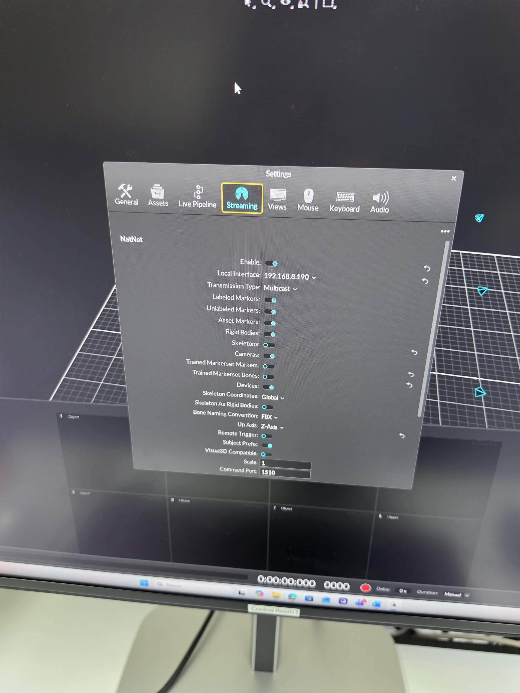
4. **Network + clock sanity** — on the LAPTOP (`jeremychia@` prompt):
   ```bash
   ip addr                     # note your IP on the lab subnet → <LAPTOP_IP>
   ping -c3 <MOTIVE_IP>        # must answer
   ss -ulpn | grep -E ':(1510|1511)' || echo "ports clear"   # per-session recheck
   ```
   On the Motive PC: Windows Settings → Time — internet time sync ON.
5. **Start the mocap driver** — laptop first, then inside the container:
   ```bash
   cd ~/AirStack-starling-max2/AirStack
   ./airstack.sh up robot-desktop
   ./airstack.sh connect robot --command=bash
   ```
   Inside (`root@` prompt) — ready to paste with our lab's IPs:
   ```bash
   ros2 launch natnet_ros2 natnet_ros2.launch.py serverIP:=192.168.8.190 clientIP:=192.168.8.112
   ```
   Leave running. A GOOD startup log looks like (2026-07-22 session, real output):
   ```
   Connected at 192.168.8.190 ...
   Mocap Framerate : 50.00
   [ERROR] Error getting Analog frame rate.   ← HARMLESS (no analog devices in our rig)
   Received N Data/Devices Descriptions:
   RigidBody found : drone_1                  ← must appear (EXPECTED once the body is created;
                                                the 07-22 log showed only cf1…cf10 — see work log)
   Configured! / Activated!
   ```
   If `drone_1` is missing from the list: create it in Motive, then Ctrl+C and re-launch.

   Real screenshots from the 2026-07-22 session — the full launch and successful connection:

   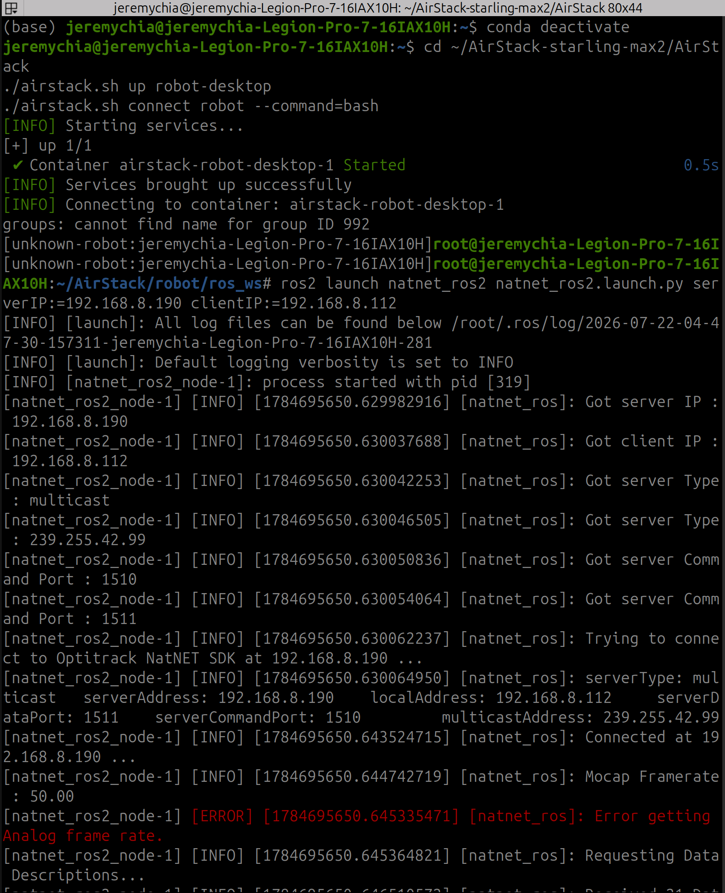

   …and the data descriptions arriving (`Configured!` / `Activated!`). **The rigid bodies the
   driver lists are exactly the ones defined in Motive** — that day only the old `cf*`
   Crazyflie bodies existed in Motive's project, so that's what appears; `drone_1` will show
   up here once it's created in Motive:

   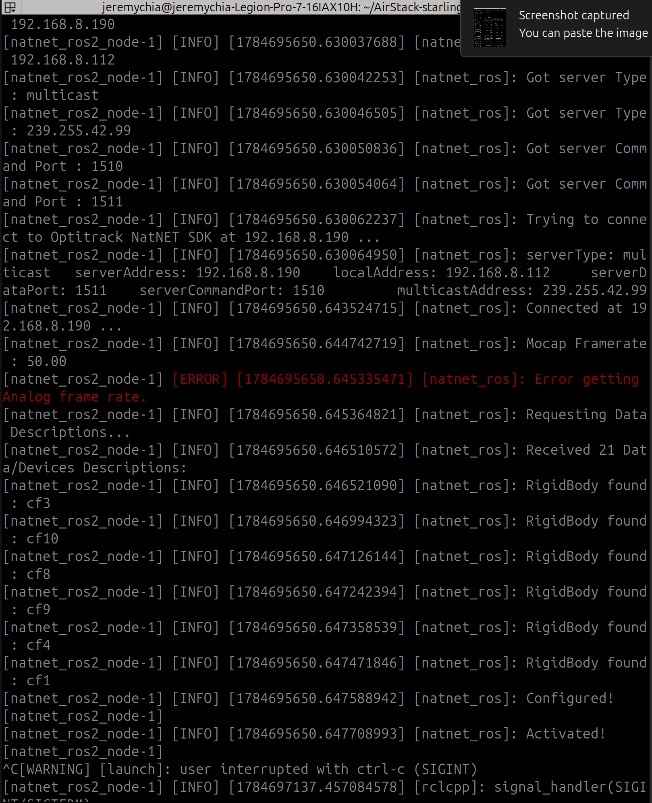

   > **About this driver:** it is the upstream
   > [L2S-lab/natnet_ros2](https://github.com/L2S-lab/natnet_ros2) package, vendored into
   > AirStack byte-identical (verified 2026-07-21 against upstream `883b095`) except three
   > launch defaults CMU changed: `serverIP`/`clientIP` are CMU's rig (192.168.50.5/.2 —
   > which is WHY the override above is mandatory), and `pub_rigid_body` defaults `true`
   > (required — it makes the driver publish `/drone_1/pose`). No separate install or clone
   > of the driver is needed; it builds with `bws` and runs inside the robot container.
6. **EXIT TEST** — open a SECOND container shell (new terminal on the laptop, then):
   ```bash
   cd ~/AirStack-starling-max2/AirStack
   ./airstack.sh connect robot --command=bash
   ```
   (This opens another shell into the SAME running container — both shells see the same
   topics.) Inside it:
   ```bash
   ros2 topic list | grep pose          # want: /drone_1/pose
   ros2 topic hz   /drone_1/pose        # want ≈ 50 Hz (our Motive's configured rate)
   ros2 topic echo /drone_1/pose --once # sane x,y,z for where the drone sits
   ```
   Hand-carry the drone around the volume — position must change smoothly, no jumps/NaNs.
   **Streaming + smooth = M2 complete.**

**What "running the full AirStack with mocap" means from here:** at M2, mocap-into-AirStack
is just the driver above — nothing else consumes `/drone_1/pose` yet, because the consumers
need the DRONE connected. The full chain (driver → `mocap_bridge` → drone's EKF2 → commander
→ RViz) lights up piece by piece: M3 connects the drone, M4 launches the commander with
`use_mocap:=true` (which starts `mocap_bridge` and feeds the pose to the drone), and M5's
hand-carry shows the whole loop in RViz. Nothing extra to run at M2.

Troubleshooting: no topic / 0 Hz → Motive not streaming, wrong `serverIP`, rigid body not
named `drone_1`, or an orphan process on 1510/1511. Only `/tf` and no `/drone_1/pose` →
`pub_rigid_body` is false (the vendored launch defaults it true).

(Done in earlier sessions: QGC AppImage on the laptop; standalone PX4 SITL build at
`~/PX4-Autopilot` for optional desk rehearsals.)

### M3 — Drone comms (props off)

**Goal:** the drone's PX4 streams its topics to the laptop over WiFi.

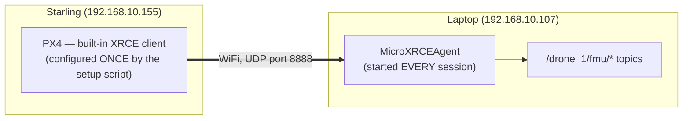

**Live values now maintained in [CONFIG.md](CONFIG.md) — check there first.** Record at time
of writing (2026-07-22): drone `starling2-max D0012` · WiFi SSID
**`AI.R STC Hangar-5G`** on interface **`mlan0`** (this VOXL has no `wlan0`; its hotspot is
`uap0` — never connect the laptop to it) · drone **192.168.10.155**, laptop WiFi
**192.168.10.107** — DHCP leases, re-check each lab day.

**Work log — what was actually done & debugged (2026-07-22):** drone prechecked healthy (PX4
running, 101 uORB topics; onboard VIO found ACTIVE → became M4's disable task; VOXL clock
unsynced). Getting the drone onto lab WiFi took the bulk of the session: `voxl-wifi station`
silently wrote a **corrupt config** (quoting bug with spaced SSIDs), the WLAN chip then
**wedged** (`Firmware Init Failed` — cured only by cold power cycle), the 2.4 GHz SSID proved
inaudible from the bench (joined the **-5G** sibling instead), and the config was finally
written manually via `wpa_passphrase` — after which the auto-enabled service Just Worked,
explaining every earlier boot failure. Result: drone auto-joins on boot, ping laptop↔drone
verified (7–22 ms). Full narrative: CLAUDE_NOTES.md §3.5; symptom→fix pairs in §7 below.

**Same day, second half — M3 done:** backups taken (drone `.FACTORY-ORIGINAL` copy + factory
file pulled to `drone-backups/voxl-px4-start.original-D0012`, committed), script pushed and
run (`voxl_setup_real_drone.sh drone_1 192.168.10.107 1 8888` — clean run, `.bak` created,
`voxl-microdds-agent` unit not present on this image so nothing to disable). Two red herrings
hit during the run — both explained under M3-A step 3's screenshot below. Agent started on
the laptop → session established, all 24 `/drone_1/fmu/*` topics materialized in the
container. **M3 exit passed.**

#### M3-A · ONE-TIME drone setup (per drone) — D0012 status: ✅ ALL DONE 2026-07-22

What a **working USB link** looks like — `adb devices` lists the drone, `adb shell` lands in
the MODAL AI banner (drone identity, image version, current IPs):

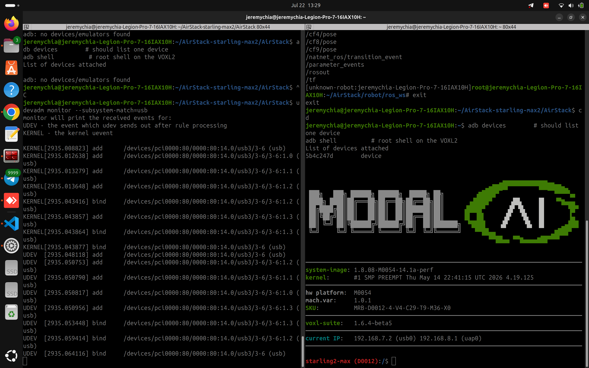

**1. Join the drone to the lab WiFi.**
> ✅ **ALREADY CONFIGURED on D0012 (2026-07-22):** the drone's WiFi role was **changed from
> factory default to lab-network client**:
> - **Before (factory):** the drone only acted as its own hotspot (`VOXL-1856926599`) — you
>   had to connect the laptop TO the drone.
> - **Now:** the drone **connects to the lab router itself**, auto-joining
>   **`AI.R STC Hangar-5G`** on every boot (config in
>   `/etc/wpa_supplicant/wpa_supplicant-mlan0.conf`, started by the auto-enabled
>   `wpa_supplicant@mlan0` service) — so drone and laptop meet on the same network, like any
>   two devices on the LAN.
> - Technically it's dual mode: the old hotspot **still broadcasts** (on `uap0`,
>   192.168.8.1) — ignore it and **never connect the laptop to it** (its subnet collides
>   with the mocap LAN).
>
> Nothing to do per session — only redo this step if the lab SSID/password changes or for a
> new drone.

⚠️ When you DO need it: do NOT use `voxl-wifi station` — on this image it corrupts the config
when the SSID contains spaces. Proven manual method (drone, adb shell):

```bash
printf 'ctrl_interface=/var/run/wpa_supplicant\nupdate_config=0\n' > /etc/wpa_supplicant/wpa_supplicant-mlan0.conf
wpa_passphrase 'AI.R STC Hangar-5G' '<PASSWORD>' >> /etc/wpa_supplicant/wpa_supplicant-mlan0.conf
systemctl restart wpa_supplicant@mlan0
sleep 15; iw dev mlan0 link      # want: Connected (5 GHz association takes >10 s)
dhcpcd mlan0 && ip addr show mlan0
```

Survives reboots (the `wpa_supplicant@mlan0` service auto-starts).

For reference, the **factory state before this change** — `voxl-wifi getmode` showing
`Mode: softap`, `Station: Disabled`, hotspot active (right pane; natnet running on the left):

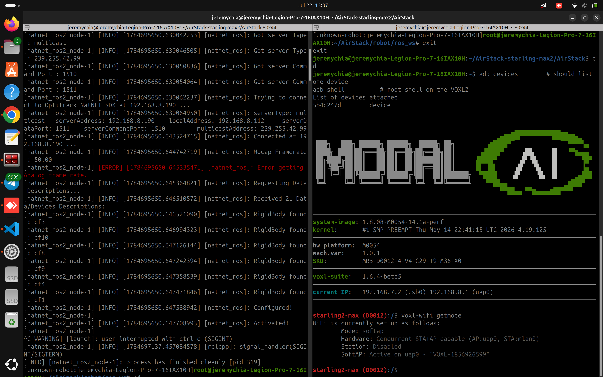

**2. Back up the file the setup script will edit:**

```bash
# on the DRONE (adb shell):
cp /usr/bin/voxl-px4-start /usr/bin/voxl-px4-start.FACTORY-ORIGINAL
```
```bash
# on the LAPTOP:
mkdir -p ~/AirStack-starling-max2/drone-backups
adb pull /usr/bin/voxl-px4-start ~/AirStack-starling-max2/drone-backups/voxl-px4-start.original-D0012
```
(Commit that pulled file to this repo afterwards — the drone's factory state, versioned.)

**3. Point PX4's client at the laptop** *(✅ done on D0012 2026-07-22 — do step 2's backups FIRST).*
⚠️ Understand what this does before running: the script **rewrites the drone's PX4 startup
file** (`/usr/bin/voxl-px4-start`) so PX4 streams to our laptop. It is reversible — see the
undo recipe below the code blocks.

```bash
# on the LAPTOP:
cd ~/AirStack-starling-max2/AirStack
adb push robot/ros_ws/src/svg_ground_control/scripts/voxl_setup_real_drone.sh /usr/bin/
```
```bash
# on the DRONE (adb shell):
chmod +x /usr/bin/voxl_setup_real_drone.sh
voxl_setup_real_drone.sh drone_1 192.168.10.107 1 8888
px4-microdds_client status        # want: connected, Agent IP = 192.168.10.107
```

The script rewrites the `microdds_client start` line of `/usr/bin/voxl-px4-start` (keeps a
timestamped `.bak` and self-restores if its edit fails verification), pins the DDS domain
**both** in the startup file **and as a flash-saved PX4 parameter**, and disables the drone's
own agent. Idempotent — re-run any time with a new IP.

What a **successful run** looks like (D0012, 2026-07-22) — note the two red herrings: the
script's own verification prints `PX4 server not running` because PX4 is still rebooting
(~30 s — just retry `px4-microdds_client status`), and the final `Running, disconnected` is
CORRECT at this point (the drone is dialing out; "connected" only happens once the laptop
agent is up, M3-B):

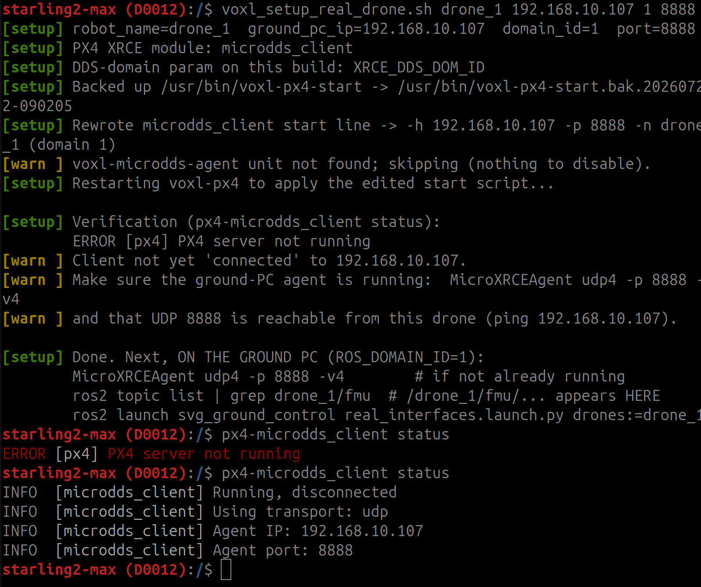

**Full revert to factory** (on the drone; note the param step — restoring the file alone
does NOT undo the flash-saved domain):

```bash
cp /usr/bin/voxl-px4-start.FACTORY-ORIGINAL /usr/bin/voxl-px4-start
px4-param reset UXRCE_DDS_DOM_ID 2>/dev/null || px4-param reset XRCE_DDS_DOM_ID
px4-param save
systemctl enable --now voxl-microdds-agent     # no-op on D0012 (unit doesn't exist on image
                                               # 1.8.08); on images that HAVE it, --now matters:
                                               # the script stops it, not just disables
systemctl restart voxl-px4
```

#### M3-B · EVERY session — laptop only, nothing to do on the drone
*(Per-session condensation of this + M4-B: [RUNBOOK.md](RUNBOOK.md) §B.)*

**First — check today's IPs (the router is DHCP, addresses drift between sessions):**

```bash
# LAPTOP's addresses — the WiFi one MUST still match what the drone dials:
ip -4 -brief addr                # wlp* (WiFi) want 192.168.10.107 — if changed → re-run M3-A
                                 # step 3 with the new IP; enp* (Ethernet) = mocap-side clientIP

# DRONE's address (needed only for diagnostics like ping — the drone dials the laptop,
# never the other way around). Two ways to read it:
adb shell ip -4 addr show mlan0  # via the USB cable (always works)
```

No cable plugged in? The drone's IP also appears in the **agent's own log** the moment it
connects — the `session established` line in the `MicroXRCEAgent -v4` output names the
client's address.

```bash
MicroXRCEAgent udp4 -p 8888 -v4      # inside the robot container; wait for "session
                                     # established"; LEAVE RUNNING (topics exist only while it runs)
```

What it looks like when the drone connects — the `session established` line names the drone's
IP:port, then a burst of `create_topic / create_publisher / create_datawriter` lines is the
drone building its `/drone_1/fmu/*` topics on the laptop:

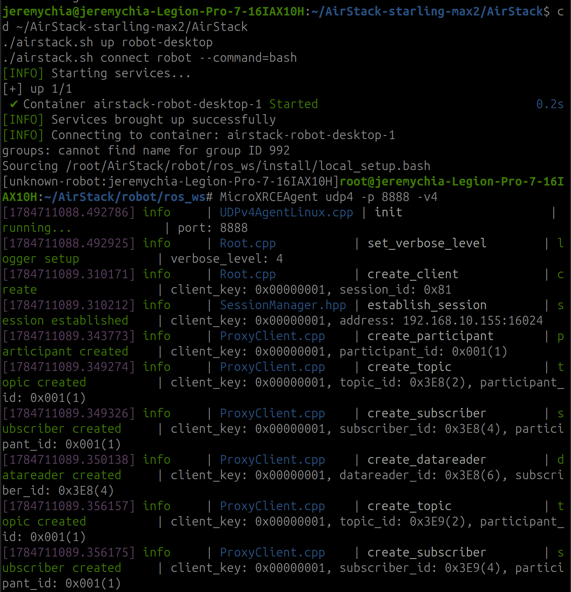

Verify in a second container shell (⚠️ the QoS flag is mandatory on all `/fmu/*` topics):

```bash
ros2 topic echo /drone_1/fmu/out/vehicle_status --qos-reliability best_effort --once
```

✅ **M3 exit:** `vehicle_status` messages arrive. (`/fmu/out/vehicle_odometry` already
publishes too, but with `quality: 0` and no usable position — EKF2 has no position source
until M4. Messages-with-no-position is the normal M3 state, not a fault.)
**Passed 2026-07-22** — session established, all 24 `/drone_1/fmu/*` topics on the laptop:

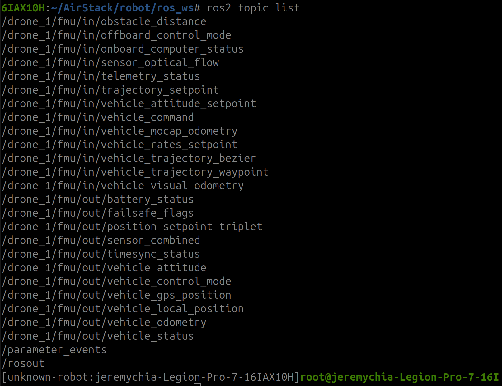

…and `vehicle_odometry` echoing live (position-less) messages, as expected pre-M4. The full
picture (drone shell left, agent top right, odometry echo bottom right):

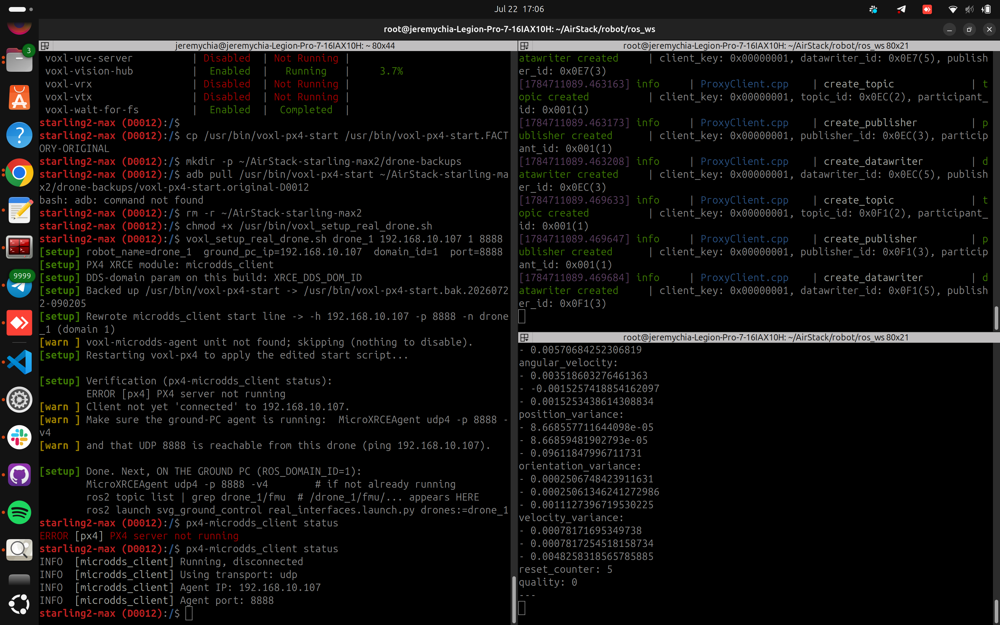

### M4 — Mocap → EKF2 (props off)

**Goal:** the drone's own state estimator (EKF2) fuses OptiTrack position — the arm-enabler
indoors (without a position source PX4 refuses to arm: "fuse failure").

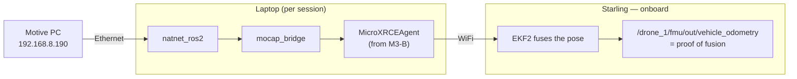

#### M4-A · ONE-TIME drone setup — per drone, stored permanently in PX4 / systemd

**1. EKF2 parameters** — set once via QGroundControl (QGC runs on the laptop host, not the
container; or use `px4-param` over adb); saved permanently in PX4:

| Param | Value | Meaning |
|---|---|---|
| `EKF2_EV_CTRL` | 11 | fuse external-vision horiz pos + vert pos + yaw |
| `EKF2_HGT_REF` | 3 | height reference = vision |
| `EKF2_GPS_CTRL` | 0 | no GPS indoors |
| `EKF2_EV_DELAY` | ≈50 | ms; mocap-over-WiFi latency (tune later if needed) |

**2. Turn off the onboard VIO feed** (confirmed needed on D0012: `voxl-open-vins-server` +
`voxl-vision-hub` are running = a competing external-vision source that would fight the mocap
inside EKF2). On the drone:

```bash
systemctl disable --now voxl-open-vins-server voxl-vision-hub
```

(Re-enable with `systemctl enable --now …` when the drone returns to outdoor/VIO work.)

**3. Housekeeping:** the VOXL clock is years off (no NTP). Harmless for flight; sync it before
ever comparing drone logs against mocap recordings.

#### M4-B · EVERY session — laptop only

**Prereq: the M3-B agent must already be running** (in its own container shell) — without it
there are no `/fmu/*` topics and every check below is silent.

**1. Mocap driver** (container; `clientIP` = the laptop's ETHERNET address — NatNet arrives
over the wire, not WiFi). Leave running:

```bash
ros2 launch natnet_ros2 natnet_ros2.launch.py serverIP:=192.168.8.190 clientIP:=192.168.8.112
```

**2. Commander + mocap bridge** (second container shell). Leave running:

```bash
ros2 launch svg_ground_control ground_control.launch.py \
  config:=$(ros2 pkg prefix svg_ground_control)/share/svg_ground_control/config/swarm_real.yaml use_mocap:=true
```

**3. Verify the fusion chain, in → out** (third container shell):

```bash
ros2 topic hz  /drone_1/fmu/in/vehicle_visual_odometry --qos-reliability best_effort   # bridge feeding (~50 Hz, our Motive rate)
ros2 topic echo /drone_1/fmu/out/vehicle_odometry --once --qos-reliability best_effort --qos-durability volatile
```

`out/vehicle_odometry` producing positions = **EKF2 is fusing**.

**4. FRAME HAND-CHECK — repeat before the FIRST flight of every lab day.**

Our mocap volume's world frame (photos, 2026-07-22): **red = x-axis ("East"), green = y-axis
("North" — the agreed forward for the hand-check), blue = z-axis up.** The floor marker is
the origin:

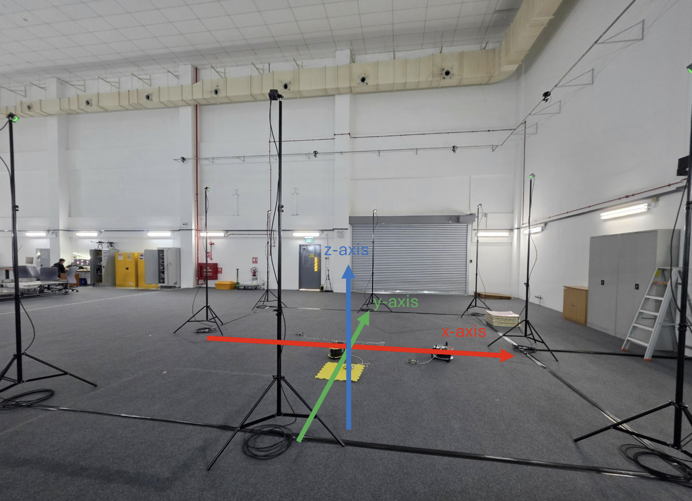

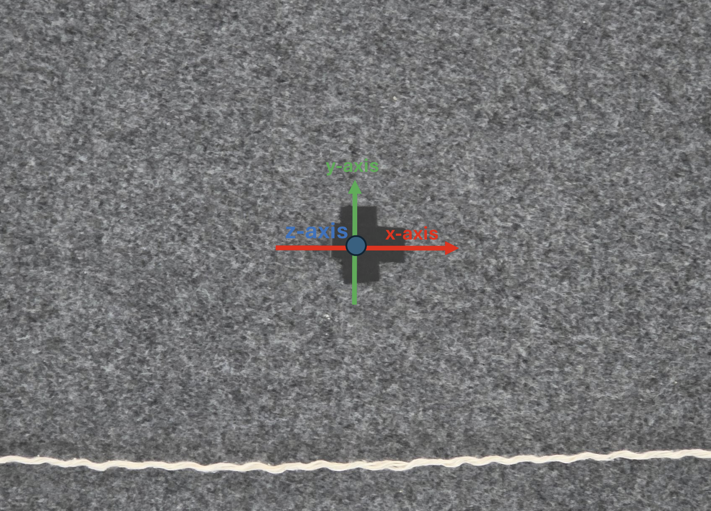

Carry the drone 1 m and watch `out/vehicle_odometry` (positions are NED — z is DOWN):

| Carry the drone… | `position[…]` must… |
|---|---|
| toward North (= the GREEN y-axis in the photos) | `[0]` **increase** |
| toward East (= the RED x-axis in the photos) | `[1]` **increase** |
| straight up | `[2]` **decrease** |

Mirrored or swapped → set `px4_vio_frame: "modalai_flip"` in `swarm_real.yaml` and re-check.
**A wrong frame flies the drone into a wall.**

✅ **M4 exit:** fusion verified + hand-check passes with correct axes.

### M5 — Hand-carry preflight (nothing armed)
```bash
ros2 launch svg_ground_control real_interfaces.launch.py drones:=drone_1
# commander idle (from M4) — do NOT call takeoff; RViz red sphere must track the carried drone
ros2 bag record /drone_1/pose /drone_1/odometry_conversion/odometry
```

### M6 — First flight
- `swarm_real.yaml`: `drone_names: ["drone_1"]`, `drone_modes: "real"`, hover, fence inside the
  net, ≤ 1.0 m/s.
- PX4: RC kill mapped + tested; `COM_OBL_RC_ACT`; low-battery action.
- Preflight (mocap hz, odometry tracks reality, thumb on kill) → `takeoff` → hover → `land`.
- Post-flight: PlotJuggler diff `/drone_1/pose` vs `/drone_1/fmu/out/vehicle_odometry`.

## 7. Troubleshooting quick table

| Symptom | Cause / fix |
|---|---|
| `ros2` not found / empty topics / service call hangs | Host shell. `./airstack.sh connect robot --command=bash` first (`root@` prompt). |
| `omni_pass.env not found` on up | Re-run `./airstack.sh setup` to (re)generate it (press Enter at the API Token prompt). |
| "mounting … user.config.json … not a directory" | Failed up made a directory; `rmdir` it, then re-run `./airstack.sh setup`. |
| `bws: command not found` | Wrong container (Isaac) or host shell. |
| `/fmu/*` looks dead | Best-effort QoS: add `--qos-reliability best_effort`. |
| PX4 won't arm indoors ("fuse failure") | No fused position source — mocap feed / EKF2 params missing. |
| Mocap topic silent | Motive not streaming, wrong serverIP, body not named `drone_N`, or orphan on UDP 1510/1511. |
| natnet log: `Error getting Analog frame rate` | Harmless — our rig has no analog devices (force plates). Ignore. |
| natnet lists `cf1…cf10` but no `drone_1` | Rigid body not created/named yet in Motive; create it, then Ctrl+C and re-launch the driver (it reads the body list only at startup). |
| `/drone_1/pose` at ~50 Hz, not 120+ | Normal — our Motive is configured at 50 Hz (adjustable in Motive's camera settings if ever needed). |
| Continuous `[timesync]` warnings (sim) | Sim below real-time; reduce load. |
| Teleop publishes but drone doesn't move | Commander HOLDING — call `start`; click teleop terminal for focus. |
| GEOFENCE BREACH, all frozen | By design: `land` → `reset_fence` → `takeoff` → `start`. |
| Commander dies: "Logger severity cannot be changed" | CMU bug — apply patch 0002, rebuild `svg_ground_control`. Report upstream. |
| Sim "Battery unhealthy", won't arm | SITL battery drained — restart the Isaac spawn script. |
| Drone WiFi: `voxl-wifi station` "succeeds" but never connects | Legacy voxl-wifi mangles SSIDs with spaces — it writes an error string into the config instead of a network block. Write `/etc/wpa_supplicant/wpa_supplicant-mlan0.conf` manually with `wpa_passphrase` (see M3 record). |
| Drone WiFi: `mlan0`/`uap0` vanish after reboot; dmesg `Firmware Init Failed` / `Card is removed: -2` | WLAN chip firmware wedged — warm reboots don't reset it. **Cold power cycle** (battery + USB out, 10 s). |
| Drone `iw` prints usage instead of link info | Old iw (4.14) needs explicit syntax: `iw dev mlan0 link`. |
| Ctrl+C does nothing in `adb shell` | VOXL adbd doesn't forward signals. Kill from a second shell (`adb shell pkill <cmd>`) or use self-terminating commands (`ping -c2 -w4`). |
