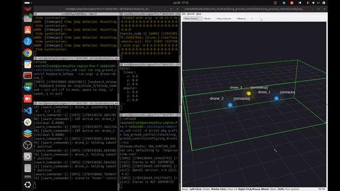

# AirStack + Starling Max 2 Live Flight — Milestones & Runbook

> Canonical (markdown) version — **our lab's own document** (see "Whose document is whose" in
> the README; CMU's upstream guide is `experiment.md` inside the AirStack checkout).
> The Word export is generated with `python3 tools/make_milestones_doc.py`.
> Last updated: 2026-07-20.
> Branch: `daniel/diffaero_ground_control` · Working folder: `~/AirStack-starling-max2/AirStack`

## 1. Objective

Replicate CMU AirLab's ground-controller workflow on our hardware: fly a ModalAI **Starling
Max 2** live, commanded by **AirStack** on a ground laptop, using **OptiTrack + Motive** mocap
as the indoor position source. CBF/swarm scenarios are out of scope for now — single-drone
takeoff / hover / land under mocap. The branch already contains the whole pipeline:
`natnet_ros2` (mocap driver), `mocap_bridge` (mocap → PX4 external vision), `px4_interface` +
`MicroXRCEAgent` (uXRCE-DDS flight link), and the swarm commander (takeoff/start/hold/land
services + software geofence).

## 2. Why milestones

Flight day is a long chain: Motive → natnet_ros2 → mocap_bridge → XRCE agent → WiFi → PX4
EKF2 → px4_interface → commander → motors. Each milestone adds **one** new link and proves it
before the next stacks on, so failures always localize to the link just added.
Sim proves the software and the operator (SITL runs real PX4 firmware); props-off stages prove
the links; hand-carry proves the stack's beliefs; only then does anything spin. Exit criteria
are observed facts, and each milestone is a re-entry point.

## 3. Status

| Milestone | Goal | Code exists? | Validated by us? |
|---|---|---|---|
| M1 Sim rehearsal | 3 SITL drones fly under the ground controller; teleop + geofence exercised | ✅ CMU | ✅ **2026-07-20** |
| M2 Ground-station hardware prep | Host networking, Motive config, time sync, port checks | 🟡 networking yes; time-sync tooling absent (manual) | **Desk half ✅ 2026-07-21**; mocap-room half pending |
| M3 Drone comms (props off) | Real PX4 topics on the laptop over WiFi (uXRCE-DDS) | ✅ CMU (audited, see §3b) | Not yet |
| M4 Mocap → EKF2 (props off) | OptiTrack pose fused by EKF2; frames verified | ✅ CMU + manual EKF2 params via QGC | Not yet |
| M5 Hand-carry preflight | RViz marker tracks the hand-carried drone | ✅ CMU (audited) | Not yet |
| M6 First flight | Stable mocap-fused hover + landing | ✅ CMU + single-drone config trim + manual PX4 failsafes | Not yet |

CMU flight-tested all of M3–M6 on their own Starling 2 Max — our work is **validation and
replication on our rig**, not development.

## 3b. Code-readiness audit (2026-07-20)

Verified by direct inspection of the `AirStack/` snapshot. Everything below EXISTS with
file:line evidence:

| Capability | Where in the code |
|---|---|
| Host networking for robot container | `robot/docker/docker-compose.yaml:48` — `network_mode: host` **already active** (no edit needed; the commented block is the old bridge config) |
| VOXL2 comms one-shot provisioner | `svg_ground_control/scripts/voxl_setup_real_drone.sh` (points PX4 DDS client at ground PC, pins domain, disables onboard agent) |
| uXRCE-DDS agent in the robot image | `robot/docker/Dockerfile.robot:198-210, 364-367` (Micro-XRCE-DDS-Agent v2.4.3 → `MicroXRCEAgent` on PATH) |
| Real-drone flight interface | `robot/ros_ws/src/interface/px4_interface/` + `launch/px4_interface.launch.xml` |
| OptiTrack NatNet driver | `robot/ros_ws/src/perception/natnet_ros2/` — `serverIP`/`clientIP` launch args at `launch/natnet_ros2.launch.py:100-101` |
| Mocap → PX4 external vision | `svg_ground_control/mocap_bridge.py:85,126` → `/{name}/fmu/in/vehicle_visual_odometry`; frame modes `enu_to_ned`/`modalai_flip` (`:83,103-105,141-153`) |
| Real-run config | `config/swarm_real.yaml` — mocap topic template `:74`, vio mode/frame `:82,86`, speed cap 1.0 m/s `:59`, fence `:64-66` (note: ships as 3 real drones `:14,:21` — trim to `drone_1` for our first flight) |
| Per-drone real interfaces launcher | `launch/real_interfaces.launch.py:38-40` (`drones:=` arg) |
| Mocap-gated commander launch | `launch/ground_control.launch.py:57-66` (`config:=`, `use_mocap:=` → mocap_bridge) |
| Flight services | `swarm_commander.py:386-389` (takeoff/start/hold/land) |
| Geofence latch + reset | `swarm_commander.py:204-206, 275, 533-565, 390/517` (`~/reset_fence`) |
| Hover scenario | `scenarios.py:135-155` |
| RViz view | `config/svg_drones.rviz` + marker publisher `swarm_commander.py:395` |
| Procedures documented by CMU | `experiment.md` Part B `:299` (B0–B6) and Part D `:745` (D1–D2) |

**Genuinely NOT in code (manual, by design):** machine clock sync (no chrony/NTP tooling
anywhere in the repo); PX4 EKF2 external-vision parameters (`EKF2_EV_CTRL` etc. — set once via
QGC/`px4-param`, the VOXL script deliberately excludes them); PX4 failsafes and RC kill switch
(QGC); Motive-side configuration.

## 4. Milestone 1 — record (2026-07-20)

### One-time setup performed

> **Historical record — do NOT follow as instructions.** This describes the original
> pre-snapshot setup (CMU clone at the then-path `~/AirStack-diffaero`). The current install
> (README, Steps 1–4) needs no submodule step, no patch step, and no config-file copying —
> the snapshot is pre-fixed and `setup` generates the configs.
1. Cloned branch; `git submodule update --init`.
2. Copied gitignored `simulation/isaac-sim/docker/omni_pass.env` and `user.config.json` from the
   old checkout (trap: a failed `up` creates the missing mount source as a root-owned
   *directory* — `rmdir` it first).
3. `./airstack.sh image-build robot-desktop` — **required**: bakes `MicroXRCEAgent` into the
   image and pins `ROS_DOMAIN_ID=1` (overwrites the shared v0.18.0 robot image tag).
4. Applied `patches/0001-zed-camera-info-init-race.patch` (PegasusSimulator submodule) — see
   CLAUDE_NOTES.md §3.1.
5. Applied `patches/0002-swarm-commander-logger-severity-crash.patch` — see §4.4 below.
6. `.env`: `COMPOSE_PROFILES="desktop,isaac-sim"`, `AUTOLAUNCH="false"`, `NUM_ROBOTS="1"`.
7. First `bws` build: 59 packages, ~4 min.

### What was achieved
Takeoff/hover/land of 3 SITL drones via the commander services; keyboard teleop of drone_3;
an accidental geofence breach with correct latch behavior and full recovery; RViz markers as
the operational viewport (sim headless).

### What it looks like

**Takeoff → hover → land** (RViz `/svg/viz/markers` view; cyan = auto sim drones, yellow =
teleop drone, green box = geofence; played at 2× speed):


**Teleop + geofence breach and latch** (drone_3 driven by keyboard through the fence wall —
all drones freeze orange, fence turns red; recover with `land` → `reset_fence`; 1.5× speed):



Source videos: [`videos/`](videos/) (`takeoff_and_land.mp4`, `teleop_with_geofence.mp4`).

### Incidents & findings
- **Commander state machine:** IDLE —takeoff→ HOLDING —start→ ACTIVE —hold→ HOLDING.
  HOLDING ignores nominal inputs (that IS the freeze). Teleop only acts in ACTIVE, and
  keypresses go to the teleop node's own terminal (focus!).
- **Geofence breach:** teleop-flew drone_3 through y<min → all drones froze (orange), fence red,
  `start` refused. Recovery: `land` (fence-exempt) → `reset_fence` → `takeoff` → `start`.
  The fence freezes only — the RC kill switch is the only true motor cutoff.
- **CMU bug found & fixed (report upstream):** first *failed* service report crashed the
  commander (`ValueError: Logger severity cannot be changed between calls`) — rclpy caches log
  severity per call-site and `report()` used one line for both info and error. Fixed by
  splitting call-sites (patch 0002). The crash killed the commander with a drone airborne →
  on hardware, PX4 `COM_OBL_RC_ACT` + RC kill are non-negotiable.
- **Fix validated:** on a later run, `drone_2: arm -> success=False` logged as ERROR and the
  commander kept running.
- **SITL battery drain:** after ~20 min of hover PX4 reports `Preflight Fail: Battery unhealthy`
  and refuses to arm. Reset = Ctrl+C the Isaac spawn script and re-run it. Also observed: the
  commander proceeds with swarm takeoff even when one drone's arm fails (second upstream
  feedback item).

## 5. Milestone 1 re-run runbook

Five terminals, one job each. Every terminal follows the same pattern: a **laptop block**
(ends with `connect`, safe to paste whole), then — after the prompt changes to `root@` — an
**inside-the-container block**. Never paste across that boundary.

### Terminal 1 — start the stack + spawn the sim drones

On your laptop:

```bash
cd ~/AirStack-starling-max2/AirStack
./airstack.sh up
./airstack.sh status                              # all three containers "Up"
./airstack.sh connect isaac-sim --command=bash
```

Inside the Isaac container (`root@` prompt) — this is ONE command, safe to paste whole:

```bash
NUM_ROBOTS=3 SVG_DOMAIN_ID=1 PLAY_SIM_ON_START=true ISAAC_SIM_HEADLESS=true \
PYTHONPATH="$ISAAC_SIM_PYTHONPATH" \
/isaac-sim/python.sh /isaac-sim/AirStack/simulation/isaac-sim/launch_scripts/svg_multi_drone_single_domain.py \
  --ext-folder ~/.local/share/ov/data/documents/Kit/shared/exts
```

Wait for `Spawning 3 drone(s) on ROS domain 1` and `Ready for takeoff!` ×3. **Leave running.**

### Terminal 2 — per-drone interfaces

On your laptop:

```bash
cd ~/AirStack-starling-max2/AirStack
./airstack.sh connect robot --command=bash
```

Inside the robot container — **first, compile the workspace** (needed on the first run and
after any code change; first build ~4 min, otherwise seconds):

```bash
cd ~/AirStack/robot/ros_ws && bws && sws
```

Wait for the build summary (`Summary: N packages finished`), **then** start the per-drone
interfaces:

```bash
./src/svg_ground_control/scripts/launch_sim_interfaces.sh 3
```

**Leave running.** Verify from any other robot-container shell:
`ros2 topic echo /drone_1/interface/mavros/state --once` → `connected: true`.

### Terminal 3 — ground controller

On your laptop:

```bash
cd ~/AirStack-starling-max2/AirStack
./airstack.sh connect robot --command=bash
```

Inside the robot container:

```bash
ros2 launch svg_ground_control ground_control.launch.py
```

**Leave running** — this is the swarm commander (the brain).

### Terminal 4 — RViz (watch the drones)

On your laptop:

```bash
cd ~/AirStack-starling-max2/AirStack
./airstack.sh connect robot --command=bash
```

Inside the robot container:

```bash
rviz2 -d $(ros2 pkg prefix svg_ground_control)/share/svg_ground_control/config/svg_drones.rviz
```

An RViz window opens: cyan spheres = sim drones, yellow = teleop drone, green box = geofence.

### Terminal 5 — cockpit (fly)

On your laptop:

```bash
cd ~/AirStack-starling-max2/AirStack
./airstack.sh connect robot --command=bash
```

Inside the robot container, one service call at a time:

```bash
ros2 service call /swarm_commander/takeoff std_srvs/srv/Trigger   # arm + climb + hold
ros2 service call /swarm_commander/start   std_srvs/srv/Trigger   # scenario live
ros2 service call /swarm_commander/hold    std_srvs/srv/Trigger   # panic freeze
ros2 service call /swarm_commander/land    std_srvs/srv/Trigger   # descend + disarm
```

Optional extras (same terminal or a sixth):

```bash
# drive the teleop drone (needs "start" first; click THIS terminal for keyboard focus):
ros2 run svg_ground_control keyboard_teleop --ros-args -p drone:=drone_3

# geofence-breach recovery (fence red, drones frozen orange):
ros2 service call /swarm_commander/land        std_srvs/srv/Trigger
ros2 service call /swarm_commander/reset_fence std_srvs/srv/Trigger
# then takeoff + start again
```

## 6. Milestones 2–6 (to do)

Full details: `robot/ros_ws/src/svg_ground_control/experiment.md` Parts B & D — **that file is
CMU's own maintained guide** (lives in the AirStack checkout, written by the package authors
for their rig); this document is our lab-specific overlay of it.
Substitute `<LAPTOP_IP>` / `<MOTIVE_IP>`.

### M2 — Ground station prep (desk half ✅ VALIDATED 2026-07-21)

Desk items, all verified on the lab laptop:
- ✅ Host networking live: `docker inspect --format '{{.HostConfig.NetworkMode}}'` → `host`;
  robot-desktop shows an empty PORTS column in `./airstack.sh status`. (Already
  `network_mode: host` in `robot/docker/docker-compose.yaml:48` — no edit needed, despite
  experiment.md's older prerequisite note.)
- ✅ Laptop clock: `timedatectl` → `System clock synchronized: yes` (NTP active). Note: the
  mocap→PX4 fusion is clock-independent (mocap_bridge sends timestamp=0; PX4 restamps), so
  machine clock sync only matters for post-flight log comparison — ordinary NTP on both
  machines is sufficient, chrony not required.
- ✅ NatNet ports 1510/1511 clear (`ss -ulpn`) — recheck at the start of every mocap session.
- ✅ NatNet SDK already vendored in the snapshot (`natnet_ros2/deps/NatNetSDK`) — no internet
  needed on lab day.
- ✅ Workspace rebuilt post-migration (59 packages).

Mocap-room items (remaining — needs Motive PC + drone with markers, no flying):
- Motive: rigid body named `drone_1`, **Up Axis = Z**, Broadcast ON, correct Local Interface.
- chrony/NTP: laptop + Motive PC (+ VOXL in M3).
- `ss -ulpn | grep -E '1510|1511'` must be clear (past lab outage = orphan on 1511).
- Done already: QGC AppImage; `~/PX4-Autopilot` SITL build.

### M3 — Drone comms (props off)
```bash
adb shell ip addr show wlan0                     # drone on the router subnet (udhcpc / voxl-wifi station)
adb push robot/ros_ws/src/svg_ground_control/scripts/voxl_setup_real_drone.sh /usr/bin/
adb shell                                        # then on the VOXL:
  chmod +x /usr/bin/voxl_setup_real_drone.sh
  voxl_setup_real_drone.sh drone_1 <LAPTOP_IP> 1 8888
  px4-microdds_client status                     # connected, Agent IP = <LAPTOP_IP>
# robot container (leave running):
MicroXRCEAgent udp4 -p 8888 -v4
# verify:
ros2 topic echo /drone_1/fmu/out/vehicle_status --qos-reliability best_effort --once
```

### M4 — Mocap → EKF2 (props off)
```bash
bws --packages-select natnet_ros2 && sws         # first build downloads NatNet SDK (internet)
ros2 launch natnet_ros2 natnet_ros2.launch.py serverIP:=<MOTIVE_IP> clientIP:=<LAPTOP_IP>
ros2 topic hz /drone_1/pose                      # ~ Motive rate, smooth under hand-carry
# PX4 params (QGC / px4-param) — MANDATORY (arm blocker indoors):
#   EKF2_EV_CTRL=11  EKF2_HGT_REF=3  EKF2_GPS_CTRL=0  EKF2_EV_DELAY≈50
# check voxl-vision-hub is not a second EV source (voxl-inspect-services)
ros2 launch svg_ground_control ground_control.launch.py \
  config:=$(ros2 pkg prefix svg_ground_control)/share/svg_ground_control/config/swarm_real.yaml use_mocap:=true
ros2 topic hz  /drone_1/fmu/in/vehicle_visual_odometry
ros2 topic echo /drone_1/fmu/out/vehicle_odometry --once --qos-reliability best_effort --qos-durability volatile
# FRAME HAND-CHECK: North → position[0]↑, East → position[1]↑, lift → position[2]↓ (NED).
# Mirrored → px4_vio_frame: "modalai_flip" in swarm_real.yaml. Wrong frame = wall.
```

### M5 — Hand-carry preflight (nothing armed)
```bash
ros2 launch svg_ground_control real_interfaces.launch.py drones:=drone_1
# commander idle (from M4) — do NOT call takeoff; RViz red sphere must track the carried drone
ros2 bag record /drone_1/pose /drone_1/odometry_conversion/odometry
```

### M6 — First flight
- `swarm_real.yaml`: `drone_names: ["drone_1"]`, `drone_modes: "real"`, hover, fence inside the
  net, ≤ 1.0 m/s.
- PX4: RC kill mapped + tested; `COM_OBL_RC_ACT`; low-battery action.
- Preflight (mocap hz, odometry tracks reality, thumb on kill) → `takeoff` → hover → `land`.
- Post-flight: PlotJuggler diff `/drone_1/pose` vs `/drone_1/fmu/out/vehicle_odometry`.

## 7. Troubleshooting quick table

| Symptom | Cause / fix |
|---|---|
| `ros2` not found / empty topics / service call hangs | Host shell. `./airstack.sh connect robot --command=bash` first (`root@` prompt). |
| `omni_pass.env not found` on up | Re-run `./airstack.sh setup` to (re)generate it (press Enter at the API Token prompt). |
| "mounting … user.config.json … not a directory" | Failed up made a directory; `rmdir` it, then re-run `./airstack.sh setup`. |
| `bws: command not found` | Wrong container (Isaac) or host shell. |
| `/fmu/*` looks dead | Best-effort QoS: add `--qos-reliability best_effort`. |
| PX4 won't arm indoors ("fuse failure") | No fused position source — mocap feed / EKF2 params missing. |
| Mocap topic silent | Motive not streaming, wrong serverIP, body not named `drone_N`, or orphan on UDP 1510/1511. |
| Continuous `[timesync]` warnings (sim) | Sim below real-time; reduce load. |
| Teleop publishes but drone doesn't move | Commander HOLDING — call `start`; click teleop terminal for focus. |
| GEOFENCE BREACH, all frozen | By design: `land` → `reset_fence` → `takeoff` → `start`. |
| Commander dies: "Logger severity cannot be changed" | CMU bug — apply patch 0002, rebuild `svg_ground_control`. Report upstream. |
| Sim "Battery unhealthy", won't arm | SITL battery drained — restart the Isaac spawn script. |
