# AirStack + Starling Max 2 — Milestones: plan, work log, setup & troubleshooting

> Canonical (markdown) version — **our lab's own document** (see "Whose document is whose" in
> the README; CMU's upstream guide is `experiment.md` inside the AirStack checkout).
> Per-session commands only? → [RUNBOOK.md](RUNBOOK.md).
> Last updated: 2026-09-04.
> Branch: `daniel/diffaero_ground_control` · Working folder: `~/AirStack-starling-max2/AirStack`

*(Unfamiliar term? → [GLOSSARY.md](GLOSSARY.md))*

## Table of contents

- [1. Objective](#1-objective)
- [2. Why milestones](#2-why-milestones)
- [3. Status](#3-status)
- [3b. Code-readiness audit](#3b-code-readiness-audit-2026-07-20)
- [3c. Test ledger — what's proven, what's next](#3c-test-ledger--whats-proven-whats-next)
- [3d. PX4 v1.14 vs v1.15 px4_msgs — compatibility audit](#3d-px4-v114-vs-v115-px4_msgs--compatibility-audit-2026-08-11)
- [4. Milestone 1 — record (2026-07-20, M1)](#4-milestone-1--record-2026-07-20)
- [5. Milestone 1 re-run runbook](#5-milestone-1-re-run-runbook)
- [6. Milestones 2–6 (procedures + validation records)](#6-milestones-26-procedures--validation-records)
  - [M2 — Ground station prep](#m2--ground-station-prep-desk-half--validated-2026-07-21)
  - [M3 — Drone comms (props off)](#m3--drone-comms-props-off)
  - [M4 — Mocap → EKF2 (props off)](#m4--mocap--ekf2-props-off--validated-2026-08-28--fusion--frame-hand-check)
  - [M5 — Hand-carry preflight](#m5--hand-carry-preflight-nothing-armed--validated-2026-08-28--ledger-15-evidence-gifvideo-in-repo)
  - [M6 — First flight](#m6--first-flight--in-progress--flown-2026-09-01-goal-flights--fence--2026-09-03-sign-off-pending)
- [7. Troubleshooting quick table](#7-troubleshooting-quick-table)
- [8. Backlog — designed but deliberately NOT implemented](#8-backlog--designed-but-deliberately-not-implemented)

## 1. Objective

Replicate CMU AirLab's ground-controller workflow on our hardware: fly a ModalAI **Starling
Max 2** live, commanded by **AirStack** on a ground laptop, using **OptiTrack + Motive** mocap
as the indoor position source. CBF/swarm scenarios are out of scope for now — single-drone
takeoff / hover / land under mocap. The branch already contains the whole pipeline:
`natnet_ros2` (mocap driver), `mocap_bridge` (mocap → PX4 external vision), `px4_interface` +
`MicroXRCEAgent` (uXRCE-DDS flight link), and the swarm commander (takeoff/start/hold/land
services + software geofence).

## 2. Why milestones

Flight day is a long chain: Motive → natnet_ros2 → mocap_bridge → XRCE agent → WiFi → PX4
EKF2 → px4_interface → commander → motors. Each milestone adds **one** new link and proves it
before the next stacks on, so failures always localize to the link just added.
Sim proves the software and the operator (SITL runs real PX4 firmware); props-off stages prove
the links; hand-carry proves the stack's beliefs; only then does anything spin. Exit criteria
are observed facts, and each milestone is a re-entry point.

## 3. Status

| Milestone | Goal | Code exists? | Validated by us? |
|---|---|---|---|
| M1 Sim rehearsal | 3 SITL drones fly under the ground controller; teleop + geofence exercised | ✅ CMU | ✅ **2026-07-20** |
| M2 Ground-station hardware prep | Host networking, Motive config, time sync, port checks | 🟡 networking yes; time-sync tooling absent (manual) | **Desk half ✅ 2026-07-21**; mocap-room half pending |
| M3 Drone comms (props off) | Real PX4 topics on the laptop over WiFi (uXRCE-DDS) | ✅ CMU (audited, see §3b) | ✅ **2026-07-22** (24 `/drone_1/fmu/*` topics live on the laptop) |
| M4 Mocap → EKF2 (props off) | OptiTrack pose fused by EKF2; frames verified | ✅ CMU + manual EKF2 params via QGC | **✅ VALIDATED 2026-08-28** — fusion (ledger #14) + frame hand-check, drone_1 / D0012 |
| M5 Hand-carry preflight | RViz marker tracks the hand-carried drone | ✅ CMU (audited) | **✅ VALIDATED 2026-08-28** — RViz tracks the carried drone (ledger #15; GIF + video in repo) |
| M6 First flight | Stable mocap-fused hover + landing | ✅ CMU + goal configs + `land_speed` fix | 🟡 **FLOWN 2026-09-01** — first offboard takeoff+hover; RC kill (ch8) mapped + takeover exercised; goal flights + **in-flight geofence ✅ 2026-09-03** (ledger #17–21). Remaining for sign-off: one clean untethered takeoff→hover→land cycle (+ optional `swarm_real` trim, deferred — see M6) |

CMU flight-tested all of M3–M6 on their own Starling 2 Max — our work is **validation and
replication on our rig**, not development. Scope note (2026-09-03): the lab has **one**
Starling — multi-drone operation is out of scope for now; single-drone goal configs are the
operative path.

## 3b. Code-readiness audit (2026-07-20)

Verified by direct inspection of the `AirStack/` snapshot. Everything below EXISTS with
file:line evidence:

| Capability | Where in the code |
|---|---|
| Host networking for robot container | `robot/docker/docker-compose.yaml:48` — `network_mode: host` **already active** (no edit needed; the commented block is the old bridge config) |
| VOXL2 comms one-shot provisioner | `svg_ground_control/scripts/voxl_setup_real_drone.sh` (points PX4 DDS client at ground PC, pins domain, disables onboard agent) |
| uXRCE-DDS agent in the robot image | `robot/docker/Dockerfile.robot:198-210, 364-367` (Micro-XRCE-DDS-Agent v2.4.3 → `MicroXRCEAgent` on PATH) |
| Real-drone flight interface | `robot/ros_ws/src/interface/px4_interface/` + `launch/px4_interface.launch.xml` |
| OptiTrack NatNet driver | `robot/ros_ws/src/perception/natnet_ros2/` — `serverIP`/`clientIP` launch args at `launch/natnet_ros2.launch.py:100-101` |
| Mocap → PX4 external vision | `svg_ground_control/mocap_bridge.py:85,126` → `/{name}/fmu/in/vehicle_visual_odometry`; frame modes `enu_to_ned`/`modalai_flip` (`:83,103-105,141-153`) |
| Real-run config | `config/swarm_real.yaml` — mocap topic template `:74`, vio mode/frame `:82,86`, speed cap 1.0 m/s `:59`, fence `:64-66` (note: ships as 3 real drones `:14,:21` — trim to `drone_1` for our first flight) |
| Per-drone real interfaces launcher | `launch/real_interfaces.launch.py:38-40` (`drones:=` arg) |
| Mocap-gated commander launch | `launch/ground_control.launch.py:57-66` (`config:=`, `use_mocap:=` → mocap_bridge) |
| Flight services | `swarm_commander.py:386-389` (takeoff/start/hold/land) |
| Geofence latch + reset | `swarm_commander.py:204-206, 275, 533-565, 390/517` (`~/reset_fence`) |
| Hover scenario | `scenarios.py:135-155` |
| RViz view | `config/svg_drones.rviz` + marker publisher `swarm_commander.py:395` |
| Procedures documented by CMU | `experiment.md` Part B `:299` (B0–B6) and Part D `:745` (D1–D2) |

**Genuinely NOT in code (manual, by design):** machine clock sync (no chrony/NTP tooling
anywhere in the repo); PX4 EKF2 external-vision parameters (`EKF2_EV_CTRL` etc. — set once via
QGC/`px4-param`, the VOXL script deliberately excludes them); PX4 failsafes and RC kill switch
(QGC); Motive-side configuration.

## 3c. Test ledger — what's proven, what's next

> Updated after every lab/bench session. One row per discrete test: what was checked, how,
> the observed result, and the date it last passed. "Next up" is ordered — do the top row
> first. Detail lives in each milestone's section; this table is the at-a-glance state.

### ✅ Tests passed

| # | Test | How (command / evidence) | Result | Date |
|---|---|---|---|---|
| 1 | Sim: takeoff/hover/land, teleop, geofence latch + recovery | commander services, keyboard teleop, RViz | 3 SITL drones flew; breach froze all; recovery clean | 2026-07-20 |
| 2 | Desk prep: host networking, NTP, NatNet ports clear | `docker inspect` · `timedatectl` · `ss -ulpn` | all pass | 2026-07-21 |
| 3 | natnet ↔ Motive connection | `natnet_ros2.launch.py serverIP:=… clientIP:=…` | connected @ 50 Hz (only old `cf*` bodies existed then) | 2026-07-22 |
| 4 | Drone on lab WiFi, survives reboot | manual `wpa_passphrase` config | auto-joins on boot; ping laptop↔drone 7–22 ms | 2026-07-22 |
| 5 | **M3 exit:** PX4 topics on laptop over WiFi | `MicroXRCEAgent` → `session established` | all 24 `/drone_1/fmu/*` topics live | 2026-07-22 |
| 6 | EKF2 params applied via QGC (QGC on the Mocap PC) | QGC Parameters pane | `EKF2_EV_CTRL=11`, `EKF2_MAG_TYPE=None`, etc. (full set: M4-A) | 2026-07-29 |
| 7 | Onboard VIO off via vision-hub conf | `/etc/modalai/voxl-vision-hub.conf` edited via sed, verified by read-back | `en_vio=false`, `offboard_mode="off"` (⚠️ the 2026-07-29 edit was never saved — live file still read `true`/`"figure_eight"` until today; lesson: only a read-back counts) + `systemctl restart voxl-vision-hub` to take effect | 2026-08-11 |
| 8 | Drone WiFi moved to `Mocap_QCGroundControl` | `voxl-wifi station` (space-free SSID → helper safe) | associated, DHCP lease obtained | 2026-08-11 |
| 9 | Drone re-pointed at laptop's new IP | `voxl_setup_real_drone.sh drone_1 192.168.0.192 1 8888` | `px4-microdds_client status`: `Running, connected`, Agent IP correct, payload tx ≈ 60 kB/s | 2026-08-11 |
| 10 | **M3 re-verified on the new network** | agent `session established`; `ros2 topic list` | all 24 topics back; `vehicle_odometry` echoes (inertial-only, `quality: 0` = normal pre-M4) | 2026-08-11 |
| 11 | `vehicle_status` streaming | `ros2 topic hz` | ~30 Hz (but see open issue: echo silent) | 2026-08-11 |
| 12 | QGC connected (drone → Mocap PC) | `primary_static_gcs_ip` → `192.168.0.190` in `voxl-mavlink-server.conf`, service restarted; drone→PC ping 3–7 ms | ✅ QGC live: PX4 detected, telemetry + battery showing; "Not Ready" = correct pre-arm state (no position source until M4) | 2026-08-11 |
| 13 | **M2 exit:** mocap poses on the laptop | `./mocap.sh` bridge (Motive broadcasts; natnet_ros2 replaced — see [MOCAP.md](MOCAP.md)) → `ros2 topic hz /drone_1/pose` in the robot container | 50 Hz, tracks the hand-carried drone | 2026-08-28 |
| 14 | **M4-B: EKF2 fuses the mocap pose** | `ground_control.launch.py … use_mocap:=true` → `fmu/in/vehicle_visual_odometry` (pose-only, quality 100, velocities NaN by design); echo `fmu/out/vehicle_odometry` | out positions match mocap in within ~2 cm (sample: in `[0.454, -0.093, -0.071]` vs out `[0.454, -0.094, -0.086]`); velocities ≈ 0 at rest | 2026-08-28 |
| 15 | **M5: RViz tracks the hand-carried drone** | `svg_drones.rviz` (Fixed Frame `map`→`world`) + `real_interfaces.launch.py`; GIF `assets/rviz_tracks_hand_carried_drone.gif`, full video `videos/SVG_check_if_rviz_moves_by_movingdrone_manually.mp4` | marker follows the carried drone live | 2026-08-28 |
| 16 | **M4 exit: frame hand-check** | carry the drone North / East / up, watch `fmu/out/vehicle_odometry` | axes correct (N → `pos[0]`↑, E → `pos[1]`↑, up → `pos[2]`↓) — confirmed by Jeremy in the hangar | 2026-08-28 |
| 17 | **M6: FIRST OFFBOARD FLIGHT — takeoff + hover under the commander** | `swarm_commander` `takeoff` service, mocap→EKF2 fused (AI.R STC hangar, drone_1 / D0012); RC kill switch mapped (ch8) + RC takeover exercised in flight | stable takeoff + hover under software control; manual landing | 2026-09-01 |
| 18 | Single-goal flight (`goal_single.yaml`) | runtime waypoint sent via `/svg/drone_1/goal_command` | drone flew to the commanded goal and held | 2026-09-03 |
| 19 | Multi-goal square (`goal_tracking.yaml`) | 4 corners commanded via a `ros2 topic pub` loop | 2 full laps of the square, all corners tracked — video: [drone POV](videos/Starling_goal_tracking_drone.mp4) · [RViz POV](videos/Starling_goal_tracking_RVIZ.mp4) (GIFs in README showcase) | 2026-09-03 |
| 20 | **GEOFENCE VALIDATED IN FLIGHT** (all configs) | deliberate in-flight breach | breach ⇒ freeze-hover (stays armed); recovery clean via `land` → `reset_fence` → `takeoff` | 2026-09-03 |
| 21 | Landing auto-disarm made reliable | `land_speed_mps` 0.3 → 0.6 in the configs (committed) | 0.3 = slow bouncy touchdown that misses PX4's land-detector window → armed-on-ground; 0.6 plants firmly and PX4 auto-disarm fires every landing | 2026-09-03 |

### ⚠️ Open issues (none block flying — but brief every pilot on the flight-ops rows)

| Issue | Details | Matters for |
|---|---|---|
| **Control-authority leak: RC takeover only clean into MANUAL** | Commander setpoints keep being consumed by PX4 v1.14 even after the pilot switches to POSCTL/ALTCTL — the stream fights the sticks. Clean takeover = switch to **MANUAL** (or hit the kill switch). Designed fix (a `~/release` Trigger service) is shelved — see the M6 backlog. | **every flight** — brief the pilot: takeover means MANUAL or kill, never POSCTL/ALTCTL |
| Commander touchdown disarm is a premature one-shot | Fires once at ~15 cm altitude, always denied → QGC shows a red "Disarming denied, not landed" **once per landing**. Cosmetic: PX4's own auto-disarm does the real work, reliable since `land_speed_mps` 0.6 (ledger #21). | landings — expect + ignore exactly one red QGC message |
| Commander stuck non-IDLE after any RC takeover | After a takeover the commander never returns to IDLE on its own, so the next `takeoff` is refused. Reset: call `land` once → back to IDLE. | every session with an RC takeover |
| `test/functional_*.py` publishes fake odometry on real topics | **Never run these tests with the real stack up** — they inject fake odometry onto the live topics. Bench/sim only. | safety — pre-flight discipline |
| **PX4 version mismatch: drone v1.14 vs workspace v1.15** (symptom: `vehicle_status` 30 Hz on `hz` but echo silent) | **Verdict (full audit: §3d):** vendored px4_msgs is effectively release/1.15; drone runs v1.14. The paths this workflow actually exercises (odometry, setpoints, offboard flags) are wire-compatible, and CMU flew the same v1.14 + px4_msgs combination — **flying on v1.14 is evidenced-OK for this workflow.** | **M6 caution, not a blocker** — fly with QGC visible + thumb on RC kill (already required); don't trust any software arming indication |
| WiFi reboot-persistence unverified | The 08-11 config was written by `voxl-wifi station` (not the proven manual method). Reboot the drone once; check `iw dev mlan0 link`. | every session |
| CONFIG.md drone-IP row still TBD | Laptop `192.168.0.192` recorded; read the drone's lease with `voxl-my-ip` and record it. | diagnostics (ping) |
| NatNet now rides WiFi on the laptop leg | Topology DECIDED 2026-08-11: single network — Motive PC on `Mocap_QCGroundControl` at `192.168.0.190`, laptop `clientIP:=192.168.0.192` (WiFi; Ethernet unused). Verify Motive's Data Streaming → Local Interface = `192.168.0.190`. Caveat: bursty 802.11 stalled our Crazyflie NatNet rig — if `/drone_1/pose` stutters, wire the laptop to the router's LAN port and use that IP as `clientIP:=`. | **M2/M4** — pose-stream quality |

### ⏭ Next up (in order)

| # | Task | Where | Gated by |
|---|---|---|---|
| 1 | ✅ done 2026-08-11 — Motive network decided (single router: Motive `.0.190`, laptop `.0.192`, in [CONFIG.md](CONFIG.md)); remaining: verify Motive's Local Interface setting on next mocap visit | Motive PC | — |
| 2 | Create the `drone_1` rigid body in Motive (asymmetric markers, exact lowercase name, BEFORE launching the driver) | mocap room | — |
| 3 | ✅ done 2026-08-28 — **M2 exit:** `/drone_1/pose` @ 50 Hz via the new `./mocap.sh` bridge (natnet replaced — see [MOCAP.md](MOCAP.md)) | container | — |
| 4 | ✅ done 2026-08-28 — **M4-B:** fusion chain verified in → out (`fmu/out/vehicle_odometry` matches mocap within ~2 cm; ledger #14) | container | — |
| 5 | ✅ done 2026-08-28 — **M4 exit:** frame hand-check passed (axes correct; ledger #16) | mocap room | — |
| 6 | ✅ done 2026-08-28 — **M5:** RViz tracks the hand-carried drone (ledger #15) | container | — |
| 7 | ✅ done 2026-09-01 — **M6 prereqs:** RC kill mapped (ch8) + takeover exercised in flight; flown on single-drone goal configs instead of a `swarm_real.yaml` trim (trim deferred — row 9) | laptop + QGC | — |
| 8 | **M6 sign-off:** one clean untethered takeoff → hover → land cycle end-to-end (auto-disarm on touchdown, no RC intervention) | hangar | — |
| 9 | *(optional — recommended for single-drone ops)* trim `swarm_real.yaml` to `drone_1` — lab decided 2026-09-03 to defer; until then the phantom `drone_2`/`drone_3` WARNs are expected and harmless | laptop | — |

## 3d. PX4 v1.14 vs v1.15 px4_msgs — compatibility audit (2026-08-11)

**Symptom that triggered this:** `vehicle_status` streams at ~30 Hz per `ros2 topic hz`, but
`ros2 topic echo` prints nothing — suspected px4_msgs definition mismatch between the drone's
PX4 v1.14 and the workspace's message definitions.

**FULL AUDIT 2026-08-11 (two-agent verification):** the vendored px4_msgs
(`src/local/controls/px4_msgs`) is a byte-exact snapshot of upstream px4_msgs **main @
`9e35651` (2024-06-26) — effectively release/1.15** for all flight-critical messages (pkg
version 2.0.1; diffed against every upstream commit since 2023). The rest of the workspace
agrees: **sim containers build PX4 v1.16.1 SITL** (`Dockerfile.isaac-ros:3`, ms-airsim
`Dockerfile:13`), agent v2.4.3 is version-agnostic, and the ONLY v1.14 artifacts are
drone-side (factory `microdds_client` name; the setup script auto-detects both names).

**Per-message audit vs release/1.14:** `VehicleOdometry`, `TrajectorySetpoint`,
`BatteryStatus` **wire-identical** (mocap feed + setpoints safe — which MASKS the problem);
`OffboardControlMode` benign for position/velocity offboard; `VehicleStatus`,
`VehicleCommand` (arm/mode commands — `source_component` u8→u16 shifts everything after it),
`VehicleLocalPosition`, `VehicleControlMode` **DANGEROUS** (mid-message inserts/reorder →
silent garbage both directions).

**REVISED after CMU input (same day):** CMU confirms THEY also flew a v1.14 drone — with
this exact px4_msgs (git history in `~/AirStack-cmu`: px4_msgs added 2026-03-09 in the
Jazzy-upgrade commit, untouched since, i.e. before their flight tests).

**Code audit explains why it works:** the SVG workflow's exercised path is wire-compatible —
`px4_interface` subscribes ONLY to `VehicleStatus` + `VehicleOdometry`; odometry +
`TrajectorySetpoint` are byte-identical to 1.14; `OffboardControlMode`'s first 6 flags (all
we use) are identical; `VehicleCommand`'s corruption is confined to trailing metadata after
`source_component` (command/params/targets decode correctly on the drone) — and crucially the
commander's ARMING sequence is **time-staged fire-and-forget** (offboard @1.0s, arm @1.5s,
ascend @2.5s — `swarm_commander.py:77-80`) and **nothing in svg_ground_control reads
`is_armed`**, so the undecodable `VehicleStatus` is never consumed.
`VehicleLocalPosition`/`VehicleControlMode` aren't subscribed at all.

**Conclusion: flying on v1.14 is evidenced-OK for THIS workflow (CMU did it).** Residual
risks to respect at M6: the software is BLIND to arming/nav state (QGC + RC kill are the only
arming visibility — both already mandated), and any future use of the onboard
`takeoff_landing_planner` path (which DOES gate on `is_armed`) would break. Optional clean-up
remains upgrading the drone to the voxl-px4 1.15 line. Worth asking CMU their exact voxl-px4
build to fully close this.

**Matters for:** M6 caution, not a blocker — fly with QGC visible + thumb on RC kill (already
required); don't trust any software arming indication.

## 4. Milestone 1 — record (2026-07-20)

### One-time setup performed

> **Historical record — do NOT follow as instructions.** This describes the original
> pre-snapshot setup (CMU clone at the then-path `~/AirStack-diffaero`). The current install
> (README, Steps 1–4) needs no submodule step, no patch step, and no config-file copying —
> the snapshot is pre-fixed and `setup` generates the configs.
1. Cloned branch; `git submodule update --init`.
2. Copied gitignored `simulation/isaac-sim/docker/omni_pass.env` and `user.config.json` from the
   old checkout (trap: a failed `up` creates the missing mount source as a root-owned
   *directory* — `rmdir` it first).
3. `./airstack.sh image-build robot-desktop` — **required**: bakes `MicroXRCEAgent` into the
   image and pins `ROS_DOMAIN_ID=1` (overwrites the shared v0.18.0 robot image tag).
4. Applied `patches/0001-zed-camera-info-init-race.patch` (PegasusSimulator submodule) — see
   the retired `CLAUDE_NOTES.md` §3.1 (in git history).
5. Applied `patches/0002-swarm-commander-logger-severity-crash.patch` — see §4.4 below.
6. `.env`: `COMPOSE_PROFILES="desktop,isaac-sim"`, `AUTOLAUNCH="false"`, `NUM_ROBOTS="1"`.
7. First `bws` build: 59 packages, ~4 min.

### What was achieved
Takeoff/hover/land of 3 SITL drones via the commander services; keyboard teleop of drone_3;
an accidental geofence breach with correct latch behavior and full recovery; RViz markers as
the operational viewport (sim headless).

### What it looks like

**Takeoff → hover → land** (RViz `/svg/viz/markers` view; cyan = auto sim drones, yellow =
teleop drone, green box = geofence; played at 2× speed):

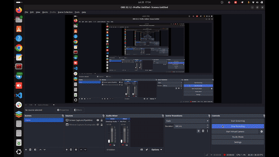

**Teleop + geofence breach and latch** (drone_3 driven by keyboard through the fence wall —
all drones freeze orange, fence turns red; recover with `land` → `reset_fence`; 1.5× speed):

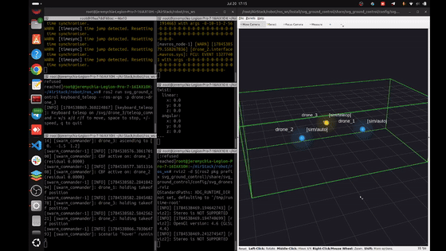

Source videos: [`videos/`](videos/) (`takeoff_and_land.mp4`, `teleop_with_geofence.mp4`).

### Incidents & findings
- **Commander state machine:** IDLE —takeoff→ ARMING → ASCEND → ACTIVE; —start→ scenario
  live; —hold→ back to ACTIVE-holding; —land→ LANDING → IDLE. There is no HOLDING state
  (the FlightState enum has none) — "holding" is simply ACTIVE with `mission_active=False`,
  and that IS the freeze: holding ignores nominal inputs. Teleop only acts while the
  scenario is live, and keypresses go to the teleop node's own terminal (focus!).
- **Geofence breach:** teleop-flew drone_3 through y<min → all drones froze (orange), fence red,
  `start` refused. Recovery: `land` (fence-exempt) → `reset_fence` → `takeoff` → `start`.
  The fence freezes only — the RC kill switch is the only true motor cutoff.
- **CMU bug found & fixed (report upstream):** first *failed* service report crashed the
  commander (`ValueError: Logger severity cannot be changed between calls`) — rclpy caches log
  severity per call-site and `report()` used one line for both info and error. Fixed by
  splitting call-sites (patch 0002). The crash killed the commander with a drone airborne →
  on hardware, PX4 `COM_OBL_RC_ACT` + RC kill are non-negotiable.
- **Fix validated:** on a later run, `drone_2: arm -> success=False` logged as ERROR and the
  commander kept running.
- **SITL battery drain:** after ~20 min of hover PX4 reports `Preflight Fail: Battery unhealthy`
  and refuses to arm. Reset = Ctrl+C the Isaac spawn script and re-run it. Also observed: the
  commander proceeds with swarm takeoff even when one drone's arm fails (second upstream
  feedback item).

## 5. Milestone 1 re-run runbook

Superseded as a procedure: the maintained per-session commands are
[RUNBOOK.md](RUNBOOK.md) §A (this section previously duplicated them). MILESTONES keeps the
validation record below.

**Unique to this section (not in RUNBOOK §A):**
- Terminal 2 verify, after launching the sim interfaces: `ros2 topic echo
  /drone_1/interface/mavros/state --once` → expect `connected: true`.
- Terminal 4 RViz legend: cyan spheres = sim drones, yellow = teleop drone, green box =
  geofence.
- Terminal 5 optional extras: keyboard teleop —
  `ros2 run svg_ground_control keyboard_teleop --ros-args -p drone:=drone_3` (needs `start`
  first; click that terminal for keyboard focus).

## 6. Milestones 2–6 (procedures + validation records)

Full details: `robot/ros_ws/src/svg_ground_control/experiment.md` Parts B & D — **that file is
CMU's own maintained guide** (lives in the AirStack checkout, written by the package authors
for their rig); this document is our lab-specific overlay of it.
Substitute `<LAPTOP_IP>` / `<MOTIVE_IP>`.

### M2 — Ground station prep (desk half ✅ VALIDATED 2026-07-21)

Desk items, all verified on the lab laptop:
- ✅ Host networking live: `docker inspect --format '{{.HostConfig.NetworkMode}}'` → `host`;
  robot-desktop shows an empty PORTS column in `./airstack.sh status`. (Already
  `network_mode: host` in `robot/docker/docker-compose.yaml:48` — no edit needed, despite
  experiment.md's older prerequisite note.)
- ✅ Laptop clock: `timedatectl` → `System clock synchronized: yes` (NTP active). Note: the
  mocap→PX4 fusion is clock-independent (mocap_bridge sends timestamp=0; PX4 restamps), so
  machine clock sync only matters for post-flight log comparison — ordinary NTP on both
  machines is sufficient, chrony not required.
- ✅ NatNet ports 1510/1511 clear (`ss -ulpn`) — recheck at the start of every mocap session.
- ✅ NatNet SDK already vendored in the snapshot (`natnet_ros2/deps/NatNetSDK`) — no internet
  needed on lab day.
- ✅ Workspace rebuilt post-migration (59 packages).

**Our lab's values (recorded 2026-07-22 — reuse unless the lab network changes):**
`MOTIVE_IP = 192.168.0.190` · `LAPTOP_IP = 192.168.0.192` — both on `Mocap_QCGroundControl`
since **2026-08-11** (the 2026-07-22 session ran on the old Ethernet LAN, 192.168.8.190/.112)
· Motive streams at **50 Hz**.

**Work log — what was actually done & debugged:** desk half validated 2026-07-21 (~10 min,
all checks passed first try). Room half attempted 2026-07-22: natnet connected to Motive on
the first launch (50 Hz; the `Analog frame rate` error proved benign; old Crazyflie bodies
cf1–cf10 visible); discovered the **two-router topology** (mocap LAN 192.168.8.x on Ethernet
vs Hangar WiFi 192.168.10.x — laptop bridges both, see M3 record). Remaining: the `drone_1`
rigid body was never created in Motive, so the exit test is still open. Full narrative:
the retired `CLAUDE_NOTES.md` §3.5 (in git history).

**Mocap-room half — doubles as the Motive-PC setup procedure (rigid-body creation, steps
1–3, + the Data Streaming pane) that [RUNBOOK.md](RUNBOOK.md) §B step 4 sends you here for
(needs the Motive PC and the drone with markers, no flying).** The Motive-side steps 1–4
below are current; only the natnet driver launch (step 5) and its exit test (step 6) are
superseded — see their banners.

1. **Markers on the Starling:** attach 4–5 reflective markers in an **asymmetric** pattern
   (no two spacings alike — symmetric layouts let Motive flip the orientation 180°).
2. **Rigid body in Motive:** place the drone in the volume, select its markers, create a
   rigid body named **exactly `drone_1`** (lowercase + underscore — topic names come from it).
   ⚠️ Do this BEFORE launching the driver (step 5): the driver reads the rigid-body list once
   at startup — if you create/rename the body afterwards, Ctrl+C and re-launch the driver.
   Old rigid bodies from other projects (our Crazyflie `cf1…cf10`) will also appear in the
   driver's log — harmless, ignore them.
3. **Motive streaming settings** (View → Data Streaming pane): NatNet streaming ENABLED,
   **Up Axis = Z** (Motive defaults to Y — the classic frame bug), Broadcast Frame Data ON,
   Local Interface = the Motive PC's LAN IP → write it down as `<MOTIVE_IP>`.

   What it should look like (our Motive PC, 2026-07-22 — read `<MOTIVE_IP>` off the
   **Local Interface** row; note **Up Axis: Z-Axis** and **Rigid Bodies: ON**):

   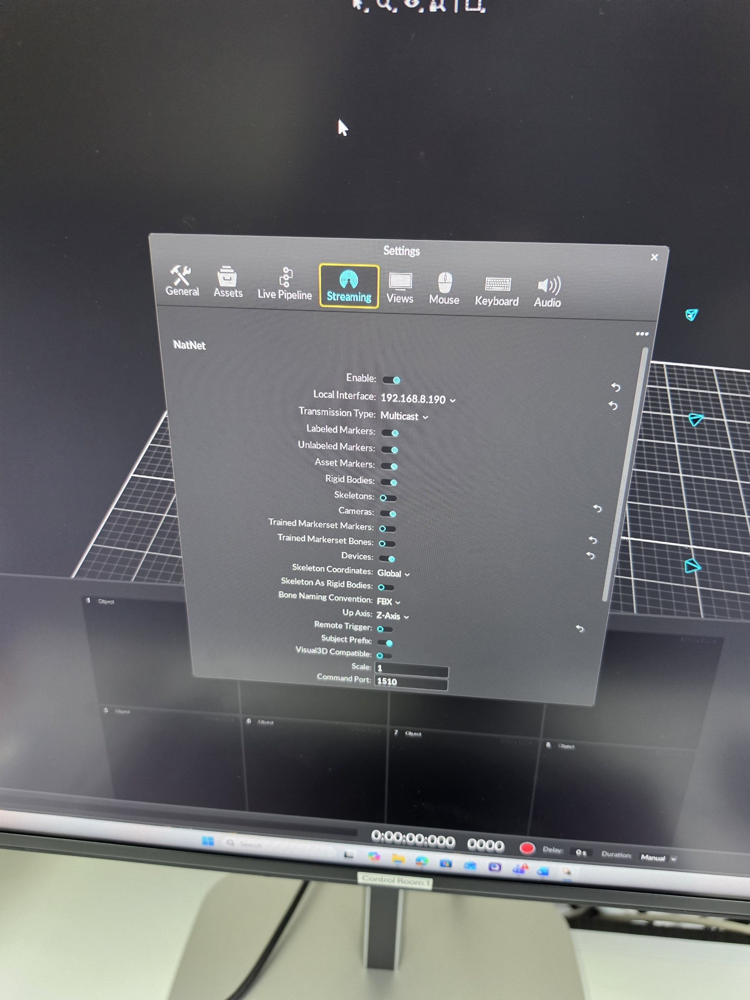
4. **Network + clock sanity** — on the LAPTOP (`jeremychia@` prompt):
   ```bash
   ip addr                     # note your IP on the lab subnet → <LAPTOP_IP>
   ping -c3 <MOTIVE_IP>        # must answer
   ss -ulpn | grep -E ':(1510|1511)' || echo "ports clear"   # per-session recheck
   ```
   On the Motive PC: Windows Settings → Time — internet time sync ON.
5. **Start the mocap driver** — **since 2026-08-27 this is the `./mocap.sh` bridge on the
   LAPTOP** (Motive set to broadcast; natnet_ros2 replaced — see [MOCAP.md](MOCAP.md) for
   how to run and troubleshoot it). *Legacy natnet launch below (superseded, kept for
   reference)* — laptop first, then inside the container:

<details>
<summary>Legacy natnet_ros2 procedure (superseded 2026-08-27 — kept for the record)</summary>

   ```bash
   cd ~/AirStack-starling-max2/AirStack
   ./airstack.sh up robot-desktop
   ./airstack.sh connect robot --command=bash
   ```
   Inside (`root@` prompt) — ready to paste with our lab's IPs:
   ```bash
   ros2 launch natnet_ros2 natnet_ros2.launch.py serverIP:=192.168.0.190 clientIP:=192.168.0.192
   ```
   Leave running. A GOOD startup log looks like (2026-07-22 session, real output):
   ```
   Connected at 192.168.8.190 ...
   Mocap Framerate : 50.00
   [ERROR] Error getting Analog frame rate.   ← HARMLESS (no analog devices in our rig)
   Received N Data/Devices Descriptions:
   RigidBody found : drone_1                  ← must appear (EXPECTED once the body is created;
                                                the 07-22 log showed only cf1…cf10 — see work log)
   Configured! / Activated!
   ```
   If `drone_1` is missing from the list: create it in Motive, then Ctrl+C and re-launch.

   Real screenshots from the 2026-07-22 session — the full launch and successful connection:

   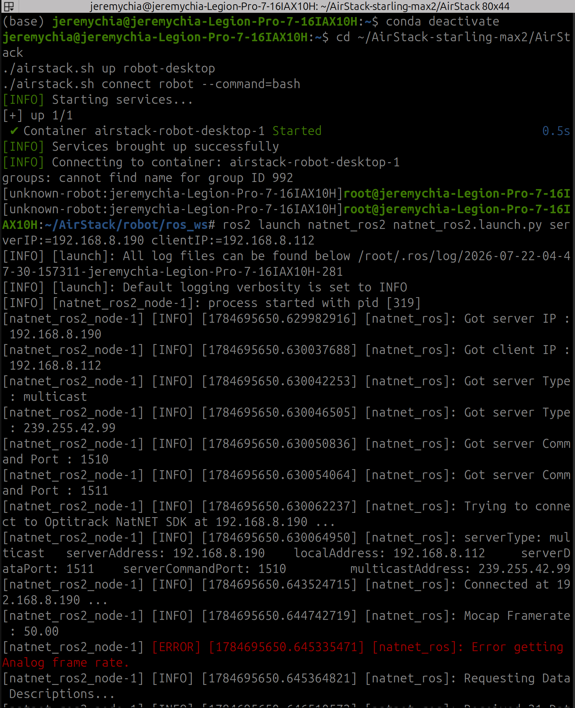

   …and the data descriptions arriving (`Configured!` / `Activated!`). **The rigid bodies the
   driver lists are exactly the ones defined in Motive** — that day only the old `cf*`
   Crazyflie bodies existed in Motive's project, so that's what appears; `drone_1` will show
   up here once it's created in Motive:

   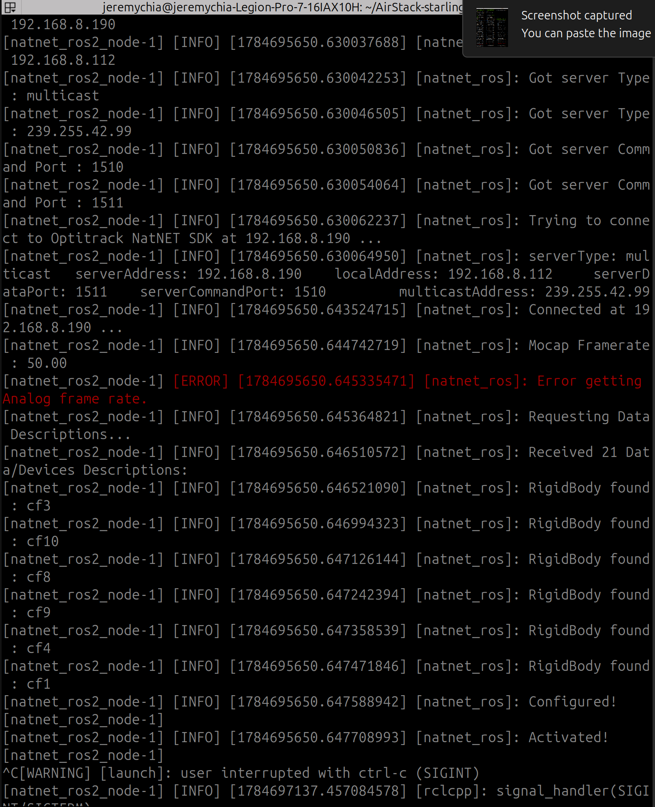

   > **About this driver:** it is the upstream
   > [L2S-lab/natnet_ros2](https://github.com/L2S-lab/natnet_ros2) package, vendored into
   > AirStack byte-identical (verified 2026-07-21 against upstream `883b095`) except three
   > launch defaults changed: `serverIP`/`clientIP` originally shipped as CMU's rig
   > (192.168.50.5/.2), but **since 2026-08-28 the vendored defaults ARE our hangar values
   > (192.168.9.124 / 192.168.9.107)** — the explicit override above is belt-and-braces,
   > not mandatory — and `pub_rigid_body` defaults `true`
   > (required — it makes the driver publish `/drone_1/pose`). No separate install or clone
   > of the driver is needed; it builds with `bws` and runs inside the robot container.

</details>

6. **EXIT TEST** — *superseded 2026-08-27 along with step 5: with `./mocap.sh` running, do
   the equivalent checks per [MOCAP.md](MOCAP.md). Legacy natnet-based test below (kept for
   reference).* Open a SECOND container shell (new terminal on the laptop, then):

<details>
<summary>Legacy natnet_ros2 procedure (superseded 2026-08-27 — kept for the record)</summary>

   ```bash
   cd ~/AirStack-starling-max2/AirStack
   ./airstack.sh connect robot --command=bash
   ```
   (This opens another shell into the SAME running container — both shells see the same
   topics.) Inside it:
   ```bash
   ros2 topic list | grep pose          # want: /drone_1/pose
   ros2 topic hz   /drone_1/pose        # want ≈ 50 Hz (our Motive's configured rate)
   ros2 topic echo /drone_1/pose --once # sane x,y,z for where the drone sits
   ```
   Hand-carry the drone around the volume — position must change smoothly, no jumps/NaNs.
   **Streaming + smooth = M2 complete.**

</details>

**What "running the full AirStack with mocap" means from here:** at M2, mocap-into-AirStack
is just the driver above — nothing else consumes `/drone_1/pose` yet, because the consumers
need the DRONE connected. The full chain (driver → `mocap_bridge` → drone's EKF2 → commander
→ RViz) lights up piece by piece: M3 connects the drone, M4 launches the commander with
`use_mocap:=true` (which starts `mocap_bridge` and feeds the pose to the drone), and M5's
hand-carry shows the whole loop in RViz. Nothing extra to run at M2.

Troubleshooting: no topic / 0 Hz → Motive not streaming, wrong `serverIP`, rigid body not
named `drone_1`, or an orphan process on 1510/1511. Only `/tf` and no `/drone_1/pose` →
`pub_rigid_body` is false (the vendored launch defaults it true).

(Done in earlier sessions: QGC AppImage on the laptop; standalone PX4 SITL build at
`~/PX4-Autopilot` for optional desk rehearsals.)

### M3 — Drone comms (props off)

**Goal:** the drone's PX4 streams its topics to the laptop over WiFi.

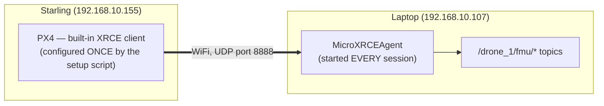
```mermaid
flowchart LR
  subgraph DRONE["Starling (192.168.10.155)"]
    PX4["PX4 — built-in XRCE client<br/>(configured ONCE by the setup script)"]
  end
  subgraph LAPTOP["Laptop (192.168.10.107)"]
    AG["MicroXRCEAgent<br/>(started EVERY session)"] --> T["/drone_1/fmu/* topics"]
  end
  PX4 == "WiFi, UDP port 8888" ==> AG
```

**Live values now maintained in [CONFIG.md](CONFIG.md) — check there first.** Record at time
of writing (2026-07-22): drone `starling2-max D0012` · WiFi SSID
**`AI.R STC Hangar-5G`** on interface **`mlan0`** (this VOXL has no `wlan0`; its hotspot is
`uap0` — never connect the laptop to it) · drone **192.168.10.155**, laptop WiFi
**192.168.10.107** — DHCP leases, re-check each lab day.

**Work log — what was actually done & debugged (2026-07-22):** drone prechecked healthy (PX4
running, 101 uORB topics; onboard VIO found ACTIVE → became M4's disable task; VOXL clock
unsynced). Getting the drone onto lab WiFi took the bulk of the session: `voxl-wifi station`
silently wrote a **corrupt config** (quoting bug with spaced SSIDs), the WLAN chip then
**wedged** (`Firmware Init Failed` — cured only by cold power cycle), the 2.4 GHz SSID proved
inaudible from the bench (joined the **-5G** sibling instead), and the config was finally
written manually via `wpa_passphrase` — after which the auto-enabled service Just Worked,
explaining every earlier boot failure. Result: drone auto-joins on boot, ping laptop↔drone
verified (7–22 ms). Full narrative: the retired `CLAUDE_NOTES.md` §3.5 (in git history); symptom→fix pairs: [TROUBLESHOOTING.md](TROUBLESHOOTING.md).

**Same day, second half — M3 done:** backups taken (drone `.FACTORY-ORIGINAL` copy + factory
file pulled to `drone-backups/voxl-px4-start.original-D0012`, committed), script pushed and
run (`voxl_setup_real_drone.sh drone_1 192.168.10.107 1 8888` — clean run, `.bak` created,
`voxl-microdds-agent` unit not present on this image so nothing to disable). Two red herrings
hit during the run — both explained under M3-A step 3's screenshot below. Agent started on
the laptop → session established, all 24 `/drone_1/fmu/*` topics materialized in the
container. **M3 exit passed.**

**Re-verification after the network change (2026-08-11):** WiFi moved to
`Mocap_QCGroundControl` (see M3-A step 1's update note); the laptop's new lease
`192.168.0.192` was baked into the drone with a clean re-run of the setup script; agent
restarted → `session established`, all 24 topics back, `px4-microdds_client status` =
`Running, connected` (payload tx ≈ 60 kB/s). **M3 exit re-passed.** Session findings:
`vehicle_status` streams at ~30 Hz but `ros2 topic echo` prints nothing (suspected px4_msgs
definition mismatch — §3c open issues); this container's `ros2 topic hz` does NOT accept
`--qos-reliability` (only `echo` does); prompt garbage `[:refused refused reached]` after
`connect` = the container .bashrc's robot-name DNS lookup failing against the new router —
cosmetic, `ROS_DOMAIN_ID` is still force-set to 1, ignore it.

#### M3-A · ONE-TIME drone setup (per drone) — D0012 status: ✅ ALL DONE 2026-07-22

What a **working USB link** looks like — `adb devices` lists the drone, `adb shell` lands in
the MODAL AI banner (drone identity, image version, current IPs):

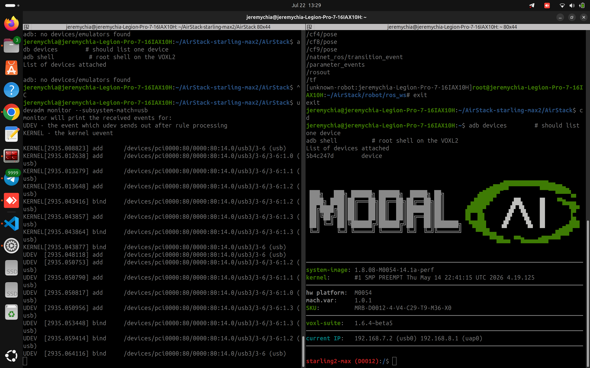

**1. Join the drone to the lab WiFi.**
> ✅ **ALREADY CONFIGURED on D0012 (2026-07-22):** the drone's WiFi role was **changed from
> factory default to lab-network client**:
> - **Before (factory):** the drone only acted as its own hotspot (`VOXL-1856926599`) — you
>   had to connect the laptop TO the drone.
> - **Now:** the drone **connects to the lab router itself**, auto-joining
>   **`AI.R STC Hangar-5G`** (→ `Mocap_QCGroundControl` since 2026-08-11, see the update
>   note below) on every boot (config in
>   `/etc/wpa_supplicant/wpa_supplicant-mlan0.conf`, started by the auto-enabled
>   `wpa_supplicant@mlan0` service) — so drone and laptop meet on the same network, like any
>   two devices on the LAN.
> - Technically it's dual mode: the old hotspot **still broadcasts** (on `uap0`,
>   192.168.8.1) — ignore it and **never connect the laptop to it** (its subnet collides
>   with the mocap LAN).
>
> Nothing to do per session — only redo this step if the lab SSID/password changes or for a
> new drone.

> ✅ **UPDATE 2026-08-11 — network changed:** the drone's station WiFi was moved to SSID
> **`Mocap_QCGroundControl`** using the stock helper, which WORKED:
> ```bash
> voxl-wifi station 'Mocap_QCGroundControl' '<PASSWORD>'
> ```
> The known `voxl-wifi` corruption bug only bites SSIDs containing SPACES — for space-free
> SSIDs `voxl-wifi station` is fine (proven this session). Read the drone's IP after joining
> with `ip addr show mlan0` or `voxl-my-ip` (VOXL helper).
> ⚠️ Consequence: changing networks changes the **LAPTOP's** IP too — re-run
> `voxl_setup_real_drone.sh drone_1 <new laptop IP> 1 8888` (step 3 below) and update
> [CONFIG.md](CONFIG.md) with the new addresses.

⚠️ When you DO need this step for an SSID **with spaces**: do NOT use `voxl-wifi station` —
on this image it corrupts the config when the SSID contains spaces (space-free SSIDs are safe
with the helper, see the 2026-08-11 update above). Proven manual method for spaced SSIDs
(drone, adb shell):

```bash
printf 'ctrl_interface=/var/run/wpa_supplicant\nupdate_config=0\n' > /etc/wpa_supplicant/wpa_supplicant-mlan0.conf
wpa_passphrase 'AI.R STC Hangar-5G' '<PASSWORD>' >> /etc/wpa_supplicant/wpa_supplicant-mlan0.conf
systemctl restart wpa_supplicant@mlan0
sleep 15; iw dev mlan0 link      # want: Connected (5 GHz association takes >10 s)
dhcpcd mlan0 && ip addr show mlan0
```

Survives reboots (the `wpa_supplicant@mlan0` service auto-starts).

For reference, the **factory state before this change** — `voxl-wifi getmode` showing
`Mode: softap`, `Station: Disabled`, hotspot active (right pane; natnet running on the left):

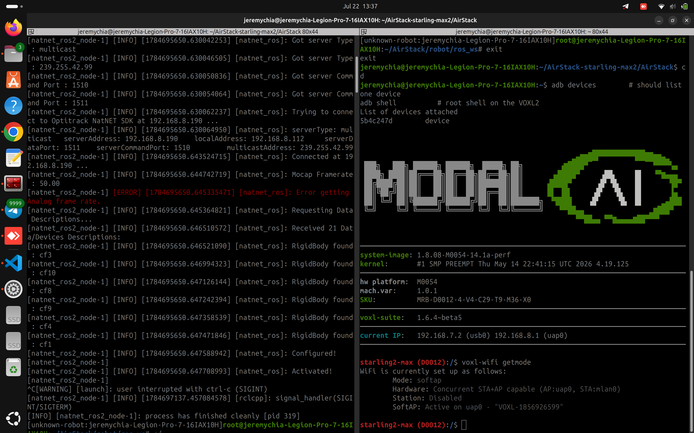

**2. Back up the file the setup script will edit:**

```bash
# on the DRONE (adb shell):
cp /usr/bin/voxl-px4-start /usr/bin/voxl-px4-start.FACTORY-ORIGINAL
```
```bash
# on the LAPTOP:
mkdir -p ~/AirStack-starling-max2/drone-backups
adb pull /usr/bin/voxl-px4-start ~/AirStack-starling-max2/drone-backups/voxl-px4-start.original-D0012
```
(Commit that pulled file to this repo afterwards — the drone's factory state, versioned.)

**3. Point PX4's client at the laptop** *(✅ done on D0012 2026-07-22 — do step 2's backups FIRST).*
⚠️ Understand what this does before running: the script **rewrites the drone's PX4 startup
file** (`/usr/bin/voxl-px4-start`) so PX4 streams to our laptop. It is reversible — see the
undo recipe below the code blocks.

```bash
# on the LAPTOP:
cd ~/AirStack-starling-max2/AirStack
adb push robot/ros_ws/src/svg_ground_control/scripts/voxl_setup_real_drone.sh /usr/bin/
```
```bash
# on the DRONE (adb shell):
chmod +x /usr/bin/voxl_setup_real_drone.sh
voxl_setup_real_drone.sh drone_1 192.168.10.107 1 8888
px4-microdds_client status        # want: connected, Agent IP = 192.168.10.107
```

The script rewrites the `microdds_client start` line of `/usr/bin/voxl-px4-start` (keeps a
timestamped `.bak` and self-restores if its edit fails verification), pins the DDS domain
**both** in the startup file **and as a flash-saved PX4 parameter**, and disables the drone's
own agent. Idempotent — re-run any time with a new IP.

⚠️ **Multi-drone rule:** when provisioning MORE THAN ONE drone, give each drone a **unique
DDS domain ID** (the script's 3rd argument) and its own distinct IP on the subnet —
`drone_1` uses domain 1.

What a **successful run** looks like (D0012, 2026-07-22) — note the two red herrings: the
script's own verification prints `PX4 server not running` because PX4 is still rebooting
(~30 s — just retry `px4-microdds_client status`), and the final `Running, disconnected` is
CORRECT at this point (the drone is dialing out; "connected" only happens once the laptop
agent is up, M3-B):

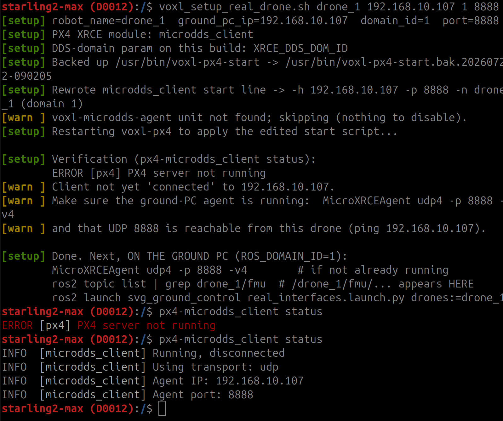

**Full revert to factory** (on the drone; note the param step — restoring the file alone
does NOT undo the flash-saved domain):

```bash
cp /usr/bin/voxl-px4-start.FACTORY-ORIGINAL /usr/bin/voxl-px4-start
px4-param reset UXRCE_DDS_DOM_ID 2>/dev/null || px4-param reset XRCE_DDS_DOM_ID
px4-param save
systemctl enable --now voxl-microdds-agent     # no-op on D0012 (unit doesn't exist on image
                                               # 1.8.08); on images that HAVE it, --now matters:
                                               # the script stops it, not just disables
systemctl restart voxl-px4
```

#### M3-B · EVERY session — laptop only, nothing to do on the drone
*(Per-session condensation of this + M4-B: [RUNBOOK.md](RUNBOOK.md) §B.)*

**First — check today's IPs (the router is DHCP, addresses drift between sessions):**

```bash
# LAPTOP's addresses — the WiFi one MUST still match what the drone dials:
ip -4 -brief addr                # wlp* (WiFi) want 192.168.10.107 — if changed → re-run M3-A
                                 # step 3 with the new IP; enp* (Ethernet) = mocap-side clientIP

# DRONE's address (needed only for diagnostics like ping — the drone dials the laptop,
# never the other way around). Two ways to read it:
adb shell ip -4 addr show mlan0  # via the USB cable (always works)
```

No cable plugged in? The drone's IP also appears in the **agent's own log** the moment it
connects — the `session established` line in the `MicroXRCEAgent -v4` output names the
client's address.

```bash
MicroXRCEAgent udp4 -p 8888 -v4      # inside the robot container; wait for "session
                                     # established"; LEAVE RUNNING (topics exist only while it runs)
```

What it looks like when the drone connects — the `session established` line names the drone's
IP:port, then a burst of `create_topic / create_publisher / create_datawriter` lines is the
drone building its `/drone_1/fmu/*` topics on the laptop:

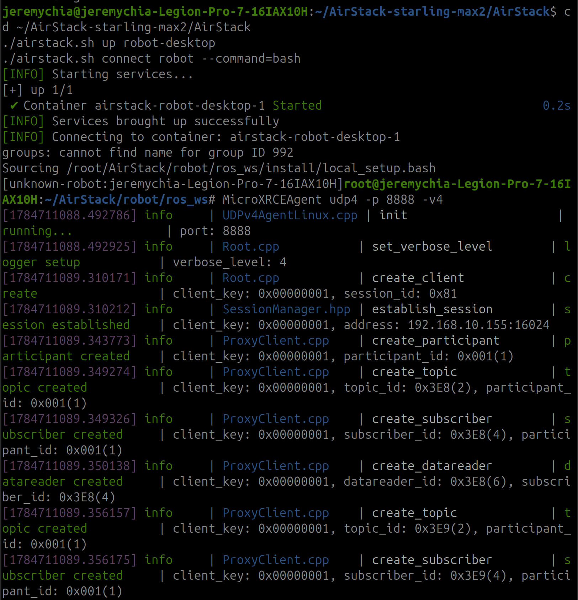

Verify in a second container shell (⚠️ the QoS flag is mandatory on all `/fmu/*` topics):

```bash
ros2 topic echo /drone_1/fmu/out/vehicle_status --qos-reliability best_effort --once
```

✅ **M3 exit:** `vehicle_status` messages arrive. (`/fmu/out/vehicle_odometry` already
publishes too, but with `quality: 0` and no usable position — EKF2 has no position source
until M4. Messages-with-no-position is the normal M3 state, not a fault.)
**Passed 2026-07-22** — session established, all 24 `/drone_1/fmu/*` topics on the laptop:

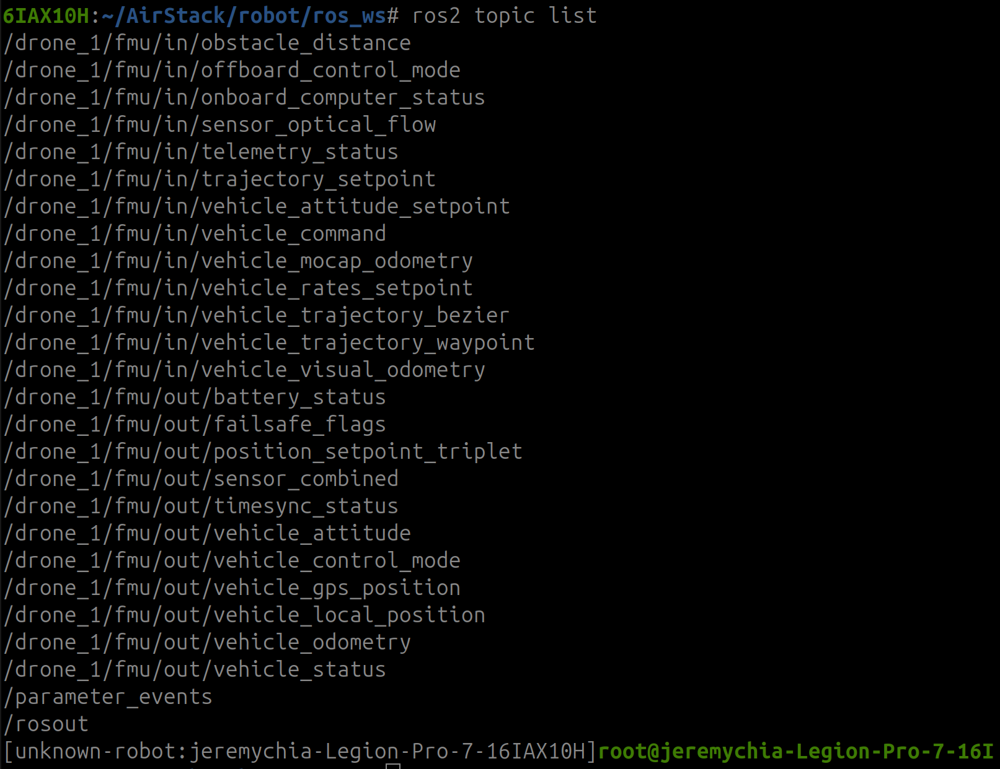

…and `vehicle_odometry` echoing live (position-less) messages, as expected pre-M4. The full
picture (drone shell left, agent top right, odometry echo bottom right):

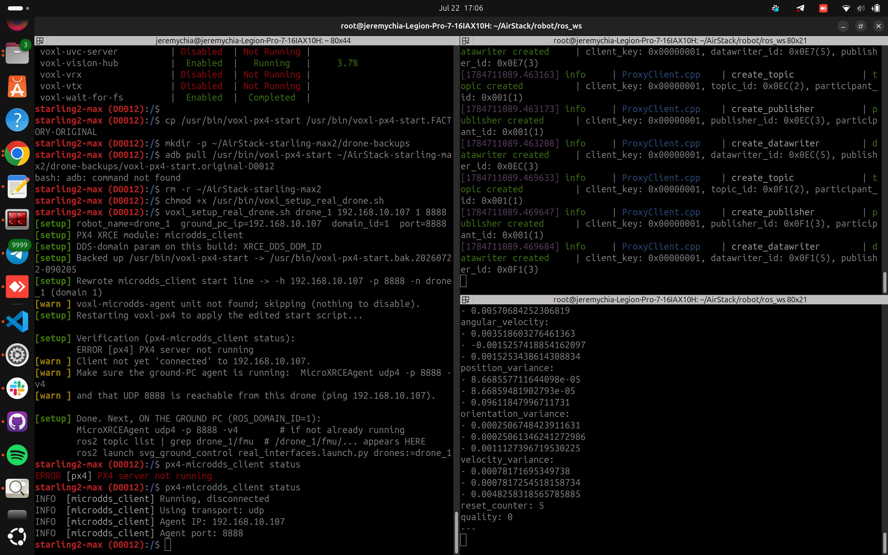

### M4 — Mocap → EKF2 (props off) (✅ VALIDATED 2026-08-28 — fusion + frame hand-check)

**Goal:** the drone's own state estimator (EKF2) fuses OptiTrack position — the arm-enabler
indoors (without a position source PX4 refuses to arm: "fuse failure").

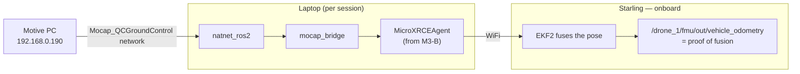
```mermaid
flowchart LR
  MO["Motive PC<br/>192.168.0.190"] -- "Mocap_QCGroundControl network" --> NA["natnet_ros2"]
  subgraph LAPTOP["Laptop (per session)"]
    NA --> BR["mocap_bridge"] --> AG["MicroXRCEAgent<br/>(from M3-B)"]
  end
  subgraph DRONE["Starling — onboard"]
    EK["EKF2 fuses the pose"] --> OUT["/drone_1/fmu/out/vehicle_odometry<br/>= proof of fusion"]
  end
  AG -- "WiFi" --> EK
```

#### M4-A · ONE-TIME drone setup — per drone, stored permanently in PX4 / systemd

> **⏩ FAST PATH (since 2026-09-04): load the whole parameter set from a file.** This repo
> ships [`starling_1_indoor_params.params`](starling_1_indoor_params.params) — a full QGC
> export of Starling 1's validated indoor setup (872 params, PX4 v1.14; includes the EKF2
> external-vision set, `RC_MAP_KILL_SW=8`, `COM_RC_OVERRIDE=1`, and the `MPC_THR_HOVER=0.165`
> retune). In **QGC (runs on the LAPTOP, outside docker)**: Vehicle Setup → Parameters →
> **Tools ⋮ (top-right) → Load from file** → pick the file → accept → **reboot PX4** (power
> cycle or QGC reboot). Then verify by read-back: spot-check `EKF2_EV_CTRL=11`,
> `RC_MAP_KILL_SW=8`, `EKF2_BARO_CTRL=0` in the Parameters search box — only a read-back
> counts (see ledger #7's lesson). The param-by-param steps below remain as reference and
> for understanding WHAT the file sets. ⚠️ The vision-hub conf step (`en_vio` false) is a
> drone-side file, NOT in the .params — still do it separately.

**1. EKF2 parameters** — set once via QGroundControl (**QGC runs on the laptop since
2026-09-01**, outside docker; it ran on the Mocap PC for the 2026-07-29 session below;
`px4-param` over adb also works); saved permanently
in PX4. Confirmed set (applied in the **2026-07-29** QGC session).

Full set + rationale: CONFIG.md §PX4/EKF2 + the .params file. Per-param notes CONFIG doesn't
spell out: `EKF2_EV_CTRL=11` sums bits 0+1+3 (horizontal pos + vertical pos + yaw; the
3D-velocity bit is deliberately left OFF); `EKF2_HGT_REF=3` selects vision as the height
reference source.

⚠️ **OUTDOOR revert:** when the drone returns to outdoor/GPS/VIO work, RE-ENABLE
`EKF2_BARO_CTRL` and `EKF2_MAG_TYPE` (and revert `SYS_HAS_MAG` / `EKF2_GPS_CTRL` as
appropriate).

Observed in the 2026-07-29 QGC session: `EKF2_EV_CTRL=11` and `EKF2_MAG_TYPE=None` already
applied; `EKF2_EV_DELAY` read **0.0 ms** then — subsequently set to **50 ms** in the
2026-09-04 `.params` export (the current canonical value).

**2. Turn off the onboard VIO feed** (confirmed needed on D0012: `voxl-open-vins-server` +
`voxl-vision-hub` are running = a competing external-vision source that would fight the mocap
inside EKF2). **Adopted method — CONFIG-BASED**, via the vision-hub config file on the drone
(`/etc/modalai/voxl-vision-hub.conf`). First check the defaults (`en_vio` was `true`,
`offboard_mode` at its default), then set:

- `"en_vio": false` — EKF2 uses the mocap state estimate instead of VIO;
- `"offboard_mode": "off"` — vision-hub must not inject offboard commands (AirStack's
  `px4_interface` commands the drone).

Edit with `vi` over adb shell or with `voxl-configure-vision-hub`, then:

```bash
systemctl restart voxl-vision-hub
```

*Alternative / legacy (NOT the adopted method):* disabling the services wholesale also
removes the competing source — `systemctl disable --now voxl-open-vins-server
voxl-vision-hub` (re-enable with `systemctl enable --now …` when the drone returns to
outdoor/VIO work). The config-file method above is what we use.

**3. Housekeeping:** the VOXL clock is years off (no NTP). Harmless for flight; sync it before
ever comparing drone logs against mocap recordings.

#### M4-B · EVERY session — laptop only

**Prereq: the M3-B agent must already be running** (in its own container shell) — without it
there are no `/fmu/*` topics and every check below is silent.

**1. Mocap driver** — **since 2026-08-28 this is the `./mocap.sh` bridge** (Motive set to
broadcast; natnet_ros2 replaced — see [MOCAP.md](MOCAP.md) for how to run and troubleshoot
it). Leave running. *Legacy natnet launch (superseded, kept for reference):*

<details>
<summary>Legacy natnet_ros2 procedure (superseded 2026-08-27 — kept for the record)</summary>

```bash
ros2 launch natnet_ros2 natnet_ros2.launch.py serverIP:=192.168.0.190 clientIP:=192.168.0.192
```

</details>

**2. Commander + mocap bridge** (second container shell). Leave running:

```bash
ros2 launch svg_ground_control ground_control.launch.py \
  config:=$(ros2 pkg prefix svg_ground_control)/share/svg_ground_control/config/swarm_real.yaml use_mocap:=true
```

**3. Verify the fusion chain, in → out** (third container shell):

```bash
ros2 topic hz  /drone_1/fmu/in/vehicle_visual_odometry   # bridge feeding (~50 Hz, our Motive rate)
ros2 topic echo /drone_1/fmu/out/vehicle_odometry --once --qos-reliability best_effort --qos-durability volatile
```

`out/vehicle_odometry` producing positions = **EKF2 is fusing**.

**✅ VALIDATED 2026-08-28 (AI.R STC hangar, drone_1 / D0012)** — the chain above ran
end-to-end:

- `./mocap.sh` bridge → `/drone_1/pose` @ 50 Hz in the robot container (step 1);
- `mocap_bridge` (step 2) forwarding to `fmu/in/vehicle_visual_odometry` — pose-only,
  quality 100, velocities NaN by design;
- **EKF2 IS FUSING** (step 3): `fmu/out/vehicle_odometry` positions match the mocap input
  within ~2 cm (verified sample: in `[0.454, -0.093, -0.071]` vs out
  `[0.454, -0.094, -0.086]`), velocities ≈ 0 at rest;
- RViz (`svg_drones.rviz`, Fixed Frame changed `map` → `world`; needs
  `real_interfaces.launch.py` running — see §7) tracks the hand-carried drone:


Full recording: [`videos/SVG_check_if_rviz_moves_by_movingdrone_manually.mp4`](videos/SVG_check_if_rviz_moves_by_movingdrone_manually.mp4).

Still pending before flight (unchanged): the frame hand-check below, `swarm_real.yaml`
3-drone → `drone_1` trim (M6), fence/RC-kill safety setup.

**4. FRAME HAND-CHECK — repeat before the FIRST flight of every lab day.**

Our mocap volume's world frame (photos, 2026-07-22): **red = x-axis ("East"), green = y-axis
("North" — the agreed forward for the hand-check), blue = z-axis up.** The floor marker is
the origin:

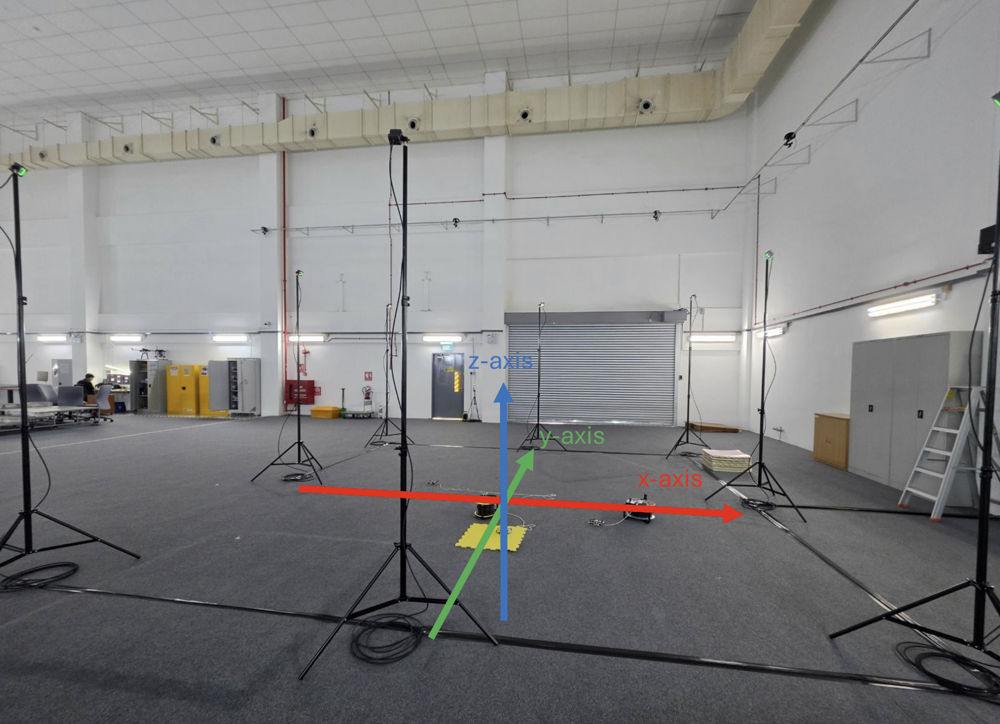

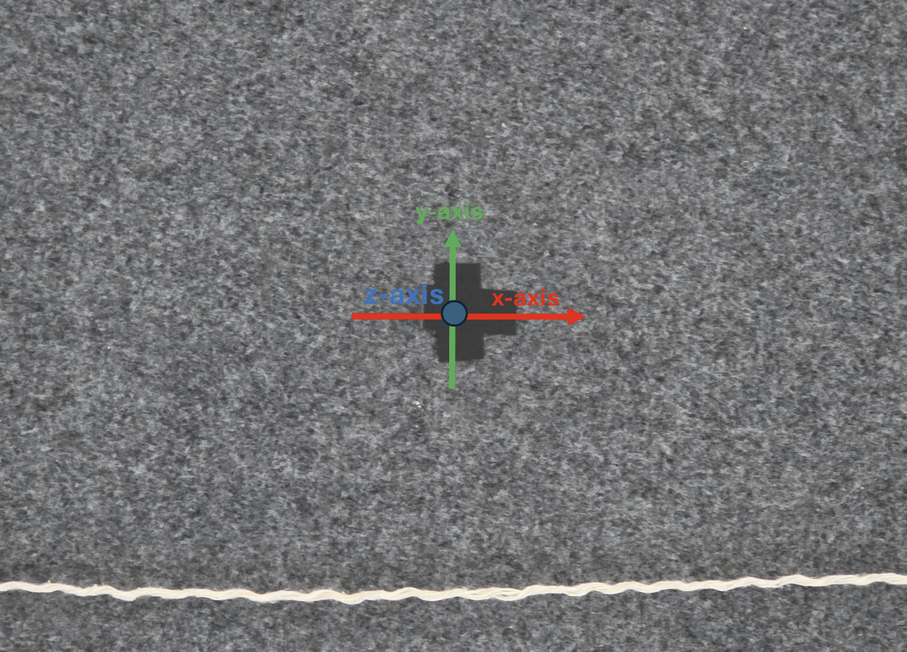

Carry the drone 1 m and watch `out/vehicle_odometry` (positions are NED — z is DOWN):

| Carry the drone… | `position[…]` must… |
|---|---|
| toward North (= the GREEN y-axis in the photos) | `[0]` **increase** |
| toward East (= the RED x-axis in the photos) | `[1]` **increase** |
| straight up | `[2]` **decrease** |

Mirrored or swapped → set `px4_vio_frame: "modalai_flip"` in `swarm_real.yaml` and re-check.
**A wrong frame flies the drone into a wall.**

✅ **M4 exit:** fusion verified + hand-check passes with correct axes. **MET 2026-08-28** (ledger #14, #16).

### M5 — Hand-carry preflight (nothing armed) (✅ VALIDATED 2026-08-28 — ledger #15; evidence GIF/video in repo)
```bash
ros2 launch svg_ground_control real_interfaces.launch.py drones:=drone_1
# commander idle (from M4) — do NOT call takeoff; RViz red sphere must track the carried drone
ros2 bag record /drone_1/pose /drone_1/odometry_conversion/odometry
```

### M6 — First flight (🟡 IN PROGRESS — FLOWN 2026-09-01; goal flights + fence ✅ 2026-09-03; sign-off pending)

Original plan (kept for reference):
- `swarm_real.yaml`: `drone_names: ["drone_1"]`, `drone_modes: "real"`, hover, fence inside the
  net, ≤ 1.0 m/s.
- PX4: RC kill mapped + tested; `COM_OBL_RC_ACT`; low-battery action.
- Preflight (mocap hz, odometry tracks reality, thumb on kill) → `takeoff` → hover → `land`.
- Post-flight: PlotJuggler diff `/drone_1/pose` vs `/drone_1/fmu/out/vehicle_odometry`.

#### M6-A · ONE-TIME RC transmitter setup (safety-critical)

**RC configuration as flown — extracted from [`starling_1_indoor_params.params`](starling_1_indoor_params.params) (2026-09-04, 16 channels, `COM_RC_IN_MODE=3`):**

| Channel | Function (PX4 param) | Notes |
|---|---|---|
| ch1 | Roll stick (`RC_MAP_ROLL`) | |
| ch2 | Pitch stick (`RC_MAP_PITCH`) | |
| ch3 | Throttle stick (`RC_MAP_THROTTLE`) | |
| ch4 | Yaw stick (`RC_MAP_YAW`) | |
| ch5 | **ARM switch** (`RC_MAP_ARM_SW`) | flipping it arms/disarms ("Armed/Disarmed by RC (switch)" in the PX4 console) |
| ch6 | **Flight-mode switch** (`RC_MAP_FLTMODE`, 3-position) | low = **MANUAL** (slot1=0) · mid = **POSITION** (slots3/4=2) · high = **OFFBOARD** (slot6=7) |
| ch8 | **KILL switch** (`RC_MAP_KILL_SW`) | the true motor cutoff — outranks everything |
| — | Offboard switch (`RC_MAP_OFFB_SW=0`) | deliberately UNMAPPED since 2026-09-04 (was ch8 — the kill-switch double-booking is resolved; offboard entry is now the ch6 high position or the software takeoff) |

⚠️ TODO (fill in — hardware-side, not in any param file): transmitter **make/model**, which
physical switch is ch5/ch6/ch8 (a labeled photo in `pictures/` is ideal), binding procedure,
transmitter battery care.

The RC kill switch is the only true motor cutoff (the geofence only freezes — see §4).
Stored in the transmitter + PX4 params, so once per drone/transmitter pairing — but the
ground check in step 4 must be repeated per step 5.

1. **Bind the transmitter to the drone's receiver** — hardware-specific (record the lab's
   transmitter model here: TODO).
2. **Calibrate sticks:** QGC → Vehicle Setup → Radio → run the stick calibration.
3. **PX4 parameters** (QGC → Parameters; cross-check the PX4 table in
   [CONFIG.md](CONFIG.md)):
   - `RC_MAP_KILL_SW = 8` — kill switch on channel 8 (✅ set + flight-verified 2026-09-01);
   - `COM_RC_OVERRIDE = 1` — sticks override AUTO modes only, NOT offboard;
   - `COM_OBL_RC_ACT = 1` — offboard-link loss → Position mode.
4. **Ground test — props OFF, drone strapped down:** arm via a software `takeoff`, flip the
   kill switch — motors must cut instantly.
5. ⚠️ **Never fly without repeating the kill ground-check (step 4) after ANY transmitter or
   receiver change** (rebind, model swap, channel remap).

**Work log — 2026-09-01 → 09-03 flight-test campaign (AI.R STC hangar, drone_1 / D0012,
single Starling):**

- **2026-09-01 — FIRST OFFBOARD FLIGHT** (ledger #17): takeoff + hover under
  `swarm_commander` with the mocap→EKF2 chain; RC kill switch mapped to **ch8** and RC
  takeover exercised in flight; manual landing.
- **2026-09-03 — goal flights** (ledger #18–19): `goal_single.yaml` single-goal flight
  (runtime waypoint via `/svg/drone_1/goal_command`), then `goal_tracking.yaml` multi-goal
  square — 4 corners via a `ros2 topic pub` loop, 2 laps.
- **2026-09-03 — GEOFENCE VALIDATED IN FLIGHT** on all configs (ledger #20): breach ⇒
  freeze-hover (stays armed); recovery via `land` → `reset_fence` → `takeoff`.
- **2026-09-03 — landing auto-disarm made reliable** (ledger #21): `land_speed_mps`
  0.3 → 0.6 (0.3 = slow bouncy touchdown that misses PX4's land-detector window →
  armed-on-ground; 0.6 plants firmly and auto-disarm fires). Configs committed.

Deviation from plan: the `swarm_real.yaml` 3-drone → `drone_1` trim was **deferred by lab
decision (2026-09-03)** — flights ran on the single-drone goal configs instead; the phantom
`drone_2`/`drone_3` WARNs are expected and harmless. Only **one** Starling exists, so
multi-drone is out of scope for now (the trim stays optional-but-recommended for
single-drone ops).

**Remaining for M6 sign-off:** one clean untethered takeoff → hover → land cycle end-to-end
(auto-disarm on touchdown, no RC intervention), plus the optional trim above.

**Flight logs:** live on the drone at `/data/px4/log/sessNNN/` (`ssh root@<drone>` —
password in [CONFIG.md](CONFIG.md)); pulled copies in `~/flight_logs/2026-09-01/`. ⚠️ The
drone clock can be unsynced, so QGC's log dates are wrong — match logs by **size**, not date.

#### M6 backlog — designed but NOT implemented (deliberately shelved 2026-09-03)

Three `swarm_commander.py` fixes were designed, then shelved after the `land_speed` 0.6 fix
proved sufficient. Full designs, the verified problems that motivate them, and revisit
triggers: [§8 — Backlog](#8-backlog--designed-but-deliberately-not-implemented).

## 7. Troubleshooting quick table

Moved to [TROUBLESHOOTING.md](TROUBLESHOOTING.md) (unified symptom index, 2026-09-07).

## 8. Backlog — designed but deliberately NOT implemented

> Three `swarm_commander.py` fixes were fully designed on 2026-09-03 (from flight-log
> forensics of the 09-01→03 sessions) and then **shelved by lab decision** after the
> `land_speed_mps 0.3→0.6` config change proved sufficient. This section preserves the
> designs so a future implementer doesn't re-derive them.
> **Revisit triggers:** any landing that leaves the drone armed on the ground · any move
> to multi-drone ops · wanting yaw control for camera-forward flight.
> All targets are in `AirStack/robot/ros_ws/src/svg_ground_control/` (Python edits need no
> rebuild — symlink-install — just Ctrl-C + relaunch the commander).

### Why these exist (the verified problems)

1. **Premature one-shot disarm** (`swarm_commander.py` ~736-741): on `land`, the commander
   sends ONE non-forced DISARM the instant mocap z ≤ 0.15 m — while still ~15 cm up and
   descending, so PX4 always denies it ("Disarming denied, not landed"). It then flips to
   IDLE and **stops streaming**, and whether the drone ends up disarmed depends on a race:
   PX4 flies the stale descent setpoint for ~1 s (`COM_OF_LOSS_T`); if its land detector
   (0.5 s of sustained low thrust) latches inside that window → auto-disarm ✅; if the gear
   bounces → offboard-loss → POSCTL fallback → hover-ish thrust on the ground → **armed
   forever** ❌. `land_speed 0.6` biases the race heavily toward ✅ but doesn't remove it.
2. **Control-authority leak**: the commander streams setpoints forever, and PX4 v1.14
   consumes `trajectory_setpoint` even in POSCTL/ALTCTL — so RC takeover is only clean
   into MANUAL (or kill). Also, any RC takeover leaves the commander stuck non-IDLE
   (fixed today by the "call `land` once" ritual).
3. **No yaw control**: the commander always publishes `angular.z = 0`; goals' orientation
   is ignored. The drone holds its takeoff heading for the whole flight.

**Hard constraint for all fixes:** the ground software CANNOT read PX4 state on this drone
(`vehicle_status` undecodable — px4_msgs v1.15 vs voxl-px4 v1.14). No `is_armed`, no
`nav_state`. Everything must be open-loop timers + explicit services, never mode-reactive.
Also: `px4_interface`'s `disarm()` service **always returns success** (fire-and-forget, no
ack check) — retries cannot be response-driven.

### Fix 1 — `LANDED_SETTLE` state (deterministic landing disarm)

- New `FlightState.LANDED_SETTLE` between LANDING and IDLE (enum at lines 69-74).
- Touchdown branch (~736-741) rewrite: on z ≤ `land_complete_altitude_m`, do NOT disarm —
  enter LANDED_SETTLE, record `settle_start`.
- While settling: **keep streaming ZERO velocity** (drone pressed on the ground at low
  thrust, still in offboard → land detector reliably latches; PX4's own auto-disarm
  usually fires right here). Publish raw zeros **bypassing the CBF** (a neighbor landing
  nearby must not make a grounded drone thrust); keep the drone in `positions` so others
  still avoid it.
- After `land_settle_duration_s` (default 3.0): send DISARM `disarm_retry_count` (3) times,
  `disarm_retry_period_s` (1.0) apart — open-loop (see constraint). Then IDLE, stop
  streaming, log honestly ("disarm sequence complete", not "disarmed").
- New params: `land_settle_duration_s`, `disarm_retry_count`, `disarm_retry_period_s`,
  reserve `land_settle_descent_mps` (default 0.0; small downward push if bench tests show
  zeros don't latch on bouncy gear).
- New `DroneHandle` fields: `settle_start`, `disarm_attempts`, `last_disarm_time`.
- Interactions (audited): fence must NOT freeze a settling drone (it only polices ACTIVE —
  already true); `hold`/`land` must not accept a settling drone (they list ASCEND/ACTIVE —
  already true); `takeoff` refused for ~6 s post-touchdown (acceptable, self-documenting).
- Safety floor: only non-forced disarms — an actually-airborne drone (bad mocap z) is
  simply denied, never dropped. Worst case = today's failure mode, never worse.
- Tests: all `test/functional_*.py` assert DISARM **membership** in commands_received, so
  retries are assertion-safe; first DISARM arrives 3 s later (timeouts have 20 s margin).
- Bench: props off, strapped — land on bench (immediate settle, count 3 disarms on
  `/drone_1/fmu/in/vehicle_command`, motors stop); hold-in-hand land (all 3 denied,
  commander still exits cleanly to IDLE); re-takeoff after.

### Fix 2 — `~/release` Trigger service (clean RC handover)

- Register next to takeoff/start/hold/land/reset_fence (~line 390).
- Handler: `mission_active=False`; for every drone: state=IDLE, clear arming/settle
  bookkeeping, `hold_target = takeoff_target.copy()`; `scenario.reset()` (add a 3-line
  `reset()` to `GoalScenario` restoring stashed initial goals — the only `scenarios.py`
  touch). Single-threaded executor ⇒ publishing stops on the next tick, no flag needed.
- Response/log must warn: *"setpoint stream stopped; PX4 (if in offboard) hits
  offboard-loss in ~1 s and falls back per COM_OBL_RC_ACT (=1 → Position). Be ready on RC."*
- Do NOT touch `fence_breached` (that's `~/reset_fence`'s job); do NOT send any disarm.
- Also fixes: post-RC-takeover stuck-non-IDLE (release resets to IDLE — replaces the
  "call land once" ritual).
- Consider pairing with a `px4_interface.cpp` heartbeat timeout (stop publishing
  `offboard_control_mode` when no setpoint for >0.5 s — also fixes "commander crash leaves
  drone in offboard with stale setpoints"): members + ~6 lines in
  `interface/px4_interface/src/px4_interface.cpp` (~205, ~507), needs `bws`.
- Bench: takeoff on bench → `release` → `topic hz` on the setpoint goes silent within a
  tick → QGC shows offboard-loss → Position → RC responds → `takeoff` accepted again.

### Fix 3 — param-gated yaw control

- Interface side already wired: `px4_interface.cpp:279` maps `twist.angular.z` → PX4
  `yawspeed` (with ENU→NED negation).
- Params: `yaw_control_enabled` (default **False** — zero behavior change until enabled),
  `yaw_kp` (1.0), `yaw_rate_max_rps` (0.5).
- `odometry_callback`: extract yaw from the quaternion → `drone.yaw`.
- `goal_callback`: if the goal's quaternion is valid and non-identity, store
  `desired_yaw` (identity/zero → None — every existing xyz-only publisher stays inert).
- Publish loop: only when enabled AND state==ACTIVE AND desired_yaw set:
  `angular.z = clip(yaw_kp * wrap_pi(desired_yaw - yaw), ±yaw_rate_max_rps)`; all other
  states publish 0 (takeoff/land stay yaw-quiet). CBF is 3-DOF linear — untouched.
- Optional mode: `yaw_follow_velocity` — face direction of travel via `atan2(vy, vx)`.
- Bench: enabled, armed, props off, strapped: 90° yaw goal → `angular.z` clamps at +max
  with correct sign; rotate the drone by hand toward the target → `angular.z` ramps to 0,
  no sign flip. Then disable the param → exactly 0 with a yawed goal.

### Order & effort

Fix 1 → Fix 2 (release must clear Fix 1's new fields) → run the sim functional tests →
Fix 3 as its own revertable commit. Roughly 15 / 25 / 30 lines respectively, one file each
(plus the optional px4_interface heartbeat pair for Fix 2).
