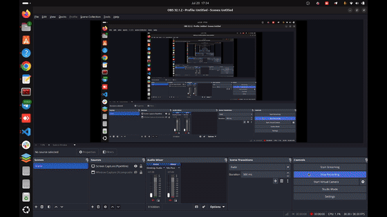

# Starling Max 2 × AirStack — Lab Notes

Working notes, milestone plan, runbooks, and local patches for flying a ModalAI **Starling
Max 2** live under **CMU AirStack** (branch `daniel/diffaero_ground_control`) with
**OptiTrack + Motive** mocap.

| File | What it is |
|---|---|
| [MILESTONES.md](MILESTONES.md) | Canonical milestone plan + runbooks + troubleshooting (source of truth) |
| [CLAUDE_NOTES.md](CLAUDE_NOTES.md) | Full session handoff for AI-assisted sessions: history, findings, machine state, gotchas |
| [patches/](patches/) | Local fixes not yet upstream (apply to a fresh AirStack checkout with `git apply`) |
| [tools/make_milestones_doc.py](tools/make_milestones_doc.py) | Generates the Word (.docx) export of the milestone plan (`pip install python-docx`) |
| [assets/](assets/) · [videos/](videos/) | GIFs (embedded in MILESTONES.md) and source screen recordings of Milestone 1 |

## Whose document is whose

There are two separate places documentation lives, written by two different groups:

**1. Written by us — stored here in `starling-airstack-notes` (everything you see in this
repo):** `README.md`, `MILESTONES.md`, `CLAUDE_NOTES.md`, `patches/`, `tools/`. Our objective,
our milestone structure, our lab's IPs/hardware, our findings and fixes.

**2. Written by CMU — stored inside the AirStack code itself** (they are part of the code you
clone from CMU; on the lab laptop that means inside `~/AirStack-diffaero/`, and they are not
copied into `starling-airstack-notes`):

- `~/AirStack-diffaero/robot/ros_ws/src/svg_ground_control/experiment.md` — **CMU's maintained
  command reference** for the SVG ground-control experiments (Parts A–D: sim, real-drone
  bring-up, tasks, first flight). The source of truth for command-level detail; written for
  CMU's rig, so substitute our IPs/names.
- `~/AirStack-diffaero/robot/ros_ws/src/svg_ground_control/README.md` — CMU's package overview
  (architecture, scenarios, CBF, safety notes).

When our runbooks and CMU's guide disagree, trust CMU's `experiment.md` for commands and
`starling-airstack-notes` for lab-specific substitutions and lessons learned.

## Milestone 1 at a glance



*Three SITL drones under the SVG ground controller: `takeoff` → hover scenario → `land`
(RViz view, 2× speed). See [MILESTONES.md](MILESTONES.md) for the geofence-breach clip and
the full runbook.*

## Patches — bug fixes we made to AirStack (backup copies)

While getting AirStack working, we found and fixed **two bugs in CMU's code**. The fixed code
runs on the lab laptop (in `~/AirStack-diffaero`) — **nothing in this folder needs to be run
for the lab laptop; it is already fixed there.**

The `patches/` folder holds a **backup copy of each fix** as a small text file (a git
"patch" — a file that records exactly which lines of which file were changed, so git can
re-apply the same change to another copy of the code). We keep them because anyone who
downloads AirStack fresh from CMU's GitHub **gets the bugs again** — CMU has not merged the
fixes yet. With these files, a new setup re-applies both fixes in seconds instead of
re-debugging them.

| Patch file | Bug it fixes | Symptom without the fix |
|---|---|---|
| `0001-zed-camera-info-init-race.patch` | Camera startup race in the Isaac Sim Pegasus extension | The drone's right stereo camera randomly never publishes → navigation flies "blind" and becomes erratic (took us days to diagnose) |
| `0002-swarm-commander-logger-severity-crash.patch` | Logging crash in the SVG ground controller | The ground-controller process **dies mid-flight** the first time any drone command fails |

### Setting up AirStack on a NEW machine (clone → fixes → build)

You do NOT need any of this on the lab laptop — it is already set up. This is the recipe for
a teammate's PC or a re-install. Steps 1–2 and 4–6 are copy-paste; step 3 needs files from an
existing machine.

```bash
# 1. Download CMU's code. daniel/diffaero_ground_control is the ONLY branch with the
#    ground controller + mocap pipeline (main/develop do not have it).
git clone -b daniel/diffaero_ground_control https://github.com/castacks/AirStack.git ~/AirStack-diffaero
cd ~/AirStack-diffaero
git submodule update --init
#   (submodules = sub-folders that are their own git repos, downloaded separately.
#    Do NOT use "git clone --recurse-submodules": other branches reference private
#    repos and the recursive download fails.)
```

```bash
# 2. One-time host setup (skip any part already on the machine).
#    Requires: Ubuntu 22.04+, an NVIDIA GPU with a recent driver (Isaac Sim needs it).
./airstack.sh setup      # puts the "airstack" command on your PATH — open a NEW terminal after
airstack install         # installs Docker Engine + NVIDIA Container Toolkit (asks for sudo)
docker info              # verify Docker runs (start it with: sudo systemctl start docker)
```

**3. Copy two config files git does not carry** (credentials / machine config — CMU keeps
them out of git on purpose). Get them from an existing lab machine, or create them from the
`*_TEMPLATE` files sitting next to them:

- `simulation/isaac-sim/docker/omni_pass.env`
- `simulation/isaac-sim/docker/user.config.json`

```bash
# 4. Apply our two bug fixes (the patches in this repo — see table above).
#    EDIT the NOTES path if you cloned this repo somewhere else:
NOTES=~/Documents/GitHub/starling-airstack-notes
git -C simulation/isaac-sim/extensions/PegasusSimulator apply "$NOTES/patches/0001-zed-camera-info-init-race.patch"
git apply "$NOTES/patches/0002-swarm-commander-logger-severity-crash.patch"
echo "both fixes applied"
#   (fix 1 uses "git -C <folder>" because PegasusSimulator is a submodule — the patch
#    must be applied from inside that folder. Both patches verified against the branch
#    as of 2026-07-20.)

# 5. Build the robot Docker image. REQUIRED on this branch: it bakes in MicroXRCEAgent
#    (the real-drone link) and pins the ROS domain — a plain "up" without this is broken.
./airstack.sh image-build robot-desktop
#    (other images — isaac-sim, gcs — download automatically on first "up";
#     isaac-sim additionally needs the Omniverse credentials from step 3)

# 6. Check the settings file, then start the stack and compile the code:
grep -E '^(COMPOSE_PROFILES|AUTOLAUNCH|NUM_ROBOTS)' .env
#   want: COMPOSE_PROFILES="desktop,isaac-sim"  AUTOLAUNCH="false"  NUM_ROBOTS="1"
./airstack.sh up
./airstack.sh connect robot --command=bash
#   then INSIDE the container:  cd ~/AirStack/robot/ros_ws && bws     (first build ~4 min)
```

From here, follow the Milestone 1 runbook in [MILESTONES.md](MILESTONES.md) §5 to fly the
simulator, or CMU's own guide (`robot/ros_ws/src/svg_ground_control/experiment.md`) for
everything else.

**These files become unnecessary** once CMU merges the fixes into their repo — fix 1 is
already on their `fix/camera-init` branch awaiting review; fix 2 we still need to report to
them. When both are merged upstream, delete this folder.

## Security note

`omni_pass.env` (Omniverse credentials) and `user.config.json` are deliberately **not** in this
repo — they are machine-local and gitignored upstream for a reason. Copy them between checkouts
by hand.
