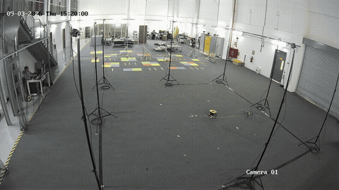
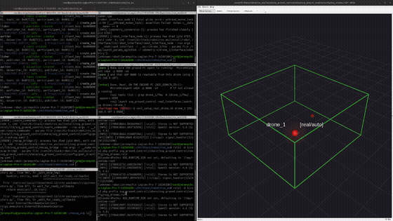
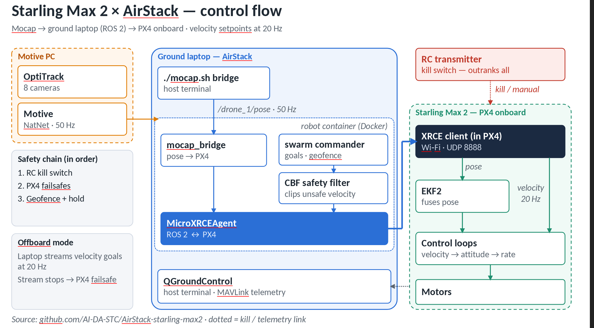
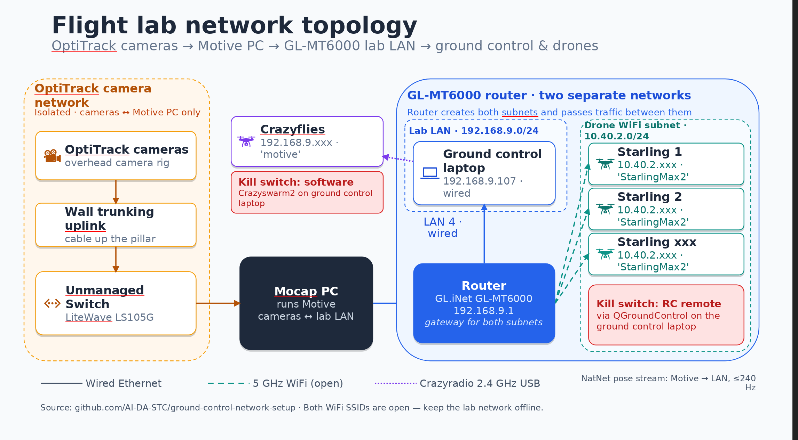

# AirStack-starling-max2 — Starling Max 2 × AirStack lab repo

Everything for flying a ModalAI **Starling Max 2** live under **CMU AirStack** (branch
`daniel/diffaero_ground_control`) with **OptiTrack + Motive** mocap: our notes, milestone
plan, bug-fix patches, demo recordings, **and a complete known-good snapshot of the AirStack
code itself**.

## ✈️ Showcase — autonomous waypoint flight, validated 2026-09-03

The drone below is flying itself. No pilot is touching sticks: ceiling cameras track it,
the ground laptop fuses that into PX4's state estimator, and the swarm commander flies it
through operator-published waypoints — takeoff, goal tracking, geofence, landing, and
auto-disarm all under software control (RC kill switch armed in hand throughout).

| Drone's-eye view (12× speed) | What the software sees — RViz (4× speed) |
|---|---|
|  |  |
| [full video](videos/Starling_goal_tracking_drone.mp4) | [full video](videos/Starling_goal_tracking_RVIZ.mp4) |

**What's been achieved so far** (details: [MILESTONES.md](MILESTONES.md)):

- **2026-09-01 — first offboard flight**: takeoff + hover fully under AirStack command,
  position from OptiTrack mocap (no GPS, no VIO), RC kill switch verified in flight.
- **2026-09-03 — waypoint flights**: runtime goals published over ROS 2 (single goal +
  a multi-goal square, 2 laps), **in-flight geofence** validated (breach ⇒ freeze-hover,
  clean recovery), reliable landing auto-disarm.
- The full toolchain to reproduce it is in this repo: mocap bridge ([MOCAP.md](MOCAP.md)),
  session runbook ([RUNBOOK.md](RUNBOOK.md) §B/§C), drone parameter set
  ([`starling_1_indoor_params.params`](starling_1_indoor_params.params)), and every
  lesson learned along the way ([MILESTONES.md](MILESTONES.md)).

> **New here? Read in this order:**
>
> - **Newcomer** → the one-page primer (next section) → run the sim ([RUNBOOK.md](RUNBOOK.md) §A)
>   → [MOCAP.md](MOCAP.md) → [PREFLIGHT.md](PREFLIGHT.md) → shadow a real session
>   ([RUNBOOK.md](RUNBOOK.md) §B) with a trained person.
> - **Flying today** → [RUNBOOK.md](RUNBOOK.md)
> - **Setting up a new drone** → [DRONE_SETUP.md](DRONE_SETUP.md)
> - **At the Motive PC** → [MOTIVE.md](MOTIVE.md)
> - **Something's broken** → [TROUBLESHOOTING.md](TROUBLESHOOTING.md)
> - **Starting an AI-assisted session** → [CLAUDE.md](CLAUDE.md)
> - **Any unfamiliar term** → [GLOSSARY.md](GLOSSARY.md)

## How the system works (one-page primer)

**PX4 is the pilot, AirStack is mission control, and the RC kill switch outranks both.**

| | Decides | Where it runs |
|---|---|---|
| **AirStack** (swarm commander) | *where to go* — takeoff, goals, hold, land | ground laptop |
| **PX4 autopilot** | *how to fly* — stabilization, motors, EKF2 state estimation, failsafes | on the drone |
| **RC pilot** | emergency veto — kill switch, mode override | your hands |

We use a **thin slice** of AirStack: our **`./mocap.sh bridge`** (runs on the laptop —
see [MOCAP.md](MOCAP.md)) feeding the mocap→PX4 bridge,
the laptop↔PX4 link (uXRCE-DDS), and the swarm commander with its CBF safety filter
(Control Barrier Function — a math filter that clips unsafe velocity commands) and geofence.
The planner/perception layers stay dormant here; those belong to AirStack's outdoor missions,
where planning runs on the drone's own computer.
*(AirStack's own mocap driver, [`natnet_ros2`](https://github.com/L2S-lab/natnet_ros2), stays
vendored in the snapshot but is unused on our rig — our Motive broadcasts, which it can't
hear; full story in [MOCAP.md](MOCAP.md) §3.)*



**How the laptop↔drone leg works:** the laptop repackages everything into PX4's native
message format (`px4_msgs`), and the **MicroXRCEAgent** program ships those messages over
WiFi to a tiny **client built into PX4 itself** — so no ROS runs on the drone, and there is
nothing to install on it. The laptop does **no state estimation and no stabilization** — it
is a courier for mocap poses and a source of velocity goals. (Both streams cross the lab
LAN — networking preconditions verified in M2.)

**Offboard mode** = PX4 outsources goal-generation to an external computer that must stream
setpoints continuously (≥2 Hz; ours: 20 Hz). Stream stops → PX4 failsafes; it never tumbles.
Onboard modes (Position/Hold/Mission…) = PX4 makes its own goals, fully self-contained.
*(Unrelated naming collision: `AUTONOMY_ROLE=onboard/offboard` in the compose files means
"which computer runs the software".)*

PX4's control is a 4-loop cascade —
`laptop velocity setpoint 20 Hz → VELOCITY ~50 Hz → ATTITUDE ~250 Hz → RATE ~1000 Hz → motors`,
everything after the first arrow running **onboard**, with the POSITION loop (~50 Hz)
bypassed because the laptop is doing that job. An offboard setpoint injects at ONE level,
bypassing only what is above it. We inject **velocity**, so everything that keeps the aircraft upright
stays onboard — WiFi hiccups are survivable, and agility is bounded (responsive, not
acrobatic; aerobatics would need attitude/rate streaming, which WiFi can't support).

**Safety chain, in authority order:**
1. **RC kill switch** — the only true motor cutoff.
2. **PX4 failsafes** — offboard-loss, low battery, RC override; PX4 can always fly itself.
3. **Commander geofence + hold** — software freeze-in-place, not a cutoff.

"The drone doesn't decide" holds only while everything is healthy — on any failure, deciding
snaps back onboard by design.

## Flight-lab network architecture



**Current topology (since 2026-08-27):** the OptiTrack camera rig sits on its own
**isolated camera network** — the overhead camera rig runs wall-trunking up the pillar to an
unmanaged LiteWave LS105G switch that talks only to the cameras and the **Mocap PC**; that
traffic never touches the lab LAN. The Mocap PC runs Motive and bridges the cameras to the
lab LAN, broadcasting the NatNet pose stream there (≤240 Hz; ours runs at 50 Hz). A
**GL.iNet GL-MT6000 router at `192.168.9.1`** creates and routes between two subnets: the
**lab LAN `192.168.9.0/24`** — where the ground-control laptop is wired in on LAN port 4
(`192.168.9.107`) and the Mocap PC lives — and the **`10.40.2.0/23` drone segment**
(gateway `10.40.2.1`), where the **Starlings** sit on WiFi SSID **`StarlingMax2`**
alongside the laptop's own WiFi NIC (`10.40.2.107`). Crazyflies stay on the lab LAN
(`192.168.9.x`, SSID `motive`).

> ⚠️ **Check the drone's actual address before every session** — [CONFIG.md](CONFIG.md) is
> the tie-breaker over this picture. The drone *dials the laptop*, so the laptop IP baked
> into it must be reachable from the drone's segment: the laptop's WiFi NIC
> (`10.40.2.107`) is same-subnet, and the router also routes to its wired `192.168.9.107`.
> Confirm with a ping from the drone before flying — a stale or unreachable value means
> [RUNBOOK](RUNBOOK.md) §B step 3 never gets `session established`.

The router serves both drone SSIDs open on 5 GHz **channel 36**. Crazyflies (also
`192.168.9.x`, SSID `motive`) are commanded over a **Crazyradio 2.4 GHz USB dongle** with a
Crazyswarm2 **software kill switch**, independent of WiFi; Starlings are commanded over
WiFi (uXRCE-DDS / MAVLink) with an **RC-remote hardware kill switch** plus QGroundControl
on the laptop. Exact per-device values (IPs, ports, static leases, SSIDs) live in
[CONFIG.md](CONFIG.md)'s network table — treat that as the single source of truth, since
several are DHCP-drifty until static leases land. The data path across this network
(cameras → Motive → bridge → EKF2) is exactly what the control-flow diagram in the primer
above draws.

**Security note:** both SSIDs are open (no WPA) — keep the lab network offline / air-gapped
from the internet and any untrusted network.

Router configuration and how to reproduce this setup:
[AI-DA-STC/ground-control-network-setup](https://github.com/AI-DA-STC/ground-control-network-setup).

The earlier two-router topology (the `Mocap_QCGroundControl` D-Link setup, 2026-08-11) is
preserved, prose-only, in the [appendix](#appendix--historical-reference) at the bottom of
this file.

| File / folder | What it is |
|---|---|
| [RUNBOOK.md](RUNBOOK.md) | **START HERE each session** — the fast path, commands only, no background: sim (§A), real drone (§B), goal flights (§C ✅ validated 09-01→03), post-flight (§D) |
| [CONFIG.md](CONFIG.md) | **Single source of truth for lab values** (IPs, SSID, ports, names — all DHCP-drifty until static leases) + what to do when one changes |
| [TROUBLESHOOTING.md](TROUBLESHOOTING.md) | **Symptom-indexed fixes — start here when something misbehaves** |
| [GLOSSARY.md](GLOSSARY.md) | Plain-English definitions of every recurring term (mocap, EKF2, offboard, DDS domain…) — linked from every doc |
| [MOCAP.md](MOCAP.md) · [mocap.sh](mocap.sh) · [mocap/](mocap/) | **How the drone knows where it is** — layman's guide to our OptiTrack pipeline, and the `./mocap.sh` bridge that replaced natnet_ros2 (our Motive broadcasts; the official SDK can't hear it — full story inside, verified 2026-08-27) |
| [MILESTONES.md](MILESTONES.md) | The plan **and the work log**: per-milestone status, what was done & debugged so far, one-time setup procedures |
| [PREFLIGHT.md](PREFLIGHT.md) | **Print + laminate for the hangar** — pre-flight checklist, emergency ladder (hold → land → KILL), iron rules |
| [MOTIVE.md](MOTIVE.md) | Motive-PC operator guide — calibration, rigid bodies, streaming pane, and why the mocap origin must be treated with respect |
| [DRONE_SETUP.md](DRONE_SETUP.md) | Provision a NEW Starling from the box — one ordered checklist (WiFi → comms script → params file → Motive body → kill test) |
| [BACKLOG.md](BACKLOG.md) | Designed-but-shelved `swarm_commander.py` fixes (landing-disarm settle, `release` service, yaw control) — full implementation designs + revisit triggers |
| [`starling_1_indoor_params.params`](starling_1_indoor_params.params) | Canonical drone parameter set (872-param QGC export, 2026-09-04) — load via QGC, procedure in MILESTONES M4-A |
| [CLAUDE.md](CLAUDE.md) | AI-session entry point — read order, iron flight rules, two-clone warning |
| [CLAUDE_NOTES.md](CLAUDE_NOTES.md) | Full session handoff for AI-assisted sessions: complete history, findings, machine state, gotchas |
| [AirStack/](AirStack/) | **Full AirStack code snapshot** (2026-07-20, bug fixes applied, submodules included) — see its own [README](AirStack/README.md) |
| [patches/](patches/) | Our bug fixes as patch files — two AirStack fixes (already applied in `AirStack/`) + the libmotioncapture NatNet-4.2 fix (`mocap.sh setup` applies it); full story in the [appendix](#appendix--historical-reference) |
| [tools/make_milestones_doc.py](tools/make_milestones_doc.py) | Word (.docx) export generator — **legacy** (pre-migration paths); [MILESTONES.md](MILESTONES.md) is canonical |
| [assets/](assets/) · [videos/](videos/) | GIFs (embedded here + in MILESTONES.md) and source recordings — M1 sim demos, the M5 hand-carry tracking check, and the 09-03 goal-tracking flight (drone + RViz POV) |
| [pictures/](pictures/) | The two current architecture diagrams (control-flow, network topology — both embedded above) plus bring-up evidence screenshots (NatNet working, drone topics, MicroXRCEAgent connection, mocap axis checks) |

## Whose document is whose

There are two separate places documentation lives, written by two different groups:

**1. Written by us:** `README.md`, `RUNBOOK.md`, `CONFIG.md`, `MOCAP.md`, `MOTIVE.md`,
`PREFLIGHT.md`, `DRONE_SETUP.md`, `TROUBLESHOOTING.md`, `GLOSSARY.md`, `MILESTONES.md`,
`BACKLOG.md`, `CLAUDE.md`, `CLAUDE_NOTES.md`, `patches/`, `tools/`
— our objective, our milestone structure, our lab's IPs/hardware, our findings and fixes.

**2. Written by CMU — everything inside the [`AirStack/`](AirStack/) folder** (it is a
snapshot of their code; the live working copy is `~/AirStack-starling-max2/AirStack/`). Their key
guides, well worth reading:

- [`AirStack/robot/ros_ws/src/svg_ground_control/experiment.md`](AirStack/robot/ros_ws/src/svg_ground_control/experiment.md)
  — **CMU's maintained command reference** for the SVG ground-control experiments (Parts A–D:
  sim, real-drone bring-up, tasks, first flight). The source of truth for command-level
  detail; written for CMU's rig, so substitute our IPs/names.
- [`AirStack/robot/ros_ws/src/svg_ground_control/README.md`](AirStack/robot/ros_ws/src/svg_ground_control/README.md)
  — CMU's package overview (architecture, scenarios, CBF, safety notes).

When our runbooks and CMU's guide disagree, trust CMU's `experiment.md` for commands and our
documents for lab-specific substitutions and lessons learned.

## The milestones, in brief

The project is split into six milestones. Each one adds and proves **one new piece** of the
flight-day system before the next builds on it — so when something fails, we always know
which piece broke. Simulation proves the software, props-off stages prove the connections,
hand-carry proves the position tracking, and only then do propellers spin.

| # | Milestone | One-line goal | Status |
|---|---|---|---|
| 1 | Sim rehearsal | Fly simulated drones with the exact software and commands used on the real drone | ✅ **Validated by us** (2026-07-20) |
| 2 | Ground-station prep | Laptop networking, Motive/OptiTrack settings, clock sync — no drone needed | ✅ Desk half 2026-07-21; mocap-room half 2026-08-27/28 (via the `mocap.sh` bridge) |
| 3 | Drone comms (props off) | Real drone's PX4 talking to the laptop over WiFi | ✅ **Validated by us** (2026-07-22; re-verified 2026-08-11) |
| 4 | Mocap → drone (props off) | OptiTrack position fused into the drone's state estimator, axes verified | ✅ **Validated by us** (2026-08-28) |
| 5 | Hand-carry preflight | Carry the drone around; the software's belief must track reality | ✅ **Validated by us** (2026-08-28) |
| 6 | First flight | Takeoff, hover, land inside the net under AirStack command | 🟡 **FLOWN** 2026-09-01 — first offboard takeoff + hover; goal flights + in-flight geofence ✅ 2026-09-03; sign-off = one clean untethered cycle |

Live status: [MILESTONES.md](MILESTONES.md) §3.

**Important context on the statuses:** CMU already built AND flight-tested all of this on their
own Starling 2 Max — our project is **replication and validation**, not development. A code
audit (2026-07-20, details in [MILESTONES.md](MILESTONES.md) §3b) confirmed every mechanism for
M3–M6 exists in the `AirStack/` code — the drone-comms setup script, the laptop↔drone link,
the mocap driver and bridge, the flight services, and the geofence (each explained in the
primer above).
The only things NOT in code (manual, by design) are: clock sync between machines, the
OptiTrack/Motive settings, and PX4-side parameters set through QGroundControl (EKF2
external-vision settings, RC kill switch, failsafes).

Full plan with commands and exit criteria: [MILESTONES.md](MILESTONES.md).

## Milestone 1 at a glance


*Three simulated PX4 drones (SITL — real autopilot firmware, simulated aircraft) under the
ground controller: `takeoff` → hover scenario → `land`
(RViz view, 2× speed). See [MILESTONES.md](MILESTONES.md) for the geofence-breach clip and
the full runbook.*

## Setting up AirStack on a NEW machine

> ⚠️ **Two clones exist on the LAB laptop:** `~/AirStack-starling-max2` is the
> **live/flying copy** — it is what docker mounts, and it is the copy every document in this
> repo assumes; `~/Documents/GitHub/AirStack-starling-max2` is the git mirror used for
> pushing. On a fresh machine there is no split — clone to `~/AirStack-starling-max2` and
> that one folder plays both roles.

You do NOT need any of this on the lab laptop — it is already set up. This is the recipe for
a teammate's PC or a re-install. Every step is copy-paste; Step 2 asks one question (just
press Enter).

#### Step 1 — Download the code

**Requirements, up front:** **Ubuntu 24.04** (hard requirement — the host mocap bridge in
Step 5 needs ROS 2 Jazzy); an **NVIDIA GPU with a recent driver — only for simulation**
(Isaac Sim needs it; real-drone work (§B) needs no GPU and no Isaac Sim); and free disk in
the **tens of GB** (docker images and Isaac Sim assets dominate).

This repo contains everything, including the fixed AirStack code — one clone is the whole
install:

```bash
git clone https://github.com/AI-DA-STC/AirStack-starling-max2.git ~/AirStack-starling-max2
cd ~/AirStack-starling-max2/AirStack      # ← your WORKING FOLDER — all airstack commands run from here
```

No submodule step, no patch step — the code snapshot is complete and already fixed.

> **Reference — where this code originally came from:** CMU's branch
> [`daniel/diffaero_ground_control`](https://github.com/castacks/AirStack/tree/daniel/diffaero_ground_control)
> of castacks/AirStack (the only branch with the ground-controller + mocap pipeline; snapshot
> taken 2026-07-20 at commit `f544c743`). You only need CMU's repo if you want their *newer*
> commits — in that case see the [patches appendix](#appendix--historical-reference)
> for how to re-apply our fixes on top.

Note: after you start using the stack, build artifacts and generated config files will appear
as untracked/ignored noise in GitHub Desktop — that is expected.

#### Step 2 — One-time host setup

Skip any part already installed on the machine. (A `git hooks … No such file or directory`
message here is harmless — the code folder is not its own git repo.)

```bash
./airstack.sh setup      # puts the "airstack" command on your PATH — open a NEW terminal after
airstack install         # installs Docker Engine + NVIDIA Container Toolkit (asks for sudo)
docker info              # verify Docker runs (start it with: sudo systemctl start docker)
```

`setup` asks one interactive question — **"API Token:" for the AirLab Nucleus login. Just
press Enter to leave it blank** (that login is for CMU's asset server; we don't use it).
Despite the "Skipping" message, `setup` still generates the two config files Isaac Sim needs
(`omni_pass.env`, `user.config.json`), so nothing further is required.

#### Step 3 — Build the robot Docker image

REQUIRED on this branch: it bakes in MicroXRCEAgent (the real-drone link) and pins the ROS
domain — a plain `up` without this is broken. The other images (isaac-sim, gcs) download
automatically on first `up`.

```bash
./airstack.sh image-build robot-desktop
```

#### Step 4 — Final setup check

```bash
grep -E '^(COMPOSE_PROFILES|AUTOLAUNCH|NUM_ROBOTS)' .env
#   want: COMPOSE_PROFILES="desktop,isaac-sim"  AUTOLAUNCH="false"  NUM_ROBOTS="1"
```

#### Step 5 — one-time mocap bridge + ground-station tools (needs internet — do BEFORE your first hangar session)

The mocap bridge runs **on the laptop itself, not in the container** — the container's ROS
does not count. So the host needs its own ROS 2 Jazzy, which is why Step 1 requires
Ubuntu 24.04.

First, configure the ROS 2 apt repository (the standard recipe from
[docs.ros.org](https://docs.ros.org/en/jazzy/Installation/Ubuntu-Install-Debs.html) for
Ubuntu 24.04 — without it the `ros-jazzy-*` packages below don't exist):

```bash
# a) enable the ROS 2 apt repository:
sudo apt install software-properties-common
sudo add-apt-repository universe
sudo apt update && sudo apt install curl -y
sudo curl -sSL https://raw.githubusercontent.com/ros/rosdistro/master/ros.key -o /usr/share/keyrings/ros-archive-keyring.gpg
echo "deb [arch=$(dpkg --print-architecture) signed-by=/usr/share/keyrings/ros-archive-keyring.gpg] http://packages.ros.org/ros2/ubuntu $(. /etc/os-release && echo $UBUNTU_CODENAME) main" | sudo tee /etc/apt/sources.list.d/ros2.list > /dev/null
sudo apt update
```

```bash
# b) host ROS 2 Jazzy + build deps + ADB + AppImage runtime — one line:
sudo apt install ros-jazzy-desktop python3-colcon-common-extensions build-essential cmake git libpcl-dev libeigen3-dev libfmt-dev ros-jazzy-eigen3-cmake-module android-tools-adb libfuse2

# c) build the mocap bridge (clones + patches + builds ~/mocap_ws, ~5 min):
cd ~/AirStack-starling-max2 && ./mocap.sh setup
```

**QGroundControl:** download the AppImage from <https://qgroundcontrol.com> (daily or
stable), save it as `~/QGroundControl-x86_64.AppImage`, then:

```bash
chmod +x ~/QGroundControl-x86_64.AppImage
sudo usermod -aG dialout $USER    # serial-port access (log out/in to take effect)
sudo apt remove modemmanager      # it grabs the serial ports QGC needs
```

Then [RUNBOOK.md](RUNBOOK.md) §B runs offline — no internet needed in the hangar.

**Setup is now complete.** You never need to repeat Steps 1–5 on this machine (except Step 3's
image rebuild if the Dockerfile ever changes). Starting and using the stack is a separate,
every-session routine — next section.

## Running AirStack (after setup, and at the start of every session)

> **Fast path each session: [RUNBOOK.md](RUNBOOK.md)** — commands only, sim (§A), real
> drone (§B), goal flights (§C — ✅ validated 2026-09-01→03), post-flight (§D). Follow it
> verbatim; the two notes below cover what the commands themselves don't say.

**What `bws` / `sws` are, and why compiling happens where it does:** after
`./airstack.sh connect robot --command=bash` your prompt changes to `root@...` — you are
inside the robot container (rule of thumb forever: `root@...` = inside, correct;
`yourname@...` = your laptop, wrong place for any `ros2`/build command). Inside, `bws`
compiles the workspace and `sws` loads the result into that shell — the first ever build
takes ~4 min, later sessions finish in seconds unless code changed. Compiling lives here and
not in setup because the code can only be compiled *inside* the robot container (that is
where ROS 2 lives — your laptop has none of it *for AirStack's workspace* — but the mocap
bridge (Step 5) needs ROS 2 Jazzy on the host; see [MOCAP.md](MOCAP.md)). So `bws`
necessarily comes after `up` and `connect`.

**Two messages that look like errors but are NORMAL on a fresh machine:**

- `Workspace not built yet. Please make sure to build first with 'bws'` — printed by every new
  container shell until the **first successful `bws`** has completed. It is the shell telling
  you to do the very next command, not a build failure. If you keep seeing it across sessions,
  it means `bws` has still never actually run to completion.
- `ROBOT_NAME: unknown-robot` in `./airstack.sh status` — harmless on this branch. The SVG
  ground-control stack names its drones `drone_1/2/3` from config files and never uses
  ROBOT_NAME. What matters is `ROS_DOMAIN_ID: 1` next to it, which should read 1.
- `groups: cannot find name for group ID 992` on every `connect` — harmless. 992 is the
  host's GPU `render` group; the container carries the numeric ID for device access but has
  no name for it in its own `/etc/group`. Permissions work on the number; only the label
  lookup fails.

## Security note

`omni_pass.env` (Omniverse credentials) and `user.config.json` are deliberately **not** in this
repo — they are machine-local and gitignored upstream for a reason. They are generated on each
machine by `./airstack.sh setup` (press Enter at the API Token prompt) and must never be
committed.

## Appendix — historical reference

Superseded or reference-only material, kept for the record. Nothing here is needed for a
normal session.

<details>
<summary><strong>Historical network topology (pre-2026-08-27)</strong> — the two-router <code>Mocap_QCGroundControl</code> setup</summary>

*(The diagram that used to illustrate this section has been retired — it depicted the
`Mocap_QCGroundControl` D-Link setup below and no longer exists as a separate file. The
current network diagram lives in the [Flight-lab network architecture](#flight-lab-network-architecture)
section above.)*

Rough pipeline, mocap to motors: the **8 OptiTrack cameras** feed (via the OptiTrack mocap
router) the **Motive workstation** — the mocap server, capable of up to 240 Hz (ours streams
at 50 Hz). Motive pushes the **NatNet pose stream over wired LAN** through the hangar's
unmanaged Ethernet switch to the **D-Link router**, which broadcasts the 5 GHz Wi-Fi SSID
**`Mocap_QCGroundControl`**. The **ground-control workstation** (the AirStack / Crazyswarm2
laptop) and the **drone** both live on that router's network — so laptop ↔ Starling Max 2 is
two-way discovery on the same subnet (uXRCE-DDS agent link, QGC MAVLink). Crazyflies are the
exception: they are commanded over a **Crazyradio USB dongle** rather than Wi-Fi, with a
software E-stop via Crazyswarm2; a **hardware E-stop remote** (safety pilot) covers drones
that support it. Two footnotes from the diagram worth remembering: the main office router and
the D-Link router are **different subnets**, and IPs are assigned **by router port, not by
machine**.

This was the lab topology as of 2026-08-11; since **2026-08-27** the lab uses the AI.R STC
hangar wired LAN instead (see the network-architecture section above, and
[CONFIG.md](CONFIG.md) for current values).

More detail on the D-Link router itself (configuration, ports, access):
[AI-DA-STC/Mocap_QC_Ground_Control_Router_Information](https://github.com/AI-DA-STC/Mocap_QC_Ground_Control_Router_Information).

</details>

<details>
<summary><strong>Patches — bug fixes we made to AirStack (backup copies)</strong> — what lives in <code>patches/</code> and when you'd need it</summary>

While getting AirStack working, we found and fixed **two bugs in CMU's code**. The fixed code
runs on the lab machines (in `~/AirStack-starling-max2/AirStack`) — **nothing in this folder needs to be run
for the lab laptop; it is already fixed there.**

The `patches/` folder holds a **backup copy of each fix** as a small text file (a git
"patch" — a file that records exactly which lines of which file were changed, so git can
re-apply the same change to another copy of the code). We keep them because anyone who
downloads AirStack fresh from CMU's GitHub **gets the bugs again** — CMU has not merged the
fixes yet. With these files, a new setup re-applies both fixes in seconds instead of
re-debugging them.

| Patch file | Bug it fixes | Symptom without the fix |
|---|---|---|
| `0001-zed-camera-info-init-race.patch` | Camera startup race in the Isaac Sim Pegasus extension | The drone's right stereo camera randomly never publishes → navigation flies "blind" and becomes erratic (took us days to diagnose) |
| `0002-swarm-commander-logger-severity-crash.patch` | Logging crash in the SVG ground controller | The ground-controller process **dies mid-flight** the first time any drone command fails |

**Reference: using CMU's repo directly (advanced — not the normal install).**
The normal install (Step 1 above) never needs these patches — the code in `AirStack/` already
contains the fixes. This is only for when you want CMU's **newer** commits than our snapshot:

```bash
# clone CMU's branch + its submodules:
git clone -b daniel/diffaero_ground_control https://github.com/castacks/AirStack.git ~/AirStack-cmu
cd ~/AirStack-cmu
git submodule update --init     # (NOT --recurse-submodules — other branches reference
                                #  private repos and the recursive download fails)

# re-apply our two fixes on top (assumes this repo is cloned at ~/AirStack-starling-max2):
git -C simulation/isaac-sim/extensions/PegasusSimulator apply ~/AirStack-starling-max2/patches/0001-zed-camera-info-init-race.patch \
  && git apply ~/AirStack-starling-max2/patches/0002-swarm-commander-logger-severity-crash.patch \
  && echo "both fixes applied" || echo "PATCH FAILED — a fix may already be merged upstream, check the errors"
```

If a patch fails, CMU may have merged that fix upstream (good — skip it) or changed the
surrounding code (the patch needs regenerating — see below).

**Reference: how a patch file is made.**

```bash
git diff > my-fix.patch    # save your edits as a patch (run in the repo you edited)
git apply my-fix.patch     # replay them onto another copy of the same code
```

Fix 1 was made inside the PegasusSimulator submodule folder, fix 2 in the AirStack root.

**Lifecycle:** the `patches/` folder becomes unnecessary once CMU merges both fixes upstream —
fix 1 is on their `fix/camera-init` branch awaiting review; fix 2 we still need to report to
them. When both are merged, delete the folder.

</details>
