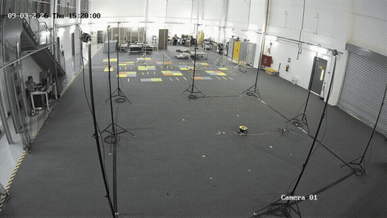
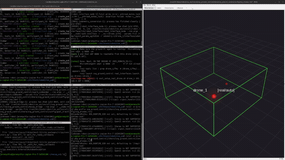
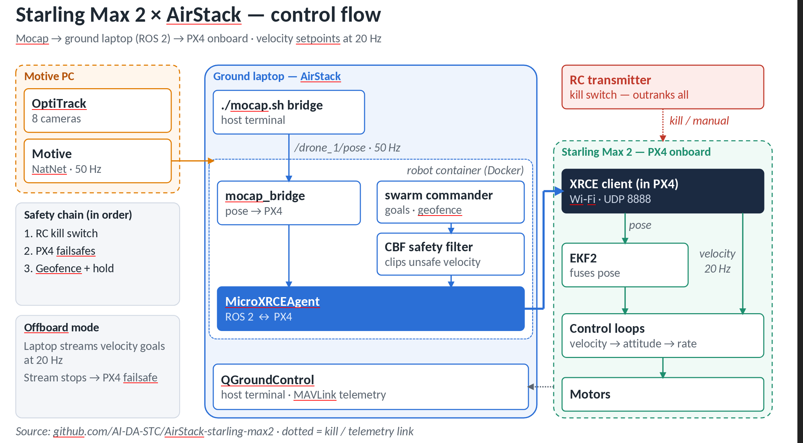
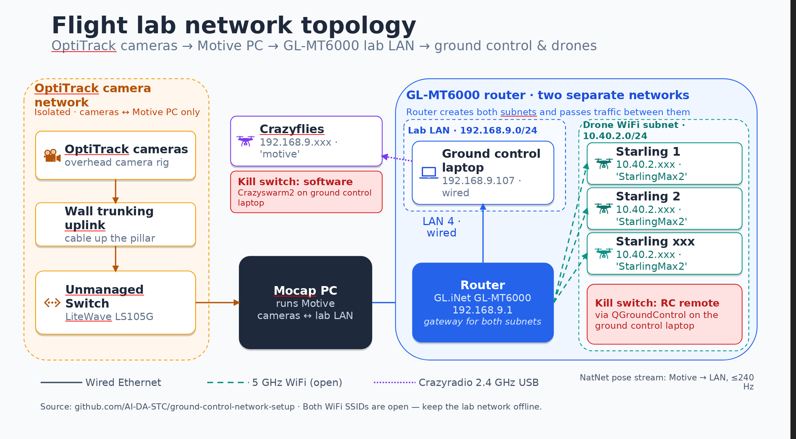
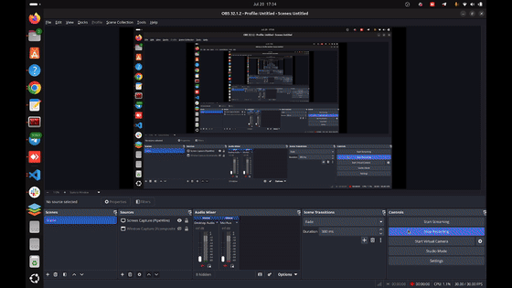

# AirStack-starling-max2 — Starling Max 2 × AirStack lab repo

Everything for flying a ModalAI **Starling Max 2** live under **CMU AirStack** (branch
`yikuan/SVG_ground_control`) with **OptiTrack + Motive** mocap: our notes, milestone
plan, bug-fix patches, demo recordings, **and a complete known-good snapshot of the AirStack
code itself**.

> **2026-10-07 — branch switch.** This `main` now documents CMU's `yikuan/SVG_ground_control`
> branch: a wired-in CBF collision filter, a braking keep-in fence, trajectory setpoints to
> PX4, gamepad teleop, LED strips and a **Foxglove "SVG Basestation"** operator console.
> Nothing on it has flown here yet — the milestone ladder restarts at M0 and every stage is
> re-validated at STE. Everything about the *previous* branch (`daniel/diffaero_ground_control`,
> flown 2026-09-01→03) is frozen on tag **`airstack-starling-max2`** / branch
> **`archive/airstack-starling-max2`**. What changed, and what to re-do before the first
> session: [MIGRATION.md](docs/MIGRATION.md).

## ✈️ Showcase — autonomous waypoint flight, validated 2026-09-03 (previous branch)

The drone below is flying itself. No pilot is touching sticks: ceiling cameras track it,
the ground laptop fuses that into PX4's state estimator, and the swarm commander flies it
through operator-published waypoints — takeoff, goal tracking, geofence, landing, and
auto-disarm all under software control (RC kill switch armed in hand throughout).

| Drone's-eye view (12× speed) | What the software saw — RViz, previous branch (4× speed) |
|---|---|
|  |  |
| [full video](videos/Starling_goal_tracking_drone.mp4) | [full video](videos/Starling_goal_tracking_RVIZ.mp4) |

*(Recorded on the previous branch. The operator view is now the Foxglove Basestation —
[BASESTATION.md](docs/BASESTATION.md); RViz remains available as a fallback.)*

**What's been achieved so far** (details: [MILESTONES.md](docs/MILESTONES.md)):

- **2026-09-01 — first offboard flight** (previous branch): takeoff + hover fully under
  AirStack command, position from OptiTrack mocap (no GPS, no VIO), RC kill switch verified
  in flight.
- **2026-09-03 — waypoint flights** (previous branch): runtime goals published over ROS 2
  (single goal + a multi-goal square, 2 laps), **in-flight geofence** validated, reliable
  landing auto-disarm.
- **2026-10-07 — moved to `yikuan/SVG_ground_control`**: the mocap chain, drone
  provisioning and network setup carry over unchanged; the flight software is re-validated
  from M0 ([MILESTONES.md](docs/MILESTONES.md) §3).
- The full toolchain is in this repo: mocap bridge ([MOCAP.md](docs/MOCAP.md)), session
  runbook ([RUNBOOK.md](docs/RUNBOOK.md) §B/§C), drone parameter set
  ([`starling_1_indoor_params.params`](starling_1_indoor_params.params)), and every lesson
  learned along the way.

> **New here? Read in this order:**
>
> - **Newcomer** → the one-page primer (next section) → run the sim ([RUNBOOK.md](docs/RUNBOOK.md) §A)
>   → [BASESTATION.md](docs/BASESTATION.md) (what you are looking at) → [MOCAP.md](docs/MOCAP.md)
>   → [PREFLIGHT.md](docs/PREFLIGHT.md) → shadow a real session ([RUNBOOK.md](docs/RUNBOOK.md) §B)
>   with a trained person.
> - **Flew the old branch** → [MIGRATION.md](docs/MIGRATION.md) first.
> - **Flying today** → [RUNBOOK.md](docs/RUNBOOK.md)
> - **Hand-flying with the gamepad** → [TELEOP.md](docs/TELEOP.md)
> - **CBF, formations, squeeze, random goals** → [SCENARIOS.md](docs/SCENARIOS.md)
> - **Setting up a new drone** → [DRONE_SETUP.md](docs/DRONE_SETUP.md)
> - **At the Motive PC** → [MOCAP.md](docs/MOCAP.md) §6
> - **Something's broken** → [TROUBLESHOOTING.md](docs/TROUBLESHOOTING.md)
> - **Starting an AI-assisted session** → [CLAUDE.md](CLAUDE.md)
> - **Any unfamiliar term** → [GLOSSARY.md](docs/GLOSSARY.md)

## How the system works (one-page primer)

**PX4 is the pilot, AirStack is mission control, and the RC kill switch outranks both.**

| | Decides | Where it runs |
|---|---|---|
| **AirStack** (swarm commander) | *where to go* — takeoff, goals, hold, land; and *how fast to get there* (an acceleration-limited profile) | ground laptop |
| **PX4 autopilot** | *how to fly* — position hold, stabilization, motors, EKF2 state estimation, failsafes | on the drone |
| **RC pilot** | emergency veto — kill switch, mode override; or hand-flying through the commander's gamepad path | your hands |

We use a **thin slice** of AirStack: our **`./mocap.sh bridge`** (runs on the laptop —
see [MOCAP.md](docs/MOCAP.md)) feeding the mocap→PX4 bridge, the laptop↔PX4 link
(uXRCE-DDS), and the swarm commander with its two safety layers: the **CBF collision
filter** (Control Barrier Function — a math filter that rewrites the velocity command so
drones keep a safety radius from each other; it is tunable in flight) and the **fence**
(either freeze-everyone `hold_all`, or a `keep_in` wall the drone brakes against). The
planner/perception layers stay dormant here; those belong to AirStack's outdoor missions,
where planning runs on the drone's own computer. The operator watches all of it in the
**Foxglove SVG Basestation** panel, fed by a 5 Hz status snapshot the commander publishes.
*(AirStack's own mocap driver, [`natnet_ros2`](https://github.com/L2S-lab/natnet_ros2), stays
vendored in the snapshot but is unused on our rig — our Motive broadcasts, which it can't
hear; full story in [MOCAP.md](docs/MOCAP.md) §3.)*



*(Diagram drawn for the previous branch — the boxes are the same; the arrow from the
commander to PX4 now carries a trajectory setpoint rather than a bare velocity, and the
Foxglove Basestation sits beside the commander as the operator view.)*

**How the laptop↔drone leg works:** the laptop repackages everything into PX4's native
message format (`px4_msgs`), and the **MicroXRCEAgent** program ships those messages over
WiFi to a tiny **client built into PX4 itself** — so no ROS runs on the drone, and there is
nothing to install on it. The laptop does **no state estimation and no stabilization** — it
is a courier for mocap poses and a source of trajectory setpoints.

**Offboard mode** = PX4 outsources goal-generation to an external computer that must stream
setpoints continuously (≥2 Hz; ours: 20 Hz). Stream stops → PX4 failsafes; it never tumbles.
Onboard modes (Position/Hold/Mission…) = PX4 makes its own goals, fully self-contained.

**What we inject, and why it changed.** PX4's control is a cascade —
`POSITION ~50 Hz → VELOCITY ~50 Hz → ATTITUDE ~250 Hz → RATE ~1000 Hz → motors`, all
onboard. The previous branch streamed a bare **velocity** setpoint, bypassing PX4's position
loop and leaving the laptop to close it over WiFi (~0.7 s lag; the drone overshot goals and
fence walls). This branch streams a **trajectory setpoint** — a reference position, the
velocity to get there, *and* the acceleration — so PX4's own position loop runs onboard
(~50 Hz, with the attitude loop below it at ~250 Hz) with feedforward, exactly like its Position flight mode. Tracking lag drops to
~0.1 s, a drone with the sticks released is held by PX4 rather than by the laptop, and a
WiFi hiccup leaves it parked on its last reference. Agility stays bounded (responsive, not
acrobatic; aerobatics would need attitude/rate streaming, which WiFi can't support).

**Safety chain, in authority order:**
1. **RC kill switch** — the only true motor cutoff.
2. **PX4 failsafes** — offboard-loss, low battery, RC override; PX4 can always fly itself.
3. **Commander fence + CBF + hold** — software velocity clips and holds, not a cutoff.

"The drone doesn't decide" holds only while everything is healthy — on any failure, deciding
snaps back onboard by design.

## Flight-lab network architecture



**Current topology (since 2026-08-27, unchanged by the branch switch):** the OptiTrack camera
rig sits on its own **isolated camera network** — the overhead camera rig runs wall-trunking
up the pillar to an unmanaged LiteWave LS105G switch that talks only to the cameras and the
**Mocap PC**; that traffic never touches the lab LAN. The Mocap PC runs Motive and bridges
the cameras to the lab LAN, broadcasting the NatNet pose stream there (≤240 Hz; ours runs
at 50 Hz). A **GL.iNet GL-MT6000 router at `192.168.9.1`** creates and routes between two
subnets: the **lab LAN `192.168.9.0/24`** — where the ground-control laptop is wired in on
LAN port 4 (`192.168.9.107`) and the Mocap PC lives — and the **`10.40.2.0/23` drone
segment** (gateway `10.40.2.1`), where the **Starlings** sit on WiFi SSID **`StarlingMax2`**
alongside the laptop's own WiFi NIC (`10.40.2.107`). Crazyflies stay on the lab LAN
(`192.168.9.x`, SSID `motive`).

> ⚠️ **Check the drone's actual address before every session** — [CONFIG.md](docs/CONFIG.md) is
> the tie-breaker over this picture. The drone *dials the laptop*, so the laptop IP baked
> into it must be reachable from the drone's segment: the laptop's WiFi NIC
> (`10.40.2.107`) is same-subnet, and the router also routes to its wired `192.168.9.107`.
> Confirm with a ping from the drone before flying — a stale or unreachable value means
> [RUNBOOK](docs/RUNBOOK.md) §B step 3 never gets `session established`.

The router serves both drone SSIDs open on 5 GHz **channel 36**. Crazyflies (also
`192.168.9.x`, SSID `motive`) are commanded over a **Crazyradio 2.4 GHz USB dongle** with a
Crazyswarm2 **software kill switch**, independent of WiFi; Starlings are commanded over
WiFi (uXRCE-DDS / MAVLink) with an **RC-remote hardware kill switch** plus QGroundControl
on the laptop. Exact per-device values (IPs, ports, static leases, SSIDs) live in
[CONFIG.md](docs/CONFIG.md)'s network table — treat that as the single source of truth, since
several are DHCP-drifty until static leases land.

**Security note:** both SSIDs are open (no WPA) — keep the lab network offline / air-gapped
from the internet and any untrusted network.

Router configuration and how to reproduce this setup:
[AI-DA-STC/ground-control-network-setup](https://github.com/AI-DA-STC/ground-control-network-setup).

The earlier two-router topology (the `Mocap_QCGroundControl` D-Link setup, 2026-08-11) is
preserved, prose-only, in the [appendix](#appendix--historical-reference) at the bottom of
this file.

*(Paths written in prose — `pictures/…`, `patches/…` — are relative to the repo root.
Clickable links inside `docs/` use `../` because they resolve from that folder.)*

| File / folder | What it is |
|---|---|
| [RUNBOOK.md](docs/RUNBOOK.md) | **START HERE each session** — the fast path, commands only, no background: sim (§A), real drone (§B), goal flights (§C), post-flight (§D) — ⏳ STE on this branch |
| [MIGRATION.md](docs/MIGRATION.md) | **Old branch → this branch**: what was removed/added, what to unlearn, the ordered re-do list, where the archived docs live |
| [BASESTATION.md](docs/BASESTATION.md) | **What you are looking at** — the Foxglove SVG Basestation panel, the `/svg/commander_status` snapshot, the LED strips |
| [TELEOP.md](docs/TELEOP.md) | Hand-flying through the commander with a gamepad: position mode, the two fences, the controller profiles, CMU-doc corrections |
| [SCENARIOS.md](docs/SCENARIOS.md) | The CBF filter and the multi-drone scenarios (formations, random-goal stress test, RC-intruder squeeze) — sim procedures now, real flight at M7 |
| [CONFIG.md](docs/CONFIG.md) | **Single source of truth for lab values** (IPs, SSID, ports, names, flight parameters, AirStack branch/commit) + what to do when one changes |
| [TROUBLESHOOTING.md](docs/TROUBLESHOOTING.md) | **Symptom-indexed fixes — start here when something misbehaves** |
| [GLOSSARY.md](docs/GLOSSARY.md) | Plain-English definitions of every recurring term — linked from every doc |
| [MOCAP.md](docs/MOCAP.md) · [mocap.sh](mocap.sh) · [mocap/](mocap/) | **How the drone knows where it is** — the laptop `./mocap.sh` bridge that replaced natnet_ros2 **and** the Motive-PC operator guide (§6). Unchanged by the branch switch |
| [MILESTONES.md](docs/MILESTONES.md) | The plan **and the work log**: M0–M7 status, code audit, test ledger (reset 2026-10-07), carried-over issues, backlog |
| [PREFLIGHT.md](docs/PREFLIGHT.md) | **Print + laminate for the hangar** — pre-flight checklist, emergency ladder (hold → land → KILL), iron rules |
| [DRONE_SETUP.md](docs/DRONE_SETUP.md) | Provision a NEW Starling from the box — one ordered checklist (WiFi → comms script → params file → Motive body → kill test → optional LEDs) |
| [`starling_1_indoor_params.params`](starling_1_indoor_params.params) | Canonical drone parameter set (872-param QGC export, 2026-09-04) — load via QGC, procedure in DRONE_SETUP §5 |
| [CLAUDE.md](CLAUDE.md) | AI-session entry point — read order, iron flight rules, two-clone warning |
| [AirStack/](AirStack/) | **Full AirStack code snapshot** (`yikuan/SVG_ground_control` @ `cf719f0`, 2026-10-07, patch 0001 applied, submodules included) — see its own [README](AirStack/README.md) |
| [patches/](patches/) | Our bug fixes as patch files — 0001 (still needed, applied in `AirStack/`), 0002 (now fixed upstream — kept for the archive branch), 0003 libmotioncapture (`mocap.sh setup` applies it); story in the [appendix](#appendix--historical-reference) |
| [tools/make_milestones_doc.py](tools/make_milestones_doc.py) | Word (.docx) export generator — **legacy**; [MILESTONES.md](docs/MILESTONES.md) is canonical |
| [assets/](assets/) · [videos/](videos/) | GIFs and source recordings — all from the previous branch (M1 sim demos, the hand-carry tracking check, the 09-03 goal-tracking flight) |
| [pictures/](pictures/) | The two architecture diagrams plus bring-up evidence screenshots (previous branch) |
| [drone-backups/](drone-backups/) | Starling 1's factory `voxl-px4-start` (pulled 2026-07-22, before any script ran) |

## Whose document is whose

There are two separate places documentation lives, written by two different groups:

**1. Written by us:** `README.md` and `CLAUDE.md` at the root, everything in
[`docs/`](docs/) (`RUNBOOK`, `MIGRATION`, `BASESTATION`, `TELEOP`, `SCENARIOS`, `CONFIG`,
`MOCAP`, `PREFLIGHT`, `DRONE_SETUP`, `TROUBLESHOOTING`, `GLOSSARY`, `MILESTONES`), plus
`patches/` and `tools/` — our objective, our milestone structure, our lab's IPs/hardware,
our findings and fixes.

**2. Written by CMU — everything inside the [`AirStack/`](AirStack/) folder** (a snapshot of
their code; the live working copy is `~/AirStack-starling-max2/AirStack/`). Their key guides,
well worth reading:

- [`AirStack/robot/ros_ws/src/svg_ground_control/experiment.md`](AirStack/robot/ros_ws/src/svg_ground_control/experiment.md)
  — **CMU's maintained command reference** for the SVG ground-control experiments (Parts A–D:
  sim, real-drone bring-up, tasks, first flight). Written for CMU's three-drone rig, so
  substitute our IPs/names — and see the "corrections" tables in our docs where it disagrees
  with its own code.
- [`AirStack/robot/ros_ws/src/svg_ground_control/README.md`](AirStack/robot/ros_ws/src/svg_ground_control/README.md)
  — CMU's package overview (architecture, scenarios, CBF, safety notes, and the
  "Update 2026-09-27" section describing this branch's flight bags).
- [`AirStack/robot/ros_ws/src/svg_ground_control/teleop.md`](AirStack/robot/ros_ws/src/svg_ground_control/teleop.md)
  — CMU's gamepad guide (⚠️ its sign table contradicts the code — [TELEOP.md](docs/TELEOP.md) §9).
- [`AirStack/robot/ros_ws/src/svg_ground_control/foxglove/svg-basestation/README.md`](AirStack/robot/ros_ws/src/svg_ground_control/foxglove/svg-basestation/README.md)
  — CMU's Basestation panel manual.

When our runbooks and CMU's guide disagree, trust CMU's `experiment.md` for commands and our
documents for lab-specific substitutions and lessons learned — **except** where our
corrections tables show CMU's doc disagreeing with CMU's code; there the code wins.

## The milestones, in brief

The ladder restarts at **M0** on this branch. Each milestone adds and proves **one new
piece** before the next builds on it — so when something fails, we always know which piece
broke. Simulation proves the software, props-off stages prove the connections, hand-carry
proves the position tracking, and only then do propellers spin.

| # | Milestone | One-line goal | Status |
|---|---|---|---|
| 0 | Bring-up on the new branch | Build, containers, Foxglove panel — three sim drones visible in the Basestation | ⏳ STE |
| 1 | Sim rehearsal | CBF crossing, braking fence, gamepad, formations, random goals in Isaac Sim; pytest green | ⏳ STE |
| 2 | Drone provisioning + hand-carry | New provisioning script + watchdog; `target_system`; Basestation tracks the carried drone; EKF2 fusing | ⏳ STE |
| 3 | First flight | Takeoff, hover, land under the trajectory output; command ACKs seen; iron rules re-verified | ⏳ STE |
| 4 | Goal flights + braking fence | Acceleration-limited goal legs; keep-in wall braking measured; live gains | ⏳ STE |
| 5 | Gamepad teleop, real | Yaw sign verified; teleop fence; release-to-hold | ⏳ STE |
| 6 | LED strips (optional) | Green default, red on CBF; ESC arm LEDs muted — acknowledged | ⏳ STE |
| 7 | Multi-drone | Formations, random-goal CBF test, RC-intruder squeeze | ⏳ blocked — one Starling |

Live status: [MILESTONES.md](docs/MILESTONES.md) §3. The previous branch's ladder (M1–M5 validated 2026-07-20→08-28, M6 flown
2026-09-01→03 without final sign-off) is on the archive tag.

**Important context on the statuses:** CMU built AND flight-tested all of this on their own
three Starlings — our project is **replication and validation**, not development. A code
audit (2026-10-07, [MILESTONES.md](docs/MILESTONES.md) §3b) confirmed every mechanism for
M0–M7 exists in the `AirStack/` code. The things NOT in code (manual, by design) are: clock
sync between machines, the OptiTrack/Motive settings, PX4-side parameters set through
QGroundControl, and which physical gamepad the lab owns.

## Milestone 1 at a glance (previous branch, 2026-07-20)



*Three simulated PX4 drones (SITL — real autopilot firmware, simulated aircraft) under the
ground controller: `takeoff` → hover scenario → `land` (RViz view, 2× speed). The same
rehearsal on this branch is M1, watched in the Basestation instead.*

## Setting up AirStack on a NEW machine

> ⚠️ **Two clones exist on the LAB laptop:** `~/AirStack-starling-max2` is the
> **live/flying copy** — it is what docker mounts, and it is the copy every document in this
> repo assumes; `~/Documents/GitHub/AirStack-starling-max2` is the git mirror used for
> pushing. On a fresh machine there is no split — clone to `~/AirStack-starling-max2` and
> that one folder plays both roles.
>
> **Already set up for the previous branch?** Skip to [MIGRATION.md](docs/MIGRATION.md) §6 —
> the ordered re-do list (rebuild, recreate the container, install the panel, re-provision
> the drone). Steps 1–5 below are unchanged.

You do NOT need any of this on the lab laptop — it is already set up. This is the recipe for
a teammate's PC or a re-install. Every step is copy-paste; Step 2 asks one question (just
press Enter).

#### Step 1 — Download the code

**Requirements, up front:** **Ubuntu 24.04** (hard requirement — the host mocap bridge in
Step 5 needs ROS 2 Jazzy); an **NVIDIA GPU with a recent driver — only for simulation**
(Isaac Sim needs it; real-drone work (§B) needs no GPU and no Isaac Sim); and free disk in
the **tens of GB** (docker images and Isaac Sim assets dominate).

This repo contains everything, including the fixed AirStack code — one clone is the whole
install:

```bash
git clone https://github.com/AI-DA-STC/AirStack-starling-max2.git ~/AirStack-starling-max2
cd ~/AirStack-starling-max2/AirStack      # ← your WORKING FOLDER — all airstack commands run from here
```

No submodule step, no patch step — the code snapshot is complete and already fixed. One
binary download is still needed (CMU's `.gitignore` excludes it): the OptiTrack NatNet SDK,
which the workspace build requires even though our mocap bridge doesn't use it:

```bash
cd ~/AirStack-starling-max2/AirStack/robot/ros_ws/src/perception/natnet_ros2 && ./install_sdk.sh
```

> **Reference — where this code originally came from:** CMU's branch
> [`yikuan/SVG_ground_control`](https://github.com/castacks/AirStack/tree/yikuan/SVG_ground_control)
> of castacks/AirStack (snapshot taken 2026-10-07 at commit `cf719f0`). It is a **sibling**
> of the previous branch, not its successor — [MIGRATION.md](docs/MIGRATION.md) §1. You only
> need CMU's repo if you want their *newer* commits — see the
> [patches appendix](#appendix--historical-reference) for how to re-apply our fix on top.

Note: after you start using the stack, build artifacts and generated config files will appear
as untracked/ignored noise in GitHub Desktop — that is expected.

#### Step 2 — One-time host setup

Skip any part already installed on the machine. (A `git hooks … No such file or directory`
message here is harmless — the code folder is not its own git repo.)

```bash
./airstack.sh setup      # puts the "airstack" command on your PATH — open a NEW terminal after
airstack install         # installs Docker Engine + NVIDIA Container Toolkit (asks for sudo)
docker info              # verify Docker runs (start it with: sudo systemctl start docker)
```

`setup` asks one interactive question — **"API Token:" for the AirLab Nucleus login. Just
press Enter to leave it blank.** Despite the "Skipping" message, `setup` still generates the
two config files Isaac Sim needs (`omni_pass.env`, `user.config.json`).

#### Step 3 — Build the robot Docker image

REQUIRED: it bakes in MicroXRCEAgent (the real-drone link), Foxglove Studio and the
`foxglove_bridge`, and pins the ROS domain — a plain `up` without this is broken. The other
images (isaac-sim, gcs) download automatically on first `up`. (The Dockerfile is identical
to the previous branch's — a machine that built it before does not need to rebuild.)

```bash
./airstack.sh image-build robot-desktop
```

#### Step 4 — Final setup check

```bash
grep -E '^(COMPOSE_PROFILES|AUTOLAUNCH|NUM_ROBOTS)' .env
#   want: COMPOSE_PROFILES="desktop,isaac-sim"  AUTOLAUNCH="false"  NUM_ROBOTS="1"
```

#### Step 5 — one-time mocap bridge + ground-station tools (needs internet — do BEFORE your first hangar session)

The mocap bridge runs **on the laptop itself, not in the container** — the container's ROS
does not count. So the host needs its own ROS 2 Jazzy, which is why Step 1 requires
Ubuntu 24.04.

First, configure the ROS 2 apt repository (the standard recipe from
[docs.ros.org](https://docs.ros.org/en/jazzy/Installation/Ubuntu-Install-Debs.html) for
Ubuntu 24.04):

```bash
# a) enable the ROS 2 apt repository:
sudo apt install software-properties-common
sudo add-apt-repository universe
sudo apt update && sudo apt install curl -y
sudo curl -sSL https://raw.githubusercontent.com/ros/rosdistro/master/ros.key -o /usr/share/keyrings/ros-archive-keyring.gpg
echo "deb [arch=$(dpkg --print-architecture) signed-by=/usr/share/keyrings/ros-archive-keyring.gpg] http://packages.ros.org/ros2/ubuntu $(. /etc/os-release && echo $UBUNTU_CODENAME) main" | sudo tee /etc/apt/sources.list.d/ros2.list > /dev/null
sudo apt update
```

```bash
# b) host ROS 2 Jazzy + build deps + ADB + AppImage runtime — one line:
sudo apt install ros-jazzy-desktop python3-colcon-common-extensions build-essential cmake git libpcl-dev libeigen3-dev libfmt-dev ros-jazzy-eigen3-cmake-module android-tools-adb libfuse2

# c) build the mocap bridge (clones + patches + builds ~/mocap_ws, ~5 min):
cd ~/AirStack-starling-max2 && ./mocap.sh setup
```

**QGroundControl:** download the AppImage from <https://qgroundcontrol.com>, save it as
`~/QGroundControl-x86_64.AppImage`, then:

```bash
chmod +x ~/QGroundControl-x86_64.AppImage
sudo usermod -aG dialout $USER    # serial-port access (log out/in to take effect)
sudo apt remove modemmanager      # it grabs the serial ports QGC needs
```

#### Step 6 — the operator view (new on this branch)

The **Foxglove SVG Basestation** panel is installed into the robot container automatically
at every `up`. To run Foxglove Studio **on the laptop** instead (nicer on a laptop screen),
install Studio from <https://foxglove.dev/download>, then install the panel into it once and
restart Studio:

```bash
cd ~/AirStack-starling-max2/AirStack && python3 robot/ros_ws/src/svg_ground_control/foxglove/install.py
```

Connect it to `ws://localhost:8765` whenever the commander is running, and import the layout
file once. Full guide: [BASESTATION.md](docs/BASESTATION.md) §2. (Alternative with nothing
to install: `use_foxglove_studio:=true` on the commander launch opens Studio inside the
container.)

**Setup is now complete.** Starting and using the stack is a separate, every-session routine
— next section.

## Running AirStack (after setup, and at the start of every session)

> **Fast path each session: [RUNBOOK.md](docs/RUNBOOK.md)** — commands only, sim (§A), real
> drone (§B), goal flights (§C), post-flight (§D). Follow it verbatim; the notes below cover
> what the commands themselves don't say.

**One tmux session instead of seven terminals.** `./airstack.sh connect robot` attaches to a
session called `bringup` that the container creates at `up`: 8 panes, every one a container
shell (`root@…#`) with the workspace sourced. Put each long-running launch in its own pane;
the session survives closing the terminal. `Ctrl-b` + arrow moves between panes, `Ctrl-b d`
detaches. The old per-step `connect robot --command=bash` still works for a throw-away shell.

**What `bws` / `sws` are, and why compiling happens where it does:** inside the container,
`bws` compiles the workspace and `sws` loads the result into that shell — the first ever
build takes ~4 min, later sessions finish in seconds unless code changed. The code can only
be compiled *inside* the robot container (that is where ROS 2 Jazzy for the workspace lives
— the host's ROS 2 Jazzy from Step 5 is for the mocap bridge only). Run `bws` in pane 0; the
other panes wait for it and source automatically.

**Messages that look like errors but are NORMAL:**

- `Workspace not built yet. Please make sure to build first with 'bws'` — printed by every new
  container shell until the **first successful `bws`** has completed.
- `ROBOT_NAME: unknown-robot` in `./airstack.sh status` — harmless. The SVG stack names its
  drones from config files. What matters is `ROS_DOMAIN_ID: 1` next to it.
- `groups: cannot find name for group ID 992` on every `connect` — harmless (host GPU
  `render` group with no name inside the container).
- `Foxglove extension install failed (non-fatal)` at `up` — the panel installer could not
  write `~/.foxglove-studio/extensions` inside the container; Studio on the laptop is
  unaffected. Re-run the installer by hand if you use in-container Studio.
- `led_controller`: `no heartbeat from drone_1` — no LED strip fitted (M6). Harmless, or
  launch with `use_led:=false`.

## Security note

`omni_pass.env` (Omniverse credentials) and `user.config.json` are deliberately **not** in this
repo — they are machine-local and gitignored upstream for a reason. They are generated on each
machine by `./airstack.sh setup` and must never be committed. The drone's SSH password is
recorded in [CONFIG.md](docs/CONFIG.md) deliberately — keep this repo private.

## Appendix — historical reference

Superseded or reference-only material, kept for the record. Nothing here is needed for a
normal session.

<details>
<summary><strong>Historical network topology (pre-2026-08-27)</strong> — the two-router <code>Mocap_QCGroundControl</code> setup</summary>

*(The diagram that used to illustrate this section has been retired. The current network
diagram lives in the [Flight-lab network architecture](#flight-lab-network-architecture)
section above.)*

Rough pipeline, mocap to motors: the **8 OptiTrack cameras** feed (via the OptiTrack mocap
router) the **Motive workstation** — the mocap server, capable of up to 240 Hz (ours streams
at 50 Hz). Motive pushes the **NatNet pose stream over wired LAN** through the hangar's
unmanaged Ethernet switch to the **D-Link router**, which broadcasts the 5 GHz Wi-Fi SSID
**`Mocap_QCGroundControl`**. The **ground-control workstation** (the AirStack / Crazyswarm2
laptop) and the **drone** both live on that router's network — so laptop ↔ Starling Max 2 is
two-way discovery on the same subnet (uXRCE-DDS agent link, QGC MAVLink). Crazyflies are the
exception: they are commanded over a **Crazyradio USB dongle** rather than Wi-Fi, with a
software E-stop via Crazyswarm2; a **hardware E-stop remote** (safety pilot) covers drones
that support it. Two footnotes from the diagram worth remembering: the main office router and
the D-Link router are **different subnets**, and IPs are assigned **by router port, not by
machine**.

This was the lab topology as of 2026-08-11; since **2026-08-27** the lab uses the AI.R STC
hangar wired LAN instead (see the network-architecture section above, and
[CONFIG.md](docs/CONFIG.md) for current values).

More detail on the D-Link router itself (configuration, ports, access):
[AI-DA-STC/Mocap_QC_Ground_Control_Router_Information](https://github.com/AI-DA-STC/Mocap_QC_Ground_Control_Router_Information).

</details>

<details>
<summary><strong>Patches — bug fixes we made to AirStack (backup copies)</strong> — what lives in <code>patches/</code> and when you'd need it</summary>

While getting AirStack working on the previous branch, we found and fixed **two bugs in
CMU's code**. On this branch one is still needed and one has been fixed upstream:

| Patch file | Bug it fixes | Symptom without the fix | Status on `yikuan/SVG_ground_control` |
|---|---|---|---|
| `0001-zed-camera-info-init-race.patch` | Camera startup race in the Isaac Sim Pegasus extension | The drone's right stereo camera randomly never publishes → navigation flies "blind" and becomes erratic | **Still needed** — upstream lacks it; **applied in `AirStack/`** (2026-10-07). Only matters for `ENABLE_CAMERA=true` runs |
| `0002-swarm-commander-logger-severity-crash.patch` | Logging crash in the SVG ground controller | The ground-controller process **dies mid-flight** the first time any drone command fails | **Fixed upstream** (same fix, different lines — `swarm_commander.py` `:1612-1620`). Do NOT apply; kept for the archive branch |
| `0003-libmotioncapture-natnet-4.2-modeldef-segfault.patch` | NatNet 4.2 modeldef segfault in libmotioncapture | the laptop mocap bridge crashes on connect | Unchanged — `./mocap.sh setup` applies it |

The `patches/` folder holds a **backup copy of each fix** as a small text file (a git
"patch"). Anyone who downloads AirStack fresh from CMU's GitHub **gets bug 1 again**.

**Reference: using CMU's repo directly (advanced — not the normal install).**
Only for when you want CMU's **newer** commits than our snapshot:

```bash
# clone CMU's branch + its submodules:
git clone -b yikuan/SVG_ground_control https://github.com/castacks/AirStack.git ~/AirStack-cmu
cd ~/AirStack-cmu
git submodule update --init     # (NOT --recurse-submodules — other branches reference
                                #  private repos and the recursive download fails)

# re-apply our remaining fix on top (assumes this repo is cloned at ~/AirStack-starling-max2):
git -C simulation/isaac-sim/extensions/PegasusSimulator apply ~/AirStack-starling-max2/patches/0001-zed-camera-info-init-race.patch \
  && echo "fix applied" || echo "PATCH FAILED — CMU may have merged it, or changed the surrounding code"
# the NatNet SDK binary download, as in Step 1:
robot/ros_ws/src/perception/natnet_ros2/install_sdk.sh
```

**Reference: how a patch file is made.**

```bash
git diff > my-fix.patch    # save your edits as a patch (run in the repo you edited)
git apply my-fix.patch     # replay them onto another copy of the same code
```

Fix 1 was made inside the PegasusSimulator submodule folder.

**Lifecycle:** delete `0001` once CMU merges it (it is on their `fix/camera-init` branch
awaiting review); `0002` is retired on this branch.

</details>
