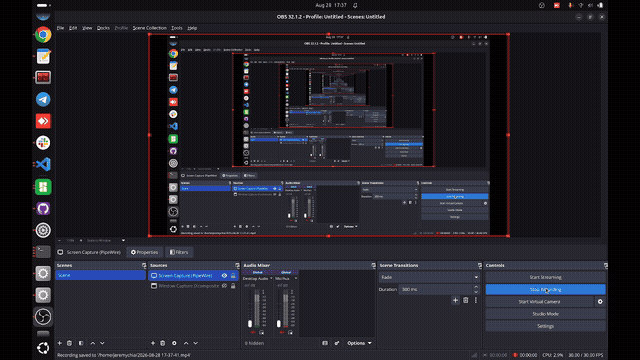

# RUNBOOK — start the pipeline fast

> **Who this is for:** anyone whose machine is already set up (README → "Setting up AirStack
> on a NEW machine") and who just wants to **run** things. No background, no debugging — that
> lives in [MILESTONES.md](MILESTONES.md) (plan + work log) and
> [CLAUDE_NOTES.md](CLAUDE_NOTES.md) (full history).
> Every code block says where it runs. **Never paste across a `connect` line** — it opens a
> new shell and swallows what follows.

**Prompt rule:** `jeremychia@…$` = laptop · `root@…#` = inside the robot container ·
`starling2-max…$` = on the drone (adb).

---

## A · Fly in SIMULATION (✅ validated 2026-07-20)

Five terminals, one job each. GPU required (Isaac Sim).

**T1 — stack + sim drones.** Laptop:
```bash
cd ~/AirStack-starling-max2/AirStack
./airstack.sh up
./airstack.sh connect isaac-sim --command=bash
```
Inside (one command, safe to paste whole):
```bash
NUM_ROBOTS=3 SVG_DOMAIN_ID=1 PLAY_SIM_ON_START=true ISAAC_SIM_HEADLESS=true \
PYTHONPATH="$ISAAC_SIM_PYTHONPATH" \
/isaac-sim/python.sh /isaac-sim/AirStack/simulation/isaac-sim/launch_scripts/svg_multi_drone_single_domain.py \
  --ext-folder ~/.local/share/ov/data/documents/Kit/shared/exts
```
Wait for `Ready for takeoff!` ×3. Leave running.

**T2 — interfaces.** Laptop: `cd ~/AirStack-starling-max2/AirStack && ./airstack.sh connect robot --command=bash`, then inside:
```bash
cd ~/AirStack/robot/ros_ws && bws && sws     # bws only if code changed
./src/svg_ground_control/scripts/launch_sim_interfaces.sh 3
```
Leave running.

**T3 — commander.** New container shell (same connect), inside:
```bash
ros2 launch svg_ground_control ground_control.launch.py
```
Leave running.

**T4 — RViz.** New container shell, inside:
```bash
rviz2 -d $(ros2 pkg prefix svg_ground_control)/share/svg_ground_control/config/svg_drones.rviz
```

**T5 — cockpit.** New container shell, inside — one call at a time:
```bash
ros2 service call /swarm_commander/takeoff std_srvs/srv/Trigger   # arm + climb + hold
ros2 service call /swarm_commander/start   std_srvs/srv/Trigger   # scenario live
ros2 service call /swarm_commander/hold    std_srvs/srv/Trigger   # PANIC freeze
ros2 service call /swarm_commander/land    std_srvs/srv/Trigger   # descend + disarm
```
Geofence latched (fence red, drones frozen)? → `land`, then `/swarm_commander/reset_fence`,
then takeoff + start again.

---

## B · REAL DRONE session (mocap room)

> **One terminal per numbered step** — every long-running piece (agent, mocap bridge,
> QGC, interfaces, commander) gets its own terminal and stays open while you fly.
> Each step says whether its terminal is a **laptop** shell or a **container** shell.

> **Maturity (2026-08-28):** steps 3–7 validated **end-to-end** — agent link, mocap bridge,
> commander + mocap_bridge, EKF2 fusing mocap, RViz tracking a hand-carried drone. One-time
> M4-A drone setup done (EKF2 params via QGC on the Mocap PC ✅ 2026-07-29 +
> `voxl-vision-hub.conf`: `en_vio` false, `offboard_mode` off — detail in MILESTONES M4-A).
> Still pending: the `swarm_real.yaml` 3-drone → `drone_1` trim (M6). No Isaac Sim needed — do
> NOT start it.

**0 — Re-provision the drone(s) after a ground-control laptop change** (needed once per
drone every time the GC laptop — or its IP — changes; the drone *dials the laptop*, so a
stale IP means step 3 never gets a session). SSH to each drone and re-run its setup script
(credentials + all current IPs: [CONFIG.md](CONFIG.md) network table; if an IP has drifted →
router admin `http://192.168.9.1:8080`, or contact **Jeremy Chia**):
```bash
ssh root@<DRONE_IP>            # e.g. Starling 1 — IP in CONFIG.md; password in CONFIG.md
```
Then, on the drone:
```bash
voxl_setup_real_drone.sh <BODY_NAME> <LAPTOP_IP> <DOMAIN_ID> <AGENT_PORT>
# Starling 1:  voxl_setup_real_drone.sh drone_1 <LAPTOP_IP> 1 8888
```
`<BODY_NAME>` = the Motive rigid-body name (`drone_1`), `<DOMAIN_ID>` = the drone's DDS
domain (`1` for drone_1 — unique per drone), `<AGENT_PORT>` = `8888` (must match step 3's
agent). Skip this step entirely if nothing about the laptop changed since last session.

**1 — Check today's IPs** (everything is DHCP; addresses drift). Laptop:
```bash
ip -4 -brief addr              # every interface + its IPv4, one line each
ping -c2 192.168.9.124         # Motive PC answers (hangar wired LAN — IP drifts, see CONFIG.md)
ss -ulpn | grep -E ':(1510|1511)' || echo "ports clear"
```
Compare against the current values in **[CONFIG.md](CONFIG.md)** (the single source of truth
for every IP/SSID/name — including *what to do* when one has drifted). Quick version: `enp…`
(Ethernet, hangar LAN) is both the mocap LAN (step 4 listens on it automatically) AND the IP
the drone dials — if it drifted, redo step 0.
Drone's IP if needed (diagnostics only): `adb shell ip -4 addr show mlan0` or `voxl-my-ip`
(drone shell), or read it from the agent's `session established` log line. The drone
auto-joins the hangar WiFi (`motive` — see CONFIG.md) at boot — nothing to do. If the
network or laptop IP changed since last session, redo step 0 or step 3 will never get a
session. (WiFi missing after reboot + dmesg `Firmware Init Failed` → cold power cycle:
battery + USB out 10 s.)

**2 — Stack up (robot container only).** Laptop:
```bash
cd ~/AirStack-starling-max2/AirStack
./airstack.sh up robot-desktop
```

**3 — Agent** (the drone link). Container shell (`./airstack.sh connect robot --command=bash`), inside:
```bash
MicroXRCEAgent udp4 -p 8888 -v4
```
Wait for `session established`. Leave running. Verify in another container shell:
```bash
ros2 topic hz /drone_1/fmu/out/vehicle_status              # want ~30 Hz
ros2 topic echo /drone_1/fmu/out/vehicle_odometry --qos-reliability best_effort --once
```
⚠️ Every `/fmu/*` **echo** needs `--qos-reliability best_effort` or it looks dead — but this
container's `ros2 topic hz` does NOT accept that flag (run hz bare). Known issue (2026-08-11):
`vehicle_status` echo prints nothing even though hz shows 30 Hz — suspected px4_msgs
definition mismatch, see MILESTONES §3c; use `vehicle_odometry` for the echo check.
(Before the agent starts, the drone-side `px4-microdds_client status` shows `Running,
disconnected` — that's normal, the drone is dialing out waiting for this agent.)

**3b — QGroundControl** (ground-station display: battery, arming status, params, kill
switch). **Laptop** terminal (NOT a container shell), its own window — leave running:
```bash
~/QGroundControl-x86_64.AppImage
```
No vehicle appears? The drone pushes MAVLink to the GCS IP configured on it
(`voxl-mavlink-server.conf`, see CONFIG.md) — it must point at this laptop.

**4 — Mocap bridge** (✅ replaced natnet_ros2 on 2026-08-27 — our Motive broadcasts and the
old driver can't hear it; story + troubleshooting in [MOCAP.md](MOCAP.md)). *Prereq: the
`drone_1` rigid body exists in Motive BEFORE launching — the body list is read only at
startup (create/rename later → Ctrl+C and relaunch).* **Laptop** terminal (NOT a container
shell; one-time `./mocap.sh setup` first if this machine never ran it):
```bash
cd ~/AirStack-starling-max2 && ./mocap.sh      # this repo's root (wherever you cloned it)
# equivalent if a built bridge workspace already exists:  ~/mocap_ws/start_mocap_bridge.sh
```
Leave running. Verify (container shell): `ros2 topic hz /drone_1/pose` (Motive's rate —
50 Hz as of 2026-08-28). Poses missing → `./mocap.sh check` (laptop) names the culprit.

**5 — Per-drone interfaces** (turns `/fmu` traffic into the odometry the commander needs —
without this, RViz shows nothing and takeoff is refused). New container shell, inside:
```bash
ros2 launch svg_ground_control real_interfaces.launch.py drones:=drone_1   # more drones: drones:=drone_1,drone_2,...
```
Leave running.

**6 — Commander + mocap bridge.** *One-time prereqs (MILESTONES M4-A/M6 — only the trim
still pending):
EKF2 params set via QGC (Mocap PC, ✅ 2026-07-29), vision-hub conf set (`en_vio` false /
`offboard_mode` off), and `swarm_real.yaml` trimmed to `drone_1` only —
with the shipped 3-drone config the commander still launches `drone_1` while configured for
phantom drone_2/3 (their hover slots, teleop/CBF roles) — trim BEFORE flying.* New container
shell, inside:
```bash
ros2 launch svg_ground_control ground_control.launch.py \
  config:=$(ros2 pkg prefix svg_ground_control)/share/svg_ground_control/config/swarm_real.yaml use_mocap:=true
```
On launch, expect a WARN that `drone_position_offsets` are all zero plus a 3-drone list
(drone_1 auto/real, drone_2 auto/real, drone_3 teleop/real/cbf-exempt) — normal until the M6
trim; **zero offsets are CORRECT for mocap**. Leave running.

**Verify fusion** (another container shell). ⚠️ Copy-paste these — arrow-key-editing `in/`
into `out/` keeps producing a nonexistent `/fmu/inout/…` topic that looks "dead":
```bash
ros2 topic hz   /drone_1/fmu/in/vehicle_visual_odometry     # ~mocap rate = mocap_bridge alive
ros2 topic echo /drone_1/fmu/out/vehicle_odometry --once --qos-reliability best_effort --qos-durability volatile
```
The `in/…` message shows velocities as `.nan` — **by design** (pose-only feed; NaN = "don't
fuse this field"), not a fault. **Success = `out/…` position matches `in/…` to within a few
cm** (EKF2 is fusing). `in/` streams but `out/` silent → EKF2 params ([CONFIG.md](CONFIG.md))
not applied on the drone. These checks only pass AFTER this step — the commander launch is
what starts mocap_bridge (CMU's experiment.md §B4b lists them earlier; see
[MOCAP.md](MOCAP.md) corrections table). Then the **frame hand-check** (before the day's
first flight — MILESTONES M4-B step 4): carry North → `position[0]`↑, East → `[1]`↑, up →
`[2]`↓.

**7 — RViz preflight (no arming).** New container shell, inside:
```bash
rviz2 -d $(ros2 pkg prefix svg_ground_control)/share/svg_ground_control/config/svg_drones.rviz
```
The shipped `svg_drones.rviz` has **Fixed Frame `map`** (sim leftover) → "Global Status:
Error" + empty view on the real rig: in Displays → Global Options set Fixed Frame to
**`world`**. Step 5's `real_interfaces` must be running or
`/drone_1/odometry_conversion/odometry` is silent and nothing draws. Quick health check:
`ros2 node list` — expect the interface nodes + swarm_commander + mocap_bridge (+ the
laptop's motion_capture_tracking and mocap_pose_relay visible on domain 1).
Hand-carry the drone — its red sphere must track. Do NOT call takeoff during this check.



Step 7 succeeding (✅ 2026-08-28) — full recording:
`videos/SVG_check_if_rviz_moves_by_movingdrone_manually.mp4`.

**8 — Fly** (only after M6's safety setup: fence fitted, RC kill tested, thumb on it):
same four service calls as sim T5.

**Shutdown** (either session type). Ctrl+C the launches, `exit` the containers, then laptop:
```bash
cd ~/AirStack-starling-max2/AirStack && ./airstack.sh down
```

**Drone shutdown** (real-drone sessions — power down cleanly, don't just yank the battery).
Laptop, USB-C connected:
```bash
adb shell shutdown now
```
Wait ~10 s for it to power down, then unplug USB and disconnect the battery. (Already in the
drone's own shell — `starling2-max` prompt? Just `shutdown now` there. NOT in a laptop or
container shell — that would shut down the wrong machine.)

---

## Pocket reference

| Thing | Rule |
|---|---|
| `ros2` / `bws` / `rviz2` | container only (`root@`) |
| `docker` / `airstack.sh` / `adb` / `ip addr` | laptop only (`jeremychia@`) |
| `/fmu/*` topics | `echo` always needs `--qos-reliability best_effort`; `hz` takes no QoS flag in this ros2 |
| Long-running (leave open) | Isaac spawn · interfaces · agent · mocap bridge (`./mocap.sh`, laptop) · QGC (laptop) · commander — **one terminal each** |
| Panic, in order | `hold` service → `land` service → **RC kill switch** |
| Container messages to ignore | `Workspace not built yet` (pre-bws) · `groups: … 992` · `unknown-robot` · prompt garbage `[:refused refused reached]` (robot-name DNS lookup fails on the router; domain still forced to 1) |
| Drone hotspot `VOXL-…` | never connect the laptop to it |
| Drone power-off | `adb shell shutdown now` (laptop) → wait ~10 s → unplug USB, then battery |
